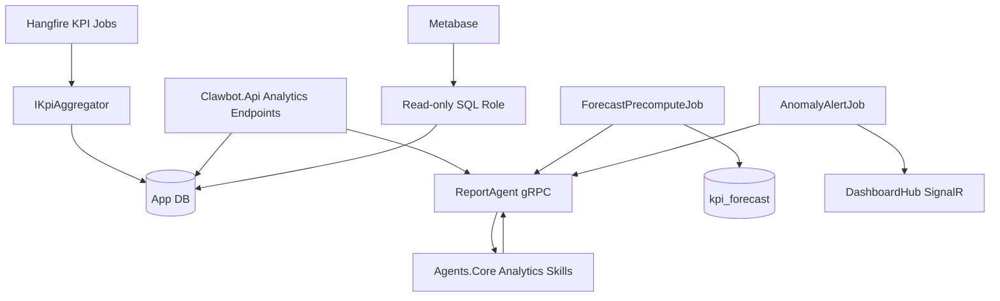

# Analytics KPI + Metabase Design

## Architecture Overview

## Data Models

- Existing `kpi_daily`: tenant/date/platform unique rows for leads, DMs, replies, conversions, response time, and ad spend.
- New `kpi_forecast`: tenant, platform, metric, forecast date, point value, lower/upper bounds, and generated timestamp.

## API Design

- `GET /api/analytics/omnichannel?from&to`
- `GET /api/analytics/funnel?from&to&platform`
- `GET /api/analytics/agent-performance?from&to`
- `GET /api/analytics/anomalies?metric&platform`
- `GET /api/analytics/forecast?metric&platform&horizon`
- `GET /api/analytics/export?format=csv|pdf&from&to`

All API reads are tenant-scoped through `ITenantAccessor`. On-demand ML requests go through `ReportAgent.ReportAgentClient`; cached forecast reads come from `kpi_forecast`.

## Component Breakdown

- `KpiAggregator`: reusable infrastructure service for daily/range aggregation and average response-time calculation.
- `DailyKpiRollupJob`: idempotent daily upsert for each channel plus `all`.
- `ReportAgentGrpcService`: daily snapshot, forecast, and anomaly RPC facade.
- `ZScoreAnomalyDetector`: rolling z-score over numeric series.
- `MlNetForecaster`: 7-day SSA forecast.
- `AnalyticsAggregationService` and `AnalyticsExportService`: API read model and export helpers.
- `AnomalyAlertJob` and `ForecastPrecomputeJob`: scheduled operational jobs.
- Deploy assets: Metabase, metadata Postgres, read-only SQL, dashboard JSON.

## Design Decisions

- Forecasts are precomputed daily and cached to keep API p95 under 500 ms.
- Anomaly detection stays on-demand because rolling z-score is fast enough for request/job use.
- SignalR is used for alerts to match the current dashboard notification path.
- CSV export is hand-rolled; PDF export reuses the existing QuestPDF renderer.

## Risks

- ML.NET and MathNet package pins may trip NuGet audit gates.
- Forecast tests should assert shape and bound relationships, not exact SSA values.
- The current worktree contains unrelated user changes, so edits must stay scoped and must not revert existing content/ads work.

