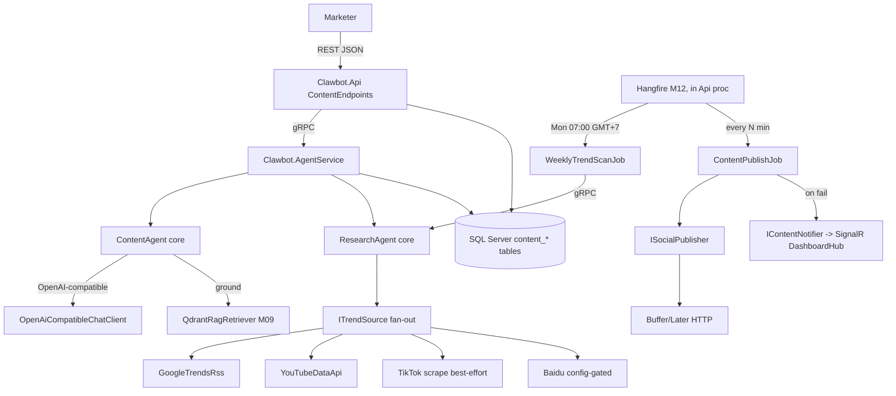

# System Design & Architecture

> M18 Content + Research pipeline. Reuses the proven agent + gRPC + endpoint + Hangfire stack from M10/M14/M17/M20. **Real connectors** behind interfaces, config-gated.

## Architecture Overview
**What is the high-level system structure?**

Key components & responsibilities
- **ContentEndpoints** (API) — brief/item CRUD, generate, approve/reject, repurpose, schedule, calendar, trends; tenant-scoped, authorized.
- **ContentAgent / ResearchAgent** (Agents.Core, pure orchestrators) — per-platform generation via OpenAI-compatible LLM + RAG grounding; trend fan-out + relevance scoring.
- **ITrendSource** impls (Infrastructure) — one per source, isolated + individually disableable.
- **ISocialPublisher** (Infrastructure) — config-driven HTTP publisher, Buffer-shaped default.
- **Hangfire jobs** — `WeeklyTrendScanJob`, `ContentPublishJob`.

Technology stack rationale
- **Content LLM = OpenAI-compatible** via the official `OpenAI` .NET library (new audit-clean dep, pinned), pointed at a configurable base URL/model/key (DeepSeek/OpenAI/local). Does **not** reuse `AnthropicChatClient`. New `IContentLlmClient` + `OpenAiCompatibleChatClient` in Agents.Core; endpoint/model/key via `ContentLlmOptions`. Record the choice + audit clearance in a one-page RFC (`.sdd/rfcs/`, like RFC-001).
- Prompt templates externalized (KB/config), **not inline string literals** (CLAUDE.md forbidden-pattern: no hardcoded prompts).
- RSS parse via `System.Xml.Linq.XDocument`, JSON via `System.Text.Json` — **no new NuGet** for Google Trends / YouTube. YouTube Data API called over `HttpClient` (REST), not the SDK, to avoid pulling `Google.Apis.*` through the audit gate. TikTok best-effort + Baidu HTML scrape → `AngleSharp` (audit-clean) behind per-source config flags.
- Scheduling/scan timezone = **GMT+7**; publish-failure alert via existing SignalR (`DashboardHub`).

## Data Models
**What data do we need to manage?**

Existing tables (no schema change for core flow) — [0001_init.sql](../../../deploy/migrations/0001_init.sql):
- `content_briefs` (id, tenant_id, platform, brief, status, created_by, timestamps) — trend output + manual briefs land here.
- `content_items` (id, tenant_id, brief_id, platform, status `draft|approved|scheduled|published|rejected`, body, assets_json, created_by, approved_by, approved_at, deleted_at, timestamps).
- `content_schedule` (id, tenant_id, content_item_id, platform, scheduled_at, posted_at, status `pending|posted|failed`, post_url, timestamps).

Domain entities ([Content/](../../../src/shared/Clawbot.Domain/Content/)) — add missing behaviors:
- `ContentBrief` → add `Update(platform, brief, updatedAt)` + `MarkStatus(status, at)` (currently create-only).
- `ContentItem` → has `Approve`/`Reject`; add `UpdateBody(body, at)`, `MarkScheduled(at)`, `MarkPublished(at)`.
- `ContentSchedule` → already has `Schedule`/`MarkPosted`/`MarkFailed`.

Data flow: trend scan → `content_briefs`; generate → `content_items(draft)`; approve → `approved`; schedule → `content_schedule(pending)` + item `scheduled`; publish job → `posted/failed` + item `published`.

## API Design
**How do components communicate?**

REST (replaces the `/api/content` 501 stub in [BoundedContextEndpoints.cs](../../../src/api/Clawbot.Api/Endpoints/BoundedContextEndpoints.cs)) — `MapContent()`, group `RequireAuthorization()`, `ITenantAccessor.Require()`, pattern per `LeadsEndpoints`/`DocumentsEndpoints`:
- `GET/POST/PUT/DELETE /api/content/briefs` (+ `?status=&platform=`)
- `POST /api/content/items/generate` `{ briefId | platform+briefText }` → Claude draft
- `GET /api/content/queue` (`?status=&platform=` paged — SPEC-06 name) · `PUT /api/content/items/{id}` · `DELETE` (soft)
- `POST /api/content/items/{id}/approve` · `/reject`
- `POST /api/content/items/{id}/repurpose` `{ targetPlatforms[] }` → derived draft items
- `POST /api/content/items/{id}/schedule` `{ scheduledAt? }` — **omit → auto golden-hour per platform (GMT+7); supplied → manual override** · `GET /api/content/calendar?from=&to=` · `DELETE /api/content/schedule/{id}`
- `GET /api/content/trends?week=` · `POST /api/content/trends/scan` (manual trigger)

gRPC (extend additively, M17 convention):
- `agent_content.proto` — keep `Generate`; extend `ContentResponse` with `repeated ContentVariant variants` (per-platform) + add `rpc Repurpose(RepurposeRequest) returns (ContentResponse)`.
- `agent_research.proto` — `WeeklyTrends` returns `TrendItem[]` (already shaped); server persists `content_briefs`.

Internal interfaces (new, Agents.Core / Infrastructure):
- `IContentLlmClient { Task<string> CompleteAsync(prompt, ContentLlmOptions, CancellationToken) }` → `OpenAiCompatibleChatClient` (OpenAI .NET lib, config endpoint/model/key).
- `ITrendSource { string Source; bool Enabled; Task<IReadOnlyList<RawTrend>> FetchAsync(string geo, CancellationToken) }`
- `ITrendRelevanceScorer { double Score(RawTrend, tenant KB context) }`
- `IPromptTemplateProvider { string Get(platform) }` (externalized templates — KB/config, not inline)
- `IGoldenHourResolver { DateTimeOffset Resolve(platform, DateOnly day) }` (per-platform optimal post time, GMT+7)
- `ISocialPublisher { Task<PublishResult> PublishAsync(PublishRequest, CancellationToken) }`

Auth: JWT bearer + tenant scoping on REST; gRPC re-validates tenant_id; publisher/YT keys via Options, never echoed.

## Component Breakdown
**What are the major building blocks?**

Backend services/modules (**layering: Agents.Core refs Domain/SharedKernel/Contracts only — never Infrastructure**; HTTP connectors that an agent consumes live in Agents.Core, like `AnthropicChatClient`):
- `Clawbot.Agents.Core/Content/` — `ContentAgent`, `IContentLlmClient` + `OpenAiCompatibleChatClient` (HttpClient + OpenAI lib), `IPromptTemplateProvider`, `RepurposeMapper`, `IGoldenHourResolver`.
- `Clawbot.Agents.Core/Research/` — `ResearchAgent`, `ITrendSource` + `GoogleTrendsRssSource`/`YouTubeDataApiSource`/`TikTokScrapeSource`/`BaiduScrapeSource` (HttpClient + AngleSharp), `ITrendRelevanceScorer` + `WeightedTrendScorer`. **Connectors live here (not Infrastructure)** because the consuming agent is in Agents.Core.
- `Clawbot.Infrastructure/Content/Publishing/` — `ISocialPublisher` + `HttpSocialPublisher` (Buffer-shaped), `PublisherOptions` (publish is mechanical, no LLM → Infrastructure, called in-process by the job).
- `Clawbot.SharedKernel/Content/` — `IContentNotifier` (publish-fail alert contract), mirrors `IInboxNotifier`.
- `Clawbot.Api/Hubs/` — `SignalRContentNotifier : IContentNotifier` over `IHubContext<DashboardHub>`.
- `Clawbot.Infrastructure/Jobs/` — `ContentPublishJob` (in-process: due schedules → `ISocialPublisher` → `MarkPosted`/`MarkFailed` + `IContentNotifier` on fail), `WeeklyTrendScanJob` (**triggers `ResearchAgent` via gRPC** — agent-centric per ADR-008). Register in `HangfireModule`, queue `content`.
- `Clawbot.AgentService/Services/` — implement `ContentAgentGrpcService` (generate/repurpose) + `ResearchAgentGrpcService` (fan-out + score + persist `content_briefs`).
- `Clawbot.Api/Endpoints/ContentEndpoints.cs` + `Clawbot.Api.Contracts/Content/ContentDtos.cs` + `ContentAgentClient` + `ResearchAgentClient` gRPC clients in `Program.cs`.

Third-party integrations
- Google Trends daily RSS (`/trends/trendingsearches/daily/rss?geo=VN`) — no key.
- YouTube Data API v3 `videos.list?chart=mostPopular&regionCode=VN` — needs API key.
- Buffer/Later/Ayrshare publish endpoint — needs token; endpoint+token configurable.

## Design Decisions
**Why did we choose this approach?**

- **Connectors behind interfaces + config-gated** — sources fail independently; missing key disables a source, never the pipeline. Mirrors `IChannelAdapter`/`PancakeConfig` resilience.
- **Dependency-free parsing first** — RSS/JSON via BCL to keep the NuGetAudit gate green; `AngleSharp` only for opt-in HTML scrape (default off) so brittle scrapers aren't load-bearing.
- **Publisher is endpoint+token-configurable** (Buffer-shaped) rather than hard-coding one vendor — Buffer/Later are partner-gated; swappable to Ayrshare without redeploy (lesson from M06 Pancake pivot).
- **Trends persisted as `content_briefs`** — reuses an existing table + the brief→generate flow; no new schema.
- **Pure-orchestrator agents** (like `DocsAgent`/`ChatAgent`) keep LLM/RAG logic unit-testable; gRPC services own DB + persistence.
- **Agent-centric research** (chosen 2026-06-07): `WeeklyTrendScanJob` (Api process) triggers `ResearchAgent` over gRPC; AgentService runs fan-out + scoring + persist. Honors ADR-008 and keeps content + research symmetric. Trade-off: a cross-process hop vs a job doing it in-process (rejected — would leave the ResearchAgent gRPC service hollow and split connector ownership).
- **Layering**: agent-consumed HTTP connectors live in Agents.Core (Agents.Core can't ref Infrastructure); the publish-fail alert crosses the Infrastructure→Api boundary via the `IContentNotifier` abstraction (SharedKernel) + Api impl, mirroring `IInboxNotifier` — a job must not reference a hub directly.
- **Content LLM = OpenAI-compatible (OpenAI .NET lib), not Claude** — explicit choice this module; endpoint/model config-driven so DeepSeek/OpenAI/local all work without code change. Diverges from the Anthropic-direct precedent of M10/M14/M17 by design; needs its own RFC. (`llm_configs`-table runtime routing per ADR-010 deferred — a cross-cutting refactor for all agents, not piecemeal here.)
- Alternatives considered: Semantic Kernel plugins (rejected per RFC-001); per-tenant publisher/LLM credential table now (deferred — global config keeps scope bounded).

## Non-Functional Requirements
**How should the system perform?**

- Performance: single-draft p95 < 10s (Claude-bound); weekly scan within Hangfire batch window; publish job processes due items in small idempotent batches.
- Scalability: trend fan-out parallel across sources with per-source timeout; publish job paginates `content_schedule` by `scheduled_at`.
- Security: secrets via Options/env only; per-tenant publisher/LLM token (if stored) AES-encrypted; validate `scheduledAt` not in past; tenant query filter on all reads; connector + LLM calls via existing `HttpResiliencePolicies` (Polly retry + breaker + timeout). Cost/latency: log token usage from the OpenAI-compatible response (`IClaudeCostTracker` is Anthropic-specific — a generic LLM cost tracker is a follow-up).
- Reliability: graceful degradation on source/publisher failure; bounded publish retries; idempotent trend upsert; structured Serilog logs + (later) OTel spans.
