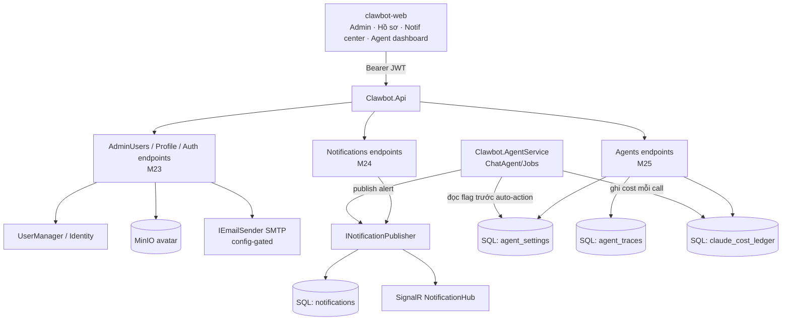

# System Design & Architecture — Backend Admin Ops

> Nguồn requirements: [module-checklist.md](../../module-checklist.md) M23/M24/M25 + pain-point audit (2026-06-13). Quyết định /review-requirements: admin-provisioned (no self-register), email = SMTP config-gated, agent enable/disable = flag auto-action per-tenant, build cả 3.
> Tuân theo kiến trúc hiện có: Clean Architecture (Domain/Application/Infrastructure/Api/AgentService), DDL = source of truth (`deploy/migrations/00XX_*.sql`), minimal-API endpoints (group + `RequireAuthorization` + perm policy + rate-limit), Identity (UserManager), tenant scoping `ITenantOwned` + `HttpTenantAccessor`, SignalR notifier, MinIO `IDocumentStorage`, config-gated graceful services.

## Architecture Overview

**Components & trách nhiệm**
- **M23 AdminUsers/Profile/Auth** — CRUD user (Identity), self-profile, change-password, avatar; email qua SMTP.
- **M24 INotificationPublisher** — 1 điểm: persist `notifications` + push SignalR. Thay các notifier rời (Inbox/Content) gọi chung.
- **M25 Agents endpoints + agent_settings** — bật/tắt auto-action per-tenant; đọc traces; agent-cost từ ledger. AgentService đọc flag trước khi auto-reply.

## Data Models

> DDL mới: `deploy/migrations/0010_user_profile_cols.sql`, `0011_notifications.sql`, `0012_agent_settings.sql`, `0013_claude_cost_ledger.sql`. EF config tương ứng trong `Persistence/Configurations`.

**M23 — extend `AppUser`** (ALTER `AspNetUsers`): `+ DateOfBirth date NULL`, `+ AvatarUrl nvarchar(512) NULL`. (DisplayName, PhoneNumber, Email đã có; IsActive = qua LockoutEnd.)

**M24 — `notifications`** (`ITenantOwned`):
| cột | kiểu | ghi chú |
|---|---|---|
| id | uniqueidentifier PK | |
| tenant_id | uniqueidentifier | FK, query-filter |
| user_id | uniqueidentifier NULL | null = tenant-broadcast |
| type | varchar(40) | hot_lead/idle/anomaly/ads_budget/system |
| severity | varchar(10) | info/warning/error |
| title, body | nvarchar | body PII-redacted [[pii-redact-derived-content]] |
| link | nvarchar(256) NULL | deep-link FE |
| is_read | bit | |
| read_at, created_at | datetime2 | |
index `(tenant_id, user_id, is_read, created_at desc)`.

**M25 — `agent_settings`** (`ITenantOwned`): `(tenant_id, agent_code) UNIQUE`, `auto_action_enabled bit`, `updated_at`, `updated_by`.
**M25 — `claude_cost_ledger`** (`ITenantOwned`): `id, tenant_id, agent_code, conversation_id NULL, input_tokens, output_tokens, usd, created_at`; index `(tenant_id, agent_code, created_at)`. (Thay `InMemoryClaudeCostTracker` → `DbClaudeCostTracker` ghi bảng này.)

## API Design

> Tất cả `RequireAuthorization` + rate-limit GeneralPolicy. Perm mới seed vào Admin (RbacSeeder): `users.read/users.write`, `agents.read/agents.manage`. `notifications` + `profile` = chủ sở hữu (self), không cần perm đặc biệt.

**M23**
- `GET /api/admin/users?page=&q=` (perm users.read) → `[{id,email,displayName,roles[],isActive,lastLoginAt}]`
- `POST /api/admin/users` (users.write) `{email,displayName,password,roles[]}` → tạo qua UserManager + AddToRoles
- `PUT /api/admin/users/{id}` (users.write) `{displayName?,roles[]?,isActive?}`
- `POST /api/admin/users/{id}/reset-password` (users.write) → sinh token + email (hoặc temp password) qua IEmailSender
- `POST /auth/change-password` (auth) `{currentPassword,newPassword}` → UserManager.ChangePasswordAsync
- `GET /api/profile` (auth) → `{id,email,displayName,phone,dateOfBirth,avatarUrl,roles[],tenantSlug}`
- `PUT /api/profile` (auth) `{displayName,phone,dateOfBirth}`
- `POST /api/profile/avatar` (auth, multipart ≤2MB image) → MinIO → set AvatarUrl → trả url

**M24**
- `GET /api/notifications?unread=&page=` (auth) → của user + broadcast tenant
- `GET /api/notifications/unread-count` (auth) → badge
- `POST /api/notifications/{id}/read` + `POST /api/notifications/read-all` (auth)

**M25**
- `GET /api/agents` (agents.read) → 8 agent + `{code,enabled,autoAction,lastRunAt,health}`
- `POST /api/agents/{code}/enable` + `/disable` (agents.manage) → set `agent_settings.auto_action_enabled`
- `GET /api/agents/{code}/traces?page=` (agents.read) → đọc `agent_traces`
- `GET /api/analytics/agent-cost?from=&to=` (auth) → group `claude_cost_ledger` theo agent_code → `[{agentCode,calls,inputTok,outputTok,usd,avgUsdPerCall}]`

## Component Breakdown
- **Api**: `AdminUsersEndpoints.cs`, `ProfileEndpoints.cs`, `NotificationsEndpoints.cs`, `AgentsEndpoints.cs`; thêm `change-password` vào `AuthEndpoints`; `agent-cost` vào `AnalyticsEndpoints`. DTO trong `Clawbot.Api.Contracts`.
- **Domain**: `Notification` aggregate (factory + `MarkRead`); `AgentSetting` entity.
- **Infrastructure**: `SmtpEmailSender : IEmailSender` (config-gated, graceful no-op + log nếu thiếu config); `DbNotificationPublisher : INotificationPublisher` (persist + SignalR); `NotificationHub` (per-tenant + per-user group); `DbClaudeCostTracker`; EF configs; 4 migration; RbacSeeder thêm perms.
- **AgentService**: ChatAgent + jobs đọc `agent_settings.auto_action_enabled` trước auto-action; ghi `claude_cost_ledger` mỗi LLM call.
- **FE** (sau, M16): bỏ mock Admin/Hồ sơ/Notif/Agent → gọi API trên.

## Design Decisions
1. **Profile = extend AppUser** (không bảng `user_profiles` riêng) — Identity-native 1:1, ít join, giữ DisplayName sẵn có. ALTER bảng AspNetUsers.
2. **Email = SMTP `IEmailSender` config-gated graceful** — đồng nhất pattern Meta/TikTok/MinIO; no-op + log nếu chưa cấu hình (dev vẫn chạy). NuGet: `System.Net.Mail` (BCL, không thêm dep → qua audit gate [[clawbot-build-gates]]).
3. **No self-register** — admin tạo user; bỏ `/auth/register`. Tenant provision = seed/ops.
4. **Notification = 1 publisher** (`INotificationPublisher` persist + push) thay vì notifier rời — DRY, đảm bảo mọi alert vừa realtime vừa lưu.
5. **Agent enable/disable = flag auto-action per-tenant** (không kill gRPC) — agent vẫn phục vụ request thủ công; chỉ tắt auto-reply/auto-job. Enforcement đọc `agent_settings` trong pipeline AgentService.
6. **Cost ledger DB** thay in-memory — bắt buộc cho agent-cost report + lịch sử; `DbClaudeCostTracker` cùng interface `IClaudeCostTracker` (drop-in).
7. **DDL-as-source** — raw SQL migrations 0010–0013, không EF migration (theo M01 convention).

## Non-Functional
- **Security**: perm-gated (users.*/agents.*); avatar validate MIME+size ≤2MB; email/password không log; notif body PII-redact; admin-reset không lộ password cũ.
- **Multi-tenant**: 3 bảng mới đều `ITenantOwned` → query-filter tự động.
- **Perf**: notifications index theo `(tenant,user,is_read,created_at)`; agent-cost group-by có index; unread-count cache nhẹ.
- **Reliability**: SMTP/avatar lỗi → graceful (alert vẫn hiện in-app; reset vẫn log token). Cost-ledger ghi async, lỗi không chặn reply.
- **Retention**: `notifications` purge >30–90d qua `RetentionPurgeJob`.

## Resolved decisions (review-design 2026-06-13)
1. **Notification broadcast read-state** → **fan-out per-user rows** khi tạo broadcast (is_read trên từng row; team nhỏ chấp nhận row count).
2. **Cost ledger** → **gộp vào M25 đợt này**: `DbClaudeCostTracker` + bảng `claude_cost_ledger` (cấp dữ liệu `/api/analytics/agent-cost`).
3. **Avatar** → **MinIO presigned 7d**, key `avatars/{tenant}/{userId}` (đồng nhất `MinioDocumentStorage`).
