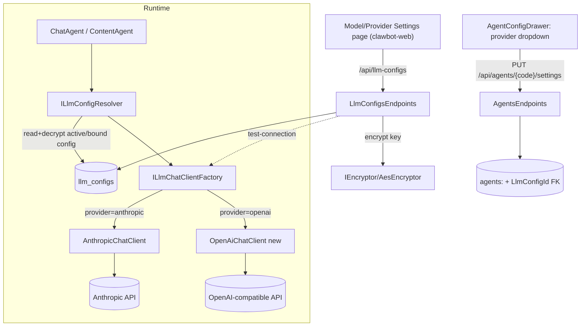

# System Design & Architecture

## Architecture Overview
**What is the high-level system structure?**

Reuse the existing encrypted-secret CRUD pattern (`ChannelsEndpoints` + `IEncryptor`) for the config surface, then introduce a **provider resolver + provider router** so the agent runtime reads `LlmConfig` from the DB instead of static `AnthropicOptions`.

- **LlmConfigsEndpoints** — tenant-scoped CRUD + rotate-key + activate/deactivate + test-connection. Mirrors `ChannelsEndpoints`/`ApiKeysEndpoints`.
- **ILlmConfigResolver** — `ResolveAsync(tenantId, agentCode, ct)`. Loads the `AgentConfig` by code, then its bound `LlmConfig` (by `LlmConfigId`), verifies `IsActive`, decrypts the key, computes effective model (`agent.model ?? config.ModelId`, D2), returns a `ResolvedLlmConfig` (provider, model, key, baseUrl, maxTokens, temperature, rates). If `LlmConfigId` is null or the config is inactive/missing → throws `LlmConfigNotConfiguredException` (→ typed `llm_config_not_configured`, D1). No fallback. Request-scoped cache. **Keyed by (tenantId, agentCode)** — the chat path carries `tenantId`, and each agent supplies its own logical code; `agentCode` must equal the `AgentConfig.Code` value.
- **ILlmChatClientFactory** — `Create(ResolvedLlmConfig)` → `IClaudeChatClient` bound to that config; selects `AnthropicChatClient` vs `OpenAiChatClient` by provider, using `IHttpClientFactory` for the HttpClient. Replaces the fixed typed-HttpClient registration. Built per call (config varies at runtime).
- **Consumers to rewire (5):** `ChatAgent`, `ContentAgent`, `SaleAssistAgent`, `ContentLlmClient`, `KbTestRunnerService` — each injects resolver+factory and passes its own agent code. Cost recording switches hardcoded `"claude"` provider string → `resolved.Provider`.
- **Stack:** existing — ASP.NET minimal APIs (net8), EF Core, React + axios FE. No new dependencies.

## Data Models
**What data do we need to manage?**

**`LlmConfig` (existing, `llm_configs`) — reuse, add cost rates:**
| Field | Type | Notes |
|---|---|---|
| Id | Guid (PK) | existing |
| TenantId | Guid | ITenantOwned, query-filtered |
| Provider | string | `anthropic` \| `openai` (openai-compatible) |
| ModelId | string | authoritative model id |
| ApiKeyEncrypted | nvarchar(max) | `IEncryptor.Encrypt`; never returned |
| BaseUrl | string? | OpenAI-compatible / Anthropic override |
| IsActive | bool | tenant default-active flag |
| MaxTokens | int? | generation default |
| Temperature | decimal? | generation default |
| **InputUsdPer1M** | decimal? | **NEW** — default to Anthropic 3.00 |
| **OutputUsdPer1M** | decimal? | **NEW** — default to Anthropic 15.00 |
| **DisplayName** | string? | **NEW (optional)** — admin label for the dropdown |
| CreatedAt/UpdatedAt | DateTimeOffset | existing |

**`AgentConfig` (`agents`) — add binding:**
| Field | Type | Notes |
|---|---|---|
| **LlmConfigId** | Guid? (FK → llm_configs.Id) | **NEW** — nullable, `ON DELETE SET NULL` |

- Per [[clawbot-migration-no-go]]: the `LlmConfigId` column FK = its own migration file (one `SqlCommand`, no `GO`); the two new `LlmConfig` rate columns + DisplayName = a separate migration file; any supporting index = its own file.

## API Design
**How do components communicate?**

Base group: `app.MapGroup("/api/llm-configs").RequirePermission("llm-configs:manage").RequireRateLimiting(GeneralPolicy)`.

| Method | Route | Body | Returns |
|---|---|---|---|
| GET | `/api/llm-configs` | — | `LlmConfigDto[]` (masked: `hasApiKey`) |
| POST | `/api/llm-configs` | `CreateLlmConfigRequest` | `LlmConfigDto` (201) |
| PUT | `/api/llm-configs/{id}` | `UpdateLlmConfigRequest` | `LlmConfigDto` |
| POST | `/api/llm-configs/{id}/rotate-key` | `{ apiKey }` | 204 |
| POST | `/api/llm-configs/{id}/activate` | — | `LlmConfigDto` |
| POST | `/api/llm-configs/{id}/deactivate` | — | `LlmConfigDto` |
| POST | `/api/llm-configs/{id}/test` | — | `{ ok, latencyMs, error? }` |
| DELETE | `/api/llm-configs/{id}` | — | 204 |

- **DTO masking:** `LlmConfigDto` exposes `hasApiKey: !string.IsNullOrEmpty(ApiKeyEncrypted)` — never the key (copy `ChannelsEndpoints.Map`).
- **Agent binding:** extend `AgentSettingsRequest`/`AgentSettingsResponse` with `llmConfigId: Guid?`; `UpdateSettingsAsync` validates the id belongs to the tenant before assigning.
- **External provider request/response:**
  - Anthropic: existing `RequestBody`/`ResponseBody` in `AnthropicChatClient` (`/v1/messages`, `x-api-key`, `anthropic-version`).
  - OpenAI-compatible: `POST {baseUrl}/v1/chat/completions`, `Authorization: Bearer`, `messages[]`, parse `choices[].message.content` + `usage`. Mirror header/auth style from `OpenAiEmbeddingProvider`.
- **Auth:** RBAC permission `llm-configs:manage` seeded **and assigned to the tenant-admin role** in `RbacSeeder` (D5, [[rbac-perm-seed-required]]).
- **Validation (boundary):** `provider ∈ {anthropic, openai}`; `modelId` non-empty ≤128; `baseUrl` must be absolute **https** (reject http + private/loopback hosts to avoid SSRF), trailing slash normalized; `maxTokens` clamped (e.g. 128–32000); `temperature` 0–2; rates ≥ 0. Reject before persist. **baseUrl normalized per-provider (D10)** so the OpenAI `/v1` suffix vs Anthropic bare-host difference is invisible to the admin.
- **Audit (D7):** create/rotate/activate/deactivate/delete flow through `AuditSaveChangesInterceptor`; key material never written to audit payload (store field-changed markers, not values).
- **Effective model rule (D2):** agent settings response exposes both `agent.model` and the bound `llmConfigId`; runtime effective model = `agent.model` if set else `LlmConfig.ModelId`. **Guarded by bind-time provider/model validation (D9)** to prevent cross-provider model strings.

## Component Breakdown
**What are the major building blocks?**

- **Backend**
  - `LlmConfigsEndpoints` (api) — CRUD/rotate/activate/test (pattern: `ChannelsEndpoints`).
  - `Clawbot.Api.Contracts/Llm/LlmConfigDtos.cs` — request/response records.
  - `ILlmConfigResolver` + impl (infrastructure) — load + decrypt + fallback.
  - `ILlmChatClientFactory` + impl — provider→client selection.
  - `OpenAiChatClient` (agents.core/Chat) — implements `IClaudeChatClient`; reuse `OpenAiEmbeddingProvider` HTTP conventions.
  - Refactor `AnthropicChatClient` to accept resolved config (per-call options object: key/model/baseUrl/maxTokens/rates) instead of `IOptions<AnthropicOptions>`. Remove the env-credential read (D1/D3). Use `IHttpClientFactory` since the factory now constructs clients per provider.
  - `LlmConfig` domain: add `UpdateRates`, optional `DisplayName`/`Provider`/`ModelId`/`BaseUrl` mutators (currently only `UpdateDefaults`/`RotateApiKey`/Activate/Deactivate).
  - EF config update (`DomainModelConfigurations.LlmConfigConfiguration`) + 2–3 migration files.
  - `RbacSeeder`: add `llm-configs:manage`.
- **Frontend** (`clawbot-web`)
  - `shared/api/llmConfigs.ts` — typed client (pattern: `agents.ts`).
  - `features/llm-providers/LlmProvidersPage.tsx` + form drawer/modal (pattern: `AgentConfigDrawer.tsx`, `DataTable`, `StatusPill`, `Modal`, `Input`, `Button`).
  - Sidebar nav entry (`shared/layout/nav.ts`) + route (`app/routes.tsx`, `lazyPages.tsx`), gated by permission.
  - `AgentConfigDrawer.tsx`: add provider-config dropdown bound to `llmConfigId`; **visibly flag agents with no/inactive binding** (StatusPill "not configured") since they hard-error at runtime (D1).
- **Storage:** `llm_configs` (existing) + `agents.LlmConfigId` (new FK).

## Design Decisions
**Why did we choose this approach?**

- **Resolver + factory over hardcoding a provider switch in the agent:** keeps `ChatAgent`/`ContentAgent` provider-agnostic, isolates the per-call credential lookup, and makes test-connection reuse the same path. Trade-off: one extra indirection.
- **OpenAI-compatible via `BaseUrl`** instead of separate Azure/local adapters: single adapter, broad coverage. Trade-off: assumes `/v1/chat/completions` shape.
- **Per-agent FK binding** (your decision) over single tenant-active: more flexible (Claude for chat, OpenAI for content). Trade-off: schema change on `agents` + dropdown UI; needs careful migration ([[clawbot-migration-no-go]]).
- **D2 — per-agent `model` overrides `LlmConfig.ModelId`.** Effective model = `AgentConfig.model` if non-empty, else `LlmConfig.ModelId`. Two sources by design; agent override wins. Resolver computes the effective model.
- **D1/D3 — no fallback, env path removed.** `AnthropicOptions` runtime read is **deleted** (kept only as a typed shape if still referenced by tests, not as a credential source). Unbound/inactive config → hard error. Hard cutover via maintenance window — no auto-seed.
- **Reuse `IEncryptor`/`ChannelsEndpoints` masking** — proven, consistent with Pancake secrets.

### Design review addenda (2026-06-20 — resolved from /check-implementation gaps)

- **D8 — ContentAgent rewired to the resolver (faithful).** `ContentAgent` previously injected `IContentLlmClient` (env `ContentLlmOptions`), so per-tenant binding never reached core content generation — re-introducing the exact env-drift the feature kills. Decision: switch `ContentAgent` onto the scoped `IClaudeChatClient` + `ILlmCallScope.Begin(tenantId, "content-agent")`; map the rendered prompt → `CompleteAsync`, carry `InputTokens/OutputTokens` (and now cost) from `ClaudeReply`. Remove `IContentLlmClient`/`OpenAiCompatibleChatClient`/`ContentLlmOptions` (only `ContentAgent` consumes them). Update `ContentAgentTests`. The image-prompt sub-path (`ClaudeImagePromptGenerator`→`IClaudeChatClient`) is already scoped. _(Note: `IVideoScriptComposer`/`IViZhTranslator` remain uninstrumented — no callers.)_
- **D9 — Bind-time model/provider compatibility validation (keeps D2).** D2 stands (`agent.Model` wins when set), but because `AgentConfig.Model` is `IsRequired`/always-populated, a cross-provider bind can ship an Anthropic model string to an OpenAI endpoint (and vice-versa). Guard at the boundary: when `UpdateSettingsAsync` binds a config, validate `agent.Model` is plausible for the bound config's provider and reject mismatches with `model_provider_mismatch`. Resolver behavior unchanged.
- **D10 — Per-provider baseUrl normalization.** Anthropic client appends `/v1/messages`; the OpenAI SDK appends only `/chat/completions` (endpoint must already include `/v1`). To remove the silent-404 foot-gun, normalize in code: for `openai`, ensure the stored/resolved endpoint ends with `/v1`; for `anthropic`, keep the host bare (client adds `/v1/messages`). Admin enters the host consistently for both.

## Non-Functional Requirements
**How should the system perform?**

- **Performance:** resolver adds one tenant-filtered indexed read + one AES decrypt per agent run; cache decrypted config per request scope. No added latency on the streaming hot path beyond first resolve.
- **Security:** plaintext keys never persisted, never logged, never returned (masked DTO). Decrypt only at call time. New endpoints permission-gated + rate-limited. Validate `baseUrl` is https and well-formed; reject SSRF-y internal hosts if exposed externally (validate at boundary).
- **Reliability:** missing/inactive bound config → typed error (`llm_config_not_configured`), not 500. Test-connection isolates a bad key before activation. Last-write-wins via `UpdatedAt`.
- **Scalability:** per-tenant rows, bounded; no fan-out. Cost tracking (`ClaudeCostEntry`/`DbClaudeCostTracker`) uses per-config rates so multi-provider cost stays correct.
- **Tenancy:** all reads/writes via `ITenantAccessor.Require()`; `LlmConfig` query filter prevents cross-tenant leakage; agent-binding validates the config id belongs to the tenant.
