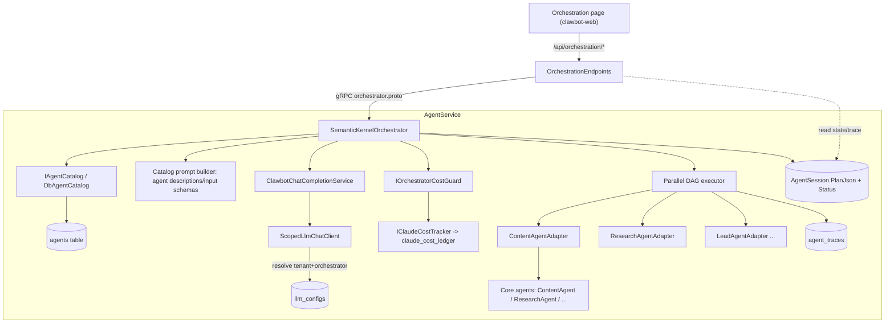

# System Design & Architecture — Dynamic Agent Orchestration (Iteration 1)

> Requirements: [2026-06-20-feature-dynamic-agent-orchestration.md](../requirements/2026-06-20-feature-dynamic-agent-orchestration.md). Approach **A**. Iteration 1 = real SK planner over the existing 8 agents + data-resolvable catalog seam. Dynamic persona creation = iteration 2.

## Architecture Overview
**What is the high-level system structure?**

Replace the keyword-matching `PlanningOrchestrator` with a **Semantic-Kernel orchestrator** in `Clawbot.AgentService`. The orchestrator plans via one LLM call (per-tenant, through a custom `IChatCompletionService` adapter), persists the plan + state to the **existing `AgentSession`/`agent_traces`**, then executes the task DAG **in parallel** by invoking the 8 agents through **uniform `IAgent` adapters** (replacing the `CatalogAgent` stubs). API (`Clawbot.Api`) drives the plan lifecycle over an **extended `orchestrator.proto`**.



- **SemanticKernelOrchestrator** — owns the single-shot SK chat-planning path; `PlanAsync(tenant, goal)` -> structured plan (JSON DAG); execution is handled by `OrchestratorGrpcService` + `ParallelDagExecutor` with cost guard + bounded re-plan. Replaces the keyword `IndexOf` planner path for dynamic orchestration while keeping legacy `Plan/Trace` RPCs compatible.
- **IAgentCatalog / DbAgentCatalog** — resolves the agent catalog from the `agents` table (`AgentConfig`), not a static array. Each entry: `code`, `displayName`, `agentType`, `description`, `inputSchema`, `orchestratable`. Replaces `DefaultAgentRegistry`.
- **Catalog prompt builder** — feeds each **orchestratable** catalog entry (code/shortName/description/input schema) into the SK chat planner prompt so the planner LLM can select + parameterize tasks. Direct SK `KernelFunction` tool invocation is intentionally deferred; execution still flows through `IAgent` adapters after plan validation.
- **ClawbotChatCompletionService : IChatCompletionService** — SK chat adapter wrapping `ScopedLlmChatClient`; `ILlmCallScope.Begin(tenantId, "orchestrator")` -> per-tenant model from `llm_configs` (ADR-010). No preview Anthropic connector.
- **IAgent adapters** — one per orchestratable agent; map generic `AgentTask` (`Input: dict<string,string>`) -> the agent's real Core call in-process. Replace the routing-only `CatalogAgent`.
- **IOrchestratorCostGuard** — pre-flight estimate + atomic/locked cap check shared across parallel tasks (over `IClaudeCostTracker`).
- **OrchestrationEndpoints** (api) — plan lifecycle: submit / get / edit / approve / run / pause / resume / cancel / trace. Perm-gated, tenant-scoped.
- **Stack delta:** **NEW dependency `Microsoft.SemanticKernel`** (RFC-gated, NuGetAudit-clean). Everything else reuses existing infra (gRPC, EF, `ScopedLlmChatClient`, `agent_traces`, telemetry).

## Data Models
**What data do we need to manage?**

**Reuse `AgentSession` (`agent_sessions`) — extend for plan lifecycle (D3):**
| Field | Type | Notes |
|---|---|---|
| Id | Guid (PK) | existing |
| TenantId | Guid | ITenantOwned (existing) |
| Goal | string? | the (PII-redacted) user goal (existing) |
| Status | string | **state machine** — `Draft \| PendingApproval \| Running \| Paused \| Completed \| Failed \| Cancelled` (extends existing pending/running/completed) |
| PlanJson | nvarchar(max) | **the DAG** (existing column, now structured — see schema below) |
| **RequiresApproval** | bool | **NEW** — effective autonomy snapshot at plan time (from per-tenant toggle, D8) |
| **ReplanCount** | int | **NEW** — bounded re-plan counter (D5) |
| **RowVersion** | rowversion/`byte[]` | **NEW** — optimistic concurrency for parallel writes (D6) |
| StartedAt / FinishedAt | DateTimeOffset | existing |

**`PlanJson` structure (the editable DAG):**
```json
{
  "version": 3,
  "tasks": [
    { "id": "t1", "agent": "research-agent", "description": "...", "input": {"topic":"HSK4"},
      "dependsOn": [], "status": "completed", "output": "...", "error": null },
    { "id": "t2", "agent": "content-agent", "description": "...", "input": {"brief":"..."},
      "dependsOn": ["t1"], "status": "pending" }
  ]
}
```

**Reuse `AgentTrace` (`agent_traces`) — execution events (existing, no schema change):** one row per task phase (`planned/started/completed/failed/re-planned/skipped`), keyed by `SessionId` + `TaskId` + `AgentName`. Parallel tasks each **insert their own trace row** + do a **targeted per-task status update** in `PlanJson` (guarded by `RowVersion`) — never a blind whole-blob overwrite (D6).

**Per-tenant autonomy toggle (D8):** new `bool` column `RequireOrchestrationApproval` on `Tenant` (default `false` = auto-run). Snapshotted to `AgentSession.RequiresApproval` at plan time. Own migration file (no `GO`).

- Migrations per [[clawbot-migration-no-go]]: `AgentSession` new columns = one `000X_*.sql` (no `GO`); any new index = its own file; EF `AgentSessionConfiguration` updated (add `IsRowVersion`, defaults).

## API Design
**How do components communicate?**

**Extend `orchestrator.proto`** (currently only `Plan` + `Trace`) with the plan lifecycle:
```proto
rpc Submit (SubmitRequest) returns (PlanResponse);      // NL goal -> draft plan (+ auto-run if !requiresApproval)
rpc GetPlan (PlanIdRequest) returns (PlanResponse);
rpc UpdatePlan (UpdatePlanRequest) returns (PlanResponse);  // edit tasks while Draft/PendingApproval
rpc Approve (PlanIdRequest) returns (PlanResponse);     // PendingApproval -> Running
rpc Control (ControlRequest) returns (PlanResponse);    // pause | resume | cancel
// Trace stream stays.
```
`PlannedTask` already carries `depends_on` -> DAG-ready. Add `status`, `output`, `error` to `PlannedTask`.

**API surface** — `app.MapGroup("/api/orchestration").RequireAuthorization().RequireRateLimiting(GeneralPolicy)` (pattern: `AgentsEndpoints`):
| Method | Route | Perm | Body | Returns |
|---|---|---|---|---|
| POST | `/api/orchestration/submit` | `orchestration:run` | `{ goal }` | `PlanDto` (Draft/Running) |
| GET | `/api/orchestration/{id}` | `orchestration:view` | — | `PlanDto` |
| GET | `/api/orchestration/{id}/trace` | `orchestration:view` | — | `TraceDto[]` |
| PUT | `/api/orchestration/{id}/plan` | `orchestration:run` | `{ planJson }` | `PlanDto` (only Draft/PendingApproval) |
| POST | `/api/orchestration/{id}/approve` | `orchestration:approve` | — | `PlanDto` |
| POST | `/api/orchestration/{id}/pause` | `orchestration:manage` | — | `PlanDto` |
| POST | `/api/orchestration/{id}/resume` | `orchestration:manage` | — | `PlanDto` |
| POST | `/api/orchestration/{id}/cancel` | `orchestration:manage` | — | `PlanDto` |

- **Auth (D10):** new perms seeded + role-assigned in `RbacSeeder.Matrix` ([[rbac-perm-seed-required]]): `run`+`view` = Admin/SalesLead/Marketer · `approve` = Admin/SalesLead · `manage` = Admin.
- **Validation (boundary):** goal non-empty <= N chars; on `UpdatePlan` validate DAG (no cycles, every `agent` in catalog & `orchestratable`, no dangling `dependsOn`); reject edits unless `Draft/PendingApproval`; transition guards -> 409.
- **Tenancy:** all reads/writes via `ITenantAccessor.Require()`; `AgentSession` query-filtered.
- **PII (D12):** redact goal + task descriptions before persist ([[pii-redact-derived-content]]).

## Component Breakdown
**What are the major building blocks?**

- **Backend (`Clawbot.Agents.Core` + `Clawbot.AgentService`)**
  - `IAgentCatalog` + `DbAgentCatalog` (replaces `DefaultAgentRegistry`).
  - `SemanticKernelOrchestrator` (replaces `PlanningOrchestrator`); keeps `OrchestratorTraceEntry` shape for back-compat where useful.
  - `ClawbotChatCompletionService : IChatCompletionService` (SK adapter over `ScopedLlmChatClient`).
  - Catalog-prompt planner wiring in `AgentService/Program.cs` (replaces `AddSingleton<AgentRegistry>(DefaultAgentRegistry.Create())` + keyword-only `PlanningOrchestrator` for dynamic lifecycle RPCs).
  - `IAgent` adapters per orchestratable agent -> Core agent calls.
  - `IOrchestratorCostGuard` + impl over `IClaudeCostTracker`.
  - `OrchestratorGrpcService` extended (Submit/GetPlan/UpdatePlan/Approve/Control).
  - `AgentSession` domain: add `RequiresApproval/ReplanCount/RowVersion` + transition methods (`MarkPlanned/Approve/Pause/Resume/Cancel/Fail/CompleteTask`).
  - `AgentSessionConfiguration` EF update + migration file(s).
  - `RbacSeeder`: add 4 `orchestration:*` perms.
- **API (`Clawbot.Api`)**
  - `OrchestrationEndpoints` + DTOs (`PlanDto`, `PlanTaskDto`, `TraceDto`); gRPC client to AgentService orchestrator.
- **Frontend (`clawbot-web`)** — minimal orchestration panel in `AgentDashboardPage`: submit goal, view plan DAG + trace, approve/pause/cancel. Typed client `shared/api/orchestration.ts` (pattern: `agents.ts`); perm-gated buttons (`orchestration:*`).
- **Dependency / RFC** — `Microsoft.SemanticKernel` (audit-clean version TBD); **confirm/supersede [RFC-001](../../.sdd/rfcs/001-semantic-kernel-vs-direct-anthropic.md)** before merge.

## Design Decisions
**Why did we choose this approach?**

- **D1 — SK as planner host only for iteration 1 (RFC-001 Option B confirmed).** Add `Microsoft.SemanticKernel`; SK hosts the chat-planning adapter and planner prompt. Agent catalog entries are supplied as structured prompt context, then validated/executed through `IAgent` adapters. Direct SK `KernelFunction` plugin execution is deferred to a later iteration. Chat stays on the direct client. New dep => RFC + NuGetAudit ([[clawbot-build-gates]]).
- **D2 — Custom `IChatCompletionService` adapter over `ScopedLlmChatClient`.** Reuses ADR-010 per-tenant resolution; avoids preview community connector. Planner runs under agentCode `"orchestrator"` (needs an `orchestrator` `AgentConfig` + `llm_config` binding — seed it).
- **D3 — Reuse `AgentSession` + `agent_traces`** (your call). `PlanJson` = DAG, `Status` = state machine, `AgentTrace` = events. Trade-off: DAG is a JSON blob (no per-task SQL querying); acceptable for iter1, `PlanJson` exists for exactly this.
- **D4 — Uniform `IAgent` adapters for ALL 8 agents (decided).** The 8 agents have **heterogeneous gRPC contracts** and the old `CatalogAgent` never actually ran them. Write one task-style adapter per agent mapping `AgentTask.Input` -> the agent's real Core call in-process. **All 8 are orchestratable**, incl. chat & sale-assist — their adapters wrap the request/response form (chat = a single **non-streaming** `ReplyAsync` turn, not the interactive stream). Catalog keeps an `orchestratable` flag for iter2, but all 8 ship `true`. Each agent's required `Input` keys documented in the plan.
- **D5 — Hybrid planner.** Single-shot structured plan (editable) + **bounded** LLM re-plan only on agent failure. Max re-plan count = **2** (accepted default).
- **D6 — Parallel DAG execution, concurrency-capped.** Independent tasks run concurrently; per-task targeted status update + `RowVersion` guard. Concurrency cap = **3** (accepted default).
- **D7 — Cost-surprise guard (mandatory). Decided: BOTH.** (a) pre-flight estimate vs remaining cap — **block auto-run** if the plan would overflow; (b) atomic/locked cap check shared across parallel tasks — **stop mid-run** when a concurrent task would cross the cap -> `Failed(cost_cap)`.
- **D8 — Auto-run default + per-tenant `require-approval` toggle.** Storage = new `bool` column on `Tenant` (accepted default). Snapshot effective mode onto `AgentSession.RequiresApproval` at plan time.
- **D9 — Catalog seam + code mapping.** `DbAgentCatalog` reads `agents` table; resolves the planner-facing agent name <-> DB `Code` (DB uses `content-agent`, old registry used `content`). Iter2 dynamic personas = insert catalog rows, no orchestrator rewrite.
- **D10 — RBAC `orchestration:*` perms seeded in `RbacSeeder.Matrix` (decided):** `orchestration:run` + `orchestration:view` = Admin, SalesLead, Marketer; `orchestration:approve` = Admin, SalesLead; `orchestration:manage` = Admin.
- **D11 — API<->AgentService via extended `orchestrator.proto`.** Keeps ADR-008; API is a separate process.
- **D12 — PII redaction** on persisted goal + task text.

## Non-Functional Requirements
**How should the system perform?**

- **Performance:** plan = 1 LLM call, target p95 < 5s (SC-8); parallel DAG keeps multi-task wall-clock near the critical path, not the sum. Concurrency cap bounds burst.
- **Cost:** planner + re-plan + agent LLM use counted in `claude_cost_ledger` (agentCode `orchestrator` for planning); $200/mo cap enforced atomically (D7). No unbounded re-plan (D5).
- **Security/Tenancy:** all plan ops tenant-scoped + perm-gated; goal/task PII-redacted; cancel/pause honor `CancellationToken` so no half-run state.
- **Reliability:** agent failure -> bounded re-plan/skip (graceful degradation, Constitution §9); transition guards prevent illegal state moves; `RowVersion` prevents lost updates under parallel writes.
- **Build:** 0/0 warnings/errors (NuGetAudit + CA); >=80% branch coverage on new logic; existing tests stay green; SK dep audit-clean.
