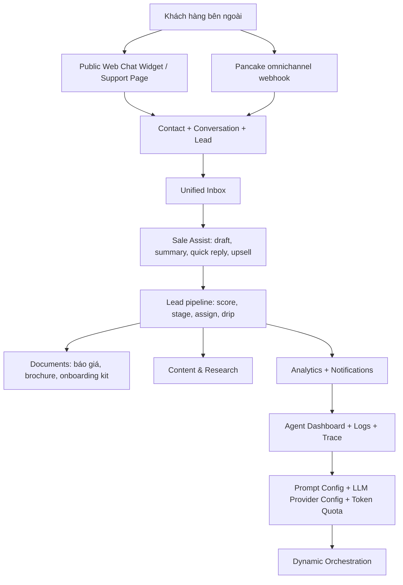

# Kịch bản demo luồng mới nhất — System Design & Architecture

> Đây là thiết kế cho bộ tài liệu demo, không phải thiết kế code mới. Mục tiêu là biến những gì đã triển khai trong ClawBot thành một câu chuyện demo rõ ràng, có thứ tự, có thông điệp kinh doanh, và có ghi chú kỹ thuật đủ để chuẩn bị môi trường.

## Architecture Overview
**Cấu trúc tổng thể của demo là gì?**

Kịch bản demo được thiết kế như một hành trình khép kín: **khách hàng bên ngoài tương tác với ClawBot → hệ thống gom hội thoại → sale được AI hỗ trợ → lead được chấm điểm và ưu tiên → hệ thống tạo tài liệu/content/báo cáo → admin kiểm soát agent, model, token và vận hành**.

Mạch demo này phù hợp với audience ban giám đốc / nhà đầu tư vì nó trả lời được ba câu hỏi chính:

1. **Hệ thống giúp tăng doanh thu như thế nào?**
   ClawBot giảm bỏ sót khách, ưu tiên lead nóng, hỗ trợ sale phản hồi nhanh hơn, tạo báo giá nhanh hơn và đo được conversion.

2. **Hệ thống vận hành thật đến đâu?**
   Demo đi qua các màn đã được triển khai: login, dashboard, inbox, sale assist, leads, documents, content, analytics, agents, prompts, tokens, system admin, public widget và orchestration.

3. **Rủi ro vận hành được kiểm soát ra sao?**
   Có RBAC, 2FA, audit/logs, notification center, token quota, LLM provider config, prompt sandbox và traceability.

## Data Models
**Demo cần dữ liệu gì?**

Kịch bản demo không tạo model mới. Nó dùng các nhóm dữ liệu đã có trong hệ thống:

| Nhóm dữ liệu | Dùng trong phần demo | Ghi chú chuẩn bị |
|---|---|---|
| User / Role / Permission | Login, RBAC, admin system | Cần tài khoản admin hoặc sales lead có đủ quyền. |
| Tenant branding | Public widget, support page, documents | Nên cấu hình tên thương hiệu, màu chính, greeting. |
| Contact / Conversation / Message | Inbox, Sale Assist, public widget | Dùng khách hàng giả, nội dung hội thoại giả hoặc đã redacted. |
| Lead / LeadActivity / LeadScoringRule | Lead pipeline, hot/warm/cold, forecast | Cần seed scoring rules và một vài lead ở các stage khác nhau. |
| QuickReplyTemplate | Sale Assist quick reply | Cần 3–5 template demo: hỏi mục tiêu, báo giá, mời học thử, follow-up. |
| KB module / KB version / test case | KB, Support FAQ, RAG-backed answer | Nếu chưa có KB thật, dùng bộ mẫu tối thiểu, không nói là accuracy production. |
| DocumentTemplate / GeneratedDocument | Báo giá, brochure, onboarding kit | Cần template `QUOTE-V1`, `BROCHURE-HSK`, `SLIDE-DEMO-5`, `ONBOARDING-KIT`. |
| ContentBrief / ContentItem / Calendar | Content pipeline | Cần vài brief và item ở trạng thái draft/approved/scheduled. |
| AgentConfig / AgentSession / AgentTrace | Agent dashboard, logs, prompts, orchestration | Cần có trace mẫu để demo history và observability. |
| LlmConfig / Token ledger | LLM provider config, token quota | Nếu chưa có key thật, demo cấu hình và trạng thái “not configured” trung thực. |
| Notification | Notification center | Cần notification mẫu: hot lead, idle conversation, anomaly, budget, system. |

### Demo seed staging

Requirements review đã chốt sẽ tạo seed dữ liệu demo riêng sau bộ tài liệu này. Thiết kế seed được chọn là **SQL seed script idempotent** trong `deploy/seed`, vì repo hiện đã có nhiều seed SQL và cách này dễ chạy lại trên staging.

Seed nên có các đặc điểm:

- Chạy được nhiều lần mà không tạo trùng dữ liệu.
- Dùng tenant demo cố định hoặc tenant slug demo rõ ràng.
- Không chứa dữ liệu khách thật.
- Không chứa secret thật, API key thật hoặc token thật.
- Có cách reset/reseed trước rehearsal.
- Bao phủ đủ dữ liệu cho các cảnh trong [docs/demo-latest-flow.md](../../demo-latest-flow.md): user, role/permission, tenant branding, contact, conversation, message, lead, activity, quick reply, document template/generated document, content item, notification, agent session/trace, token ledger và LLM config mẫu ở trạng thái an toàn.

Seed này **không nằm trong scope viết docs hiện tại**. Nó là bước tiếp theo khi chuyển sang `/execute-plan`.

## API Design
**Các phần của demo dựa trên API nào?**

Demo không cần trình bày endpoint với ban giám đốc, nhưng tài liệu phải ghi rõ để dev/QA chuẩn bị và debug.

| Phần demo | API / route chính | Mục đích |
|---|---|---|
| Login / 2FA / profile | `/auth/login`, `/auth/login/2fa`, `/auth/me`, `/api/profile` | Chứng minh bảo mật cơ bản và quyền người dùng. |
| Dashboard | `/api/analytics/omnichannel`, `/api/analytics/omnichannel-delta`, `/api/analytics/funnel`, `/api/analytics/agent-cost` | Mở đầu bằng KPI kinh doanh. |
| Inbox | `/api/inbox/conversations`, `/api/inbox/conversations/{id}`, `/api/inbox/conversations/{id}/messages` | Xem và xử lý hội thoại. |
| Sale Assist | `/api/sale-assist/draft`, `/summary`, `/quick-replies`, `/daily-summary`, `/upsell` | AI hỗ trợ sale trả lời và ra quyết định tiếp theo. |
| Leads | `/api/leads`, `/api/leads/{id}`, `/api/leads/{id}/activities`, `/api/leads/{id}/assign`, `/api/leads/forecast` | Pipeline, chấm điểm, phân loại và dự báo. |
| Documents | `/api/docs/generate`, `/api/docs/generate-kit`, `/api/docs/templates`, `/api/docs/generated` | Tạo báo giá và bộ tài liệu bán hàng. |
| Content | `/api/content/briefs`, `/api/content/trends`, `/api/content/items/generate`, `/api/content/queue`, `/api/content/calendar` | Tự động hóa nội dung marketing. |
| Notifications | `/api/notifications`, `/api/notifications/unread-count` | Trung tâm cảnh báo nội bộ. |
| Agents | `/api/agents`, `/api/agents/{code}/settings`, `/api/agents/{code}/sandbox`, `/api/agents/{code}/traces` | Quản lý và test agent. |
| Prompts | `/api/prompts/configs`, `/api/prompts/configs/{code}`, `/api/prompts/configs/{code}/sandbox` | Quản lý prompt gốc và test sandbox. |
| Tokens | `/api/tokens/usage`, `/api/tokens/settings` | Kiểm soát chi phí và hạn ngạch AI. |
| LLM provider | `/api/llm-configs` | Cấu hình provider/model/API key theo tenant. |
| Orchestration | `/api/orchestration/*` | Demo mục tiêu tự nhiên → kế hoạch agent → chạy/trace. |
| Public widget | `/api/public/widget/{tenantSlug}/bootstrap`, `/lead`, `/messages`, `/faq` | Cho thấy khách hàng ngoài hệ thống đi vào CRM. |
| System admin | `/api/admin/users`, `/api/rbac`, `/api/api-keys`, `/api/channels/pancake`, `/api/admin/tenant/branding` | Quản trị người dùng, quyền, tích hợp và thương hiệu. |

## Component Breakdown
**Bộ tài liệu gồm những phần nào?**

### 1. AI DevKit phase docs

- Requirements: xác định mục tiêu, audience, phạm vi và tiêu chí hoàn thành.
- Design: thiết kế mạch demo, dữ liệu, API và quyết định trình bày.
- Planning: task breakdown để hoàn thiện tài liệu và chuẩn bị demo.
- Implementation: hướng dẫn viết tài liệu, nguyên tắc bám code và các phần cần cập nhật.
- Testing: checklist review tài liệu và smoke test môi trường demo.
- Deployment: cách đưa tài liệu vào repo, cách chuẩn bị môi trường demo.
- Monitoring: cách theo dõi chất lượng demo sau khi tài liệu được dùng.

### 2. Tài liệu demo chính

Tạo [docs/demo-latest-flow.md](../../demo-latest-flow.md) với cấu trúc:

1. Mục tiêu demo.
2. Audience và thông điệp chính.
3. Checklist chuẩn bị.
4. Kịch bản 12–15 phút.
5. Lời thoại gợi ý theo từng cảnh.
6. Màn hình / module cần mở.
7. Dữ liệu demo cần có.
8. Phần “đã triển khai” và “cần credential / dữ liệu thật”.
9. Câu hỏi thường gặp khi demo.
10. Checklist sau demo.

### 3. Các tài liệu tham chiếu

- [docs/plan.md](../../plan.md): checklist frontend/backend mới nhất.
- [docs/module-checklist.md](../../module-checklist.md): trạng thái module theo P0/P1/P2.
- [docs/sale-flow.md](../../sale-flow.md): chi tiết sale/inbox/lead/Sale Assist.
- [docs/login-flow.md](../../login-flow.md): chi tiết auth/login.

## Design Decisions
**Vì sao chọn cách này?**

### D1 — Chọn “board demo script” thay vì runbook kỹ thuật

Audience là ban giám đốc / nhà đầu tư, nên demo phải kể câu chuyện kinh doanh. Nếu viết như runbook kỹ thuật, người nghe sẽ thấy nhiều endpoint nhưng không thấy giá trị. Vì vậy tài liệu chính sẽ bắt đầu bằng bài toán doanh thu và vận hành, sau đó mới đi vào tính năng.

### D2 — Demo full product tour, nhưng vẫn có mạch chính là bán hàng

ClawBot hiện đã có nhiều surface. Nếu chỉ demo sale flow thì bỏ sót phần vận hành AI rất quan trọng như prompt config, LLM provider config, token quota, logs và orchestration. Tuy nhiên, toàn bộ tour vẫn phải xoay quanh câu chuyện bán hàng: khách vào, sale xử lý, lead được chăm sóc, hệ thống đo lường và vận hành.

### D3 — Phân loại rõ “có thể demo” và “cần điều kiện vận hành”

Một số code path đã có nhưng cần credential hoặc dữ liệu thật để chứng minh live. Ví dụ: live Pancake payload, real LLM/embedder, SMTP, MinIO, publisher hoặc Meta/TikTok credentials. Tài liệu phải nói rõ điều kiện này để tránh demo quá lời.

### D4 — Dùng SignalR / in-app notification làm kênh alert chính

Theo trạng thái hiện tại, Telegram đã được retired khỏi hướng sản phẩm. Kịch bản demo không dùng Telegram làm kênh chính. Các cảnh báo như hot lead, idle conversation, anomaly, budget và system event được trình bày qua notification center và realtime UI.

### D5 — Dùng Pancake unified adapter làm câu chuyện omnichannel hiện tại

Tài liệu cũ có nhắc n8n hoặc từng API native. Code hiện tại chọn Pancake là cổng omnichannel thống nhất. Vì vậy demo nói: “ClawBot tích hợp qua Pancake để gom kênh vào một inbox”, không nói hệ thống hiện tự tích hợp trực tiếp từng vendor như lõi chính.

### D6 — Không che giấu gap, nhưng đặt đúng ngữ cảnh

Với audience lãnh đạo, gap phải được nói theo hướng quản trị rủi ro: “đường code đã có nhưng cần credential/live payload để xác nhận”, hoặc “phase tiếp theo cần dữ liệu KB chuẩn để chứng minh accuracy”. Không trình bày gap như lỗi sản phẩm nếu đó là điều kiện vận hành.

### D7 — Demo seed staging dùng SQL seed script idempotent

Requirements review đã chốt môi trường demo chính là staging và cần seed dữ liệu demo riêng. Cách thiết kế được chọn là SQL seed script idempotent trong `deploy/seed`, thay vì API seeder hoặc nhập tay. Lý do: repo đã có convention seed SQL, dễ chạy lại trước rehearsal, dễ review diff, không phụ thuộc frontend hoặc auth token, và phù hợp với staging. Trade-off là seed cần hiểu schema và phải tránh chứa secret hoặc dữ liệu thật.

### D8 — Live/fallback path được trình bày bằng bảng từng cảnh

Requirements review đã chốt credential xử lý theo mô hình hai lớp: live path khi có credential, fallback path khi thiếu credential hoặc vendor chưa verify. Cách thể hiện trong tài liệu demo được chọn là **bảng từng cảnh** với các cột: cảnh demo, live path, fallback path, điều kiện cần có. Cách này giúp người demo chuyển mạch rõ ràng mà không làm người nghe hiểu nhầm rằng mọi vendor đã chạy live.

## Non-Functional Requirements
**Tài liệu demo cần đạt chất lượng gì?**

- **Dễ hiểu:** viết bằng tiếng Việt đầy đủ câu, hạn chế thuật ngữ không giải thích.
- **Chính xác:** mọi claim kỹ thuật phải dựa vào code hoặc tài liệu hiện có trong repo.
- **Không phóng đại:** không nói tính năng chạy live nếu thực tế cần credential hoặc dữ liệu thật.
- **Dễ dùng:** người demo có thể đọc theo thứ tự và chạy được trong 12–15 phút.
- **Dễ kiểm thử:** QA có checklist rõ để xác minh môi trường trước buổi demo.
- **An toàn dữ liệu:** không dùng dữ liệu khách thật; nếu có hội thoại mẫu thì phải là dữ liệu giả hoặc đã redacted.
- **Bảo trì được:** khi code thay đổi, chỉ cần cập nhật một tài liệu chính và các phase docs liên quan.
