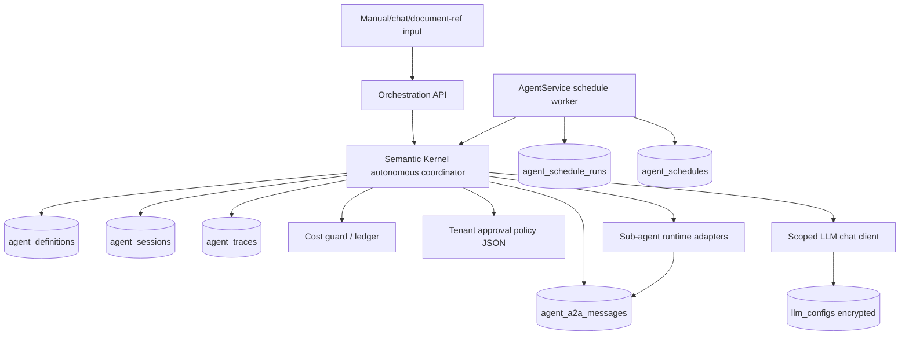

# Dynamic Agent Orchestration v2 — System Design & Architecture

## Context Quality Assessment

- V1 code already has `SemanticKernelOrchestrator`, `OrchestratorGrpcService`, `AgentSession`, `agent_traces`, LLM scoping, cost guard, and parallel DAG execution foundation.
- V2 needs new runtime contracts for sub-agent definitions, A2A mailbox, schedules, and schedule runs.
- Demo LLM seed must reuse existing encrypted `llm_configs`; plaintext secrets stay outside repo.

## Executive Summary

V2 adds a bounded autonomous layer around the V1 orchestration foundation. Semantic Kernel acts as coordinator. Sub-agents are data records with persona, skills, memory scope, and model binding. Agents collaborate through persisted A2A messages. A scheduler creates orchestration sessions on daily, weekly, monthly, and quarterly cadences. Guardrails enforce tenant isolation, RBAC, cost, cancellation, approval, and traceability.

## Architecture Overview



The scheduler runs inside AgentService and invokes the orchestration service in-process. It does not call the public HTTP API loopback.

## Data Models

### `agent_definitions`

Sub-agent/persona as data.

| Column | Notes |
|---|---|
| `id` | PK |
| `tenant_id` | tenant scoped |
| `code` | stable unique code per tenant |
| `display_name` | UI label |
| `persona_prompt` | system/persona prompt, PII-safe |
| `allowed_tools_json` | tool/skill allowlist |
| `input_schema_json` | expected task input shape |
| `output_schema_json` | expected output/artifact shape |
| `memory_scope` | `tenant`, `campaign`, `session`, or `none` |
| `llm_config_id` | optional FK to `llm_configs` |
| `is_orchestratable` | visible to coordinator |
| `version` | definition version used by runs |
| `created_at`, `updated_at`, `deleted_at` | lifecycle |

### `agent_a2a_messages`

Persisted agent-to-agent mailbox.

| Column | Notes |
|---|---|
| `id` | PK |
| `tenant_id` | tenant scoped |
| `session_id` | FK to `agent_sessions` |
| `from_agent_definition_id` | nullable for system/coordinator |
| `to_agent_definition_id` | target agent |
| `task_id` | task/run correlation |
| `intent` | `plan`, `delegate`, `result`, `critique`, `revise`, `finalize`, `stop` |
| `payload_json` | message content/artifact refs, redacted |
| `status` | `pending`, `processing`, `completed`, `failed`, `cancelled` |
| `error` | safe error text |
| `created_at`, `processed_at` | timestamps |

### `agent_schedules`

Recurring orchestration policy.

| Column | Notes |
|---|---|
| `id` | PK |
| `tenant_id` | tenant scoped |
| `name` | schedule name |
| `goal_template` | scheduled goal text, redacted |
| `cadence` | `daily`, `weekly`, `monthly`, `quarterly` |
| `cron_expression` | optional advanced representation |
| `timezone_id` | IANA timezone |
| `next_run_at`, `last_run_at` | UTC timestamps |
| `overlap_policy` | default `skip` |
| `misfire_policy` | default `skip_missed` |
| `requires_approval` | schedule-level gate override |
| `approval_policy_json` | optional override; otherwise use tenant policy JSON |
| `is_active` | enable/disable |

### `agent_schedule_runs`

One row per schedule firing.

| Column | Notes |
|---|---|
| `id` | PK |
| `schedule_id` | FK |
| `tenant_id` | tenant scoped |
| `session_id` | nullable until session created |
| `window_key` | unique idempotency key per cadence window |
| `status` | `started`, `skipped_overlap`, `completed`, `failed`, `cancelled` |
| `started_at`, `finished_at` | timestamps |

## API Design

Extend `/api/orchestration` with V2 routes:

| Method | Route | Permission | Purpose |
|---|---|---|---|
| POST | `/api/orchestration/v2/runs` | `orchestration:run` | Start manual/chat/document-reference sourced autonomous run |
| GET | `/api/orchestration/v2/runs/{id}` | `orchestration:view` | Read session, messages, trace summary |
| POST | `/api/orchestration/v2/runs/{id}/control` | `orchestration:manage` | pause/resume/cancel/steer |
| GET | `/api/orchestration/v2/agents` | `orchestration:view` | list sub-agent definitions |
| POST | `/api/orchestration/v2/agents` | `orchestration:manage` | create/update data-defined sub-agent |
| GET | `/api/orchestration/v2/schedules` | `orchestration:view` | list schedules |
| POST | `/api/orchestration/v2/schedules` | `orchestration:manage` | create schedule |
| POST | `/api/orchestration/v2/schedules/{id}/run-now` | `orchestration:run` | manual fire schedule |

`POST /api/orchestration/v2/runs` request:

```json
{
  "source": "manual|chat|document",
  "goal": "Prepare HSK4 launch campaign",
  "conversationId": "optional-guid-for-chat-source",
  "documentRefs": ["document-or-artifact-id"],
  "requiresApproval": false
}
```

`POST /api/orchestration/v2/schedules` request:

```json
{
  "name": "Daily lead triage",
  "goalTemplate": "Review hot leads and produce follow-up plan",
  "cadence": "daily|weekly|monthly|quarterly|cron",
  "cronExpression": "0 9 * * 1",
  "timezoneId": "Asia/Ho_Chi_Minh",
  "overlapPolicy": "skip",
  "misfirePolicy": "skip_missed",
  "requiresApproval": false
}
```

Document-sourced runs pass document/content references and extracted summaries only; raw uploaded text is not copied into orchestration payloads.

## Component Breakdown

- `AutonomousOrchestrator` — SK coordinator loop: plan, delegate, wait for A2A results, review, replan, stop.
- `AgentDefinitionCatalog` — loads/creates sub-agent definitions from DB.
- `A2AMailbox` — persists and claims messages with tenant/session locks.
- `AgentScheduleWorker` — runs inside AgentService, scans due schedules, claims windows, creates sessions, applies overlap policy, invokes coordinator in-process.
- `RecurrenceCalculator` — computes `next_run_at` from presets or optional cron plus timezone.
- `DemoLlmConfigSeeder` — reads local key from env/CLI, encrypts through existing encryption service, upserts `llm_configs`, binds `orchestrator` and seeded sub-agents.
- Dedicated Orchestration page — owns schedule/run management, A2A timeline, pause/cancel/run-now.
- Agent Dashboard summary cards — later embed high-level active/failed schedule/run status only.

## Design Decisions

1. **Sub-agents as data, not codegen.** Safer, auditable, deploy-free.
2. **A2A mailbox over in-memory callbacks.** Persisted traceable collaboration; survives process restarts.
3. **Reuse `AgentSession`.** Session already models orchestration run lifecycle; new tables only cover V2-specific data.
4. **Schedule windows with idempotency.** Prevent duplicate daily/weekly/monthly/quarterly runs.
5. **Local LLM seed through encrypted DB path.** Demo works while preserving production secret hygiene.
6. **No overlapping scheduled runs by default.** Skip beats queue for demo and cost control; queue can be added later.
7. **In-process scheduler invocation.** AgentService schedule worker calls coordinator directly instead of HTTP loopback.
8. **Tenant policy JSON for approvals.** Faster than a new policy table; enough for V2 while keeping high-risk action classes configurable.
9. **Dedicated Orchestration page first.** Keeps V2 schedule/A2A complexity out of Agent Dashboard; dashboard summary cards can come later.
10. **Presets plus optional cron.** Presets cover demo/business cases; cron supports advanced schedules with validation.

## Security Considerations

- All V2 endpoints require existing `orchestration:*` permissions.
- Tenant ID from authenticated context; request body tenant IDs ignored or validated.
- API key plaintext exists only in process memory during seed, never in SQL files or docs.
- A2A payloads persist redacted derived text and artifact references, not raw customer content unless retention policy allows it.
- External-facing/destructive/costly actions are checked against tenant approval policy JSON. Policy can require approval even when a schedule or tenant normally auto-runs.

## Performance Considerations

- Coordinator loop has max rounds and max runtime.
- Worker concurrency is capped per session and per tenant.
- Schedule scan uses indexed `is_active,next_run_at` query.
- A2A claiming uses row locking or optimistic status transition to avoid double-processing.

## Acceptance Criteria

- Data-defined sub-agent can be added and selected by coordinator without code changes.
- Schedule fires once per cadence window in tenant timezone.
- A2A messages show delegate/result/critique/finalize flow.
- Local OpenAI-compatible LLM config is encrypted and bound to orchestrator.
- Cost cap, cancellation, and RBAC failures produce safe terminal states.

## Traceability Matrix

| Requirement | Design Element |
|---|---|
| SK coordinator | `AutonomousOrchestrator` |
| Input sources | V2 run API source fields |
| Sub-agents as data | `agent_definitions` |
| A2A collaboration | `agent_a2a_messages` + `A2AMailbox` |
| Schedules | `agent_schedules`, `agent_schedule_runs`, worker |
| LLM seed | `DemoLlmConfigSeeder` |
| Guardrails | RBAC, cost guard, max rounds, approval gates |

## Review Notes

- Requires `/review-design` before implementation.
- V2 supersedes Iteration 1 non-goals around dynamic personas and full A2A; those were scoped out only for V1.
