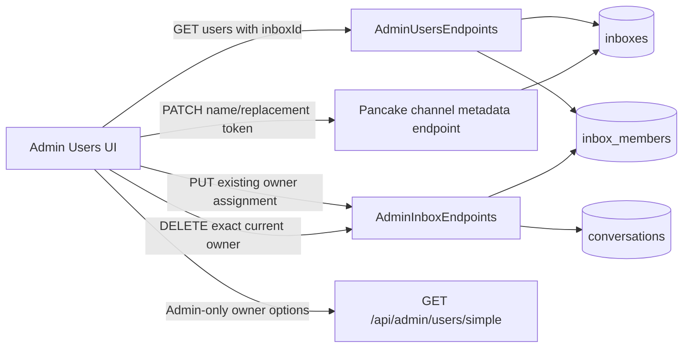

# User Pancake Channel Management — System Design

## Architecture Overview

The current EF model enforces a **single responsible user per inbox**: `InboxMember` has composite identity `(InboxId, AgentId)` and `AppDbContext` adds a unique index on `InboxId`. One user may own multiple inboxes, but one inbox has at most one member.

The feature therefore separates only the operations that actually need different contracts:

1. `GET /api/admin/users` adds stable `inboxId` to each projected channel.
2. A dedicated token-manager endpoint updates shared channel name/replacement token.
3. The existing Admin-only `PUT /api/admin/inboxes/{id}/members` assigns or changes the single responsible user.
4. A new exact DELETE removes the current `(inboxId, agentId)` relation and permits the inbox to become unassigned.



No new package, service, or database migration is required.

## Data Models

```text
Inbox
- Id: Guid
- TenantId: Guid
- Name: string
- Platform: string
- ExternalPageId: string
- EncryptedAccessToken: string?
- DeletedAt: DateTime?

InboxMember
- InboxId: Guid       ┐ composite identity
- AgentId: Guid       ┘
- TenantId: Guid
- UNIQUE(InboxId)     => at most one responsible user per inbox

Conversation
- InboxId: Guid?
- AssignedTo: Guid?
```

### Admin user channel projection

```json
{
  "inboxId": "b6b4290e-f1ea-4126-8912-1e05ec5251f2",
  "pageId": "134970094277281958",
  "name": "Hồng Vân Học Bá",
  "platform": "facebook",
  "hasToken": true
}
```

Rules:

- `inboxId` is the mutation identity and React key.
- Page ID/platform are read-only in this feature.
- Token data remains write-only; the response exposes only `hasToken`.
- Deleted and cross-tenant inboxes remain excluded.

## API Design

### 1. Admin user channel projection

`GET /api/admin/users`

Authorization remains the current endpoint behavior: `admin.system` or `users:pancake-token:manage`.

Change only the projection:

- Include `InboxId = i.Id` in the channel query/result.
- Preserve current bounded pagination and batched membership query.

### 2. Update shared channel metadata

`PATCH /api/admin/pancake-channels/{inboxId}`

This is a separate rate-limited route group so it can require token-management permission without inheriting the existing Admin-only inbox group.

Authorization:

- `users:pancake-token:manage`

Request:

```json
{
  "name": "Hồng Vân Học Bá",
  "pageAccessToken": "replacement-secret"
}
```

Both fields are optional individually, but at least one effective value is required.

Behavior:

- Load an active inbox by current tenant, ID, and `DeletedAt == null`.
- Trim supplied values.
- Validate name against the configured 256-character limit.
- Reject blank supplied values.
- Encrypt the replacement token before persistence and validate storage constraints.
- Omitted values stay unchanged.
- Never log or return raw/encrypted token material.
- Return `204` on success.

Errors:

| Condition | Status | Stable code |
|---|---:|---|
| No effective field | 400 | `channel_update_required` |
| Blank name | 400 | `channel_name_required` |
| Name too long | 400 | `channel_name_too_long` |
| Blank/invalid token | 400 | `page_access_token_invalid` |
| Missing/deleted/cross-tenant inbox | 404 | generic not found |
| Missing permission | 403 | existing authorization response |

### 3. Assign or change the responsible user

Reuse:

`PUT /api/admin/inboxes/{inboxId}/members`

Authorization:

- `admin:inboxes`

Request:

```json
{
  "agentId": "ff74c1a8-a4ec-44b0-8a4d-6b498f7eab30"
}
```

Required corrections while reusing the endpoint:

1. If the requested agent is already the current owner, return `204` without removing/re-adding the relation and without unassigning conversations.
2. If changing owner, replace the single relation and unassign only conversations where both the affected inbox and former owner match.
3. If assigning an unowned inbox, add the relation without unassigning conversations.
4. After saving, emit one conversation update per affected conversation using `conversation.Id`, `conversation.Status`, `conversation.AssignedTo`, and `conversation.LastMessageAt`. The current implementation incorrectly emits an inbox ID as a conversation ID.
5. Preserve the requested user's ownership of other inboxes.

The existing nullable `agentId` branch remains a legacy contract and is not used by this feature for unlinking.

### 4. Unlink the exact current owner

`DELETE /api/admin/inboxes/{inboxId}/members/{agentId}`

Authorization:

- `admin:inboxes`

Behavior:

1. Load the active current-tenant inbox.
2. Load the exact `(inboxId, agentId)` relation.
3. If either is absent, return `404` so a stale UI cannot remove a different current owner.
4. Load only conversations where `InboxId == inboxId` and `AssignedTo == agentId`.
5. Unassign those conversations and remove the exact relation in one save/transactional unit.
6. Leave the inbox active with zero members allowed.
7. After persistence, emit one update per affected conversation using the actual conversation ID.

Success returns `204`. Repeated deletion returns `404`.

### Permission matrix

| Operation | Permission |
|---|---|
| View Admin Users/channel projection | Existing `admin.system` or `users:pancake-token:manage` |
| Edit channel name/token | `users:pancake-token:manage` |
| Load owner options | `admin:inboxes` |
| Assign/change owner | `admin:inboxes` |
| Exact unlink | `admin:inboxes` |
| Edit account/profile | `admin.system` |

Sales Leads can maintain channel metadata/token but cannot manage ownership. If that requirement changes later, introduce a dedicated permission rather than broadening token permission.

## Component Breakdown

### Backend

#### `src/api/Clawbot.Api/Endpoints/AdminUsersEndpoints.cs`

- Add `inboxId` to channel projection.
- Preserve create-user and explicit add-channel behavior.

#### `src/api/Clawbot.Api/Endpoints/AdminInboxEndpoints.cs`

- Add the separate metadata PATCH route/policy.
- Add exact owner DELETE.
- Harden existing owner PUT for same-owner no-op, scoped unassignment, and correct real-time event IDs.
- Reuse tenant resolution, encryption, `Conversation.Unassign()`, and notifier patterns.
- Keep the legacy nullable-member branch for compatibility, but do not call it from the new UI.

### Frontend

#### `src/frontend/clawbot-web/src/shared/api/admin.ts`

- Add required `inboxId` to `PancakeChannelInfo`.
- Add `updatePancakeChannel` and `unlinkInboxMember`.
- Reuse `updateInboxMember` for owner assignment/change.
- Keep token fields request-only.

#### `src/frontend/clawbot-web/src/features/admin/AdminUsersTab.tsx`

- Render name, platform, Page ID, and token status for every channel.
- Use `inboxId` as key.
- Pass source user plus channel to action callbacks.
- Gate metadata actions separately from owner/unlink actions.

#### `src/frontend/clawbot-web/src/features/admin/AdminConsolePage.tsx`

- Compute `canManageUsers`, `canManagePancakeToken`, and `canManageInboxOwners` independently.
- Own selected channel state and mutations.
- Load simple users only while the channel modal is open and `canManageInboxOwners` is true.
- Reuse `updateInboxMember` for owner changes.
- Use exact DELETE for unlink.
- Invalidate `['admin']` after success; avoid optimistic movement across paginated users.

#### New `AdminPancakeChannelModal.tsx`

Reuse `Modal`, `ConfirmDialog`, `Alert`, `Button`, `StatusPill`, `Field`, and `inputClass`.

Sections:

1. **Channel information** — editable name, read-only platform/Page ID, blank replacement-token input.
2. **Responsible user** — current source user and Admin-only user selector/change action.
3. **Unlink** — Admin-only confirmation stating that the inbox remains, matching conversations are unassigned, and the channel becomes unassigned.

Metadata save and owner change remain separate actions so failures are clear.

#### `AdminUserModal.tsx` / `AdminConsolePage.openEditUser`

- Stop seeding inputs from `pancakeChannels[0]`.
- Keep blank, explicitly labeled **Add a new channel** fields.
- Submit channel fields only when Page ID is entered.

## Design Decisions

### Recommendation

Use a dedicated metadata endpoint, reuse the existing single-owner assignment endpoint, and add only the missing exact unlink endpoint.

Why:

- Matches the actual unique-owner schema.
- Minimizes new contracts.
- Keeps least-privilege metadata access for Sales Leads.
- Prevents stale unlink requests from deleting a newly changed owner.
- Preserves create/add-channel compatibility.

### Alternatives rejected

1. **Generic user update for existing-channel editing** — cannot identify the intended channel reliably and perpetuates `pancakeChannels[0]` behavior.
2. **Put metadata on the existing Admin-only inbox update** — blocks Sales Lead token managers or requires broadening an Admin route.
3. **Add a second transfer endpoint** — redundant because the database already enforces one owner and the existing PUT is the correct assignment contract once same-owner/event bugs are fixed.
4. **Move ownership to `Inbox.OwnerAgentId`** — unnecessary migration and broad access-control churn.

### External reference check

No public repository matched the stack and feature closely enough to adopt. The endpoint behavior follows established Minimal API and EF Core patterns:

- [ASP.NET Core Minimal API tutorial](https://learn.microsoft.com/en-us/aspnet/core/tutorials/min-web-api?view=aspnetcore-10.0)
- [Minimal API authorization](https://learn.microsoft.com/en-us/aspnet/core/fundamentals/minimal-apis?view=aspnetcore-10.0)
- [EF Core composite keys](https://learn.microsoft.com/en-us/aspnet/core/data/ef-rp/complex-data-model?view=aspnetcore-10.0)
- [EF Core relationship changes](https://learn.microsoft.com/en-us/ef/core/change-tracking/relationship-changes)

## Non-Functional Requirements

### Security

- Validate every input at the API boundary.
- Treat cross-tenant IDs as not found.
- Enforce exact permissions and existing rate limits.
- Never return/log raw or encrypted token values.
- Keep owner-options calls disabled for principals without `admin:inboxes`.

### Reliability

- Same-owner PUT is a no-op and must not unassign work.
- Change/unlink queries always scope conversations by both inbox and former owner.
- Exact DELETE includes `agentId` to reject stale clients safely.
- Persist before publishing real-time events; failures must be logged without exposing secrets.

### Performance

- `inboxId` adds no query.
- Owner/unlink work is bounded to one inbox and its matching assigned conversations.
- No frontend optimistic reconciliation for paginated user data.

### Accessibility and UX

- Use existing accessible modal/confirmation components.
- Explain shared-resource effects: name/token changes apply everywhere the channel appears.
- Explain owner effects: owner change/unlink unassigns matching conversations; unlink does not delete the channel.
- Disable duplicate submissions and reset token input on close/channel change.

### Maintainability

- Keep account editing separate from existing-channel editing.
- Reuse the owner endpoint instead of adding a redundant abstraction.
- Keep new handlers and components focused and aligned with nearby conventions.
