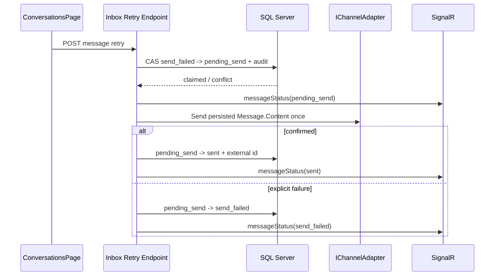

# Failed Message Retry Design

## Architecture Overview

- `InboxEndpoints` owns authorization and the retry orchestration, reusing `ApproveDraftAsync` patterns.
- `IChannelAdapter` remains the only channel-send boundary and keeps automatic HTTP retry disabled.
- SignalR receives a dedicated status event so older-message retries do not alter list preview metadata.

## Data Models

- Reuse `Message`; no migration.
- Eligible row: current tenant/conversation, `Direction=out`, `SenderType in (agent, ai, bot)`, `Status=send_failed`, `ExternalMessageId=null`.
- State machine: `send_failed -> pending_send -> sent | send_failed`.
- `pending_send` is terminal for manual reconciliation if channel success is followed by DB persistence failure.
- Add `InboxMessageStatusEvent(ConversationId, MessageId, Status, AssignedTo, InboxId)`.

## API Design

`POST /api/inbox/conversations/{conversationId}/messages/{messageId}/retry`

- Permission: `conversations:write`.
- Body: none.
- `200`: existing `MessageDto` with final status.
- `403`: outside inbox scope/missing permission.
- `404`: foreign/missing conversation or message.
- `409 message_retry_not_available`: invalid direction/sender/status/external ID.
- `409 message_already_claimed`: compare-and-set lost.
- `400 channel_send_failed` or safety error: row restored to `send_failed`.

## Component Breakdown

- Backend route/handler: `src/api/Clawbot.Api/Endpoints/InboxEndpoints.cs`.
- Notification contract: `src/shared/Clawbot.SharedKernel/Inbox/IInboxNotifier.cs`.
- SignalR/no-op implementations: API hub and infrastructure notifier.
- API client/realtime cache: `shared/api/inbox.ts`, `useInboxRealtime.ts`.
- Per-message UI/mutation: `ConversationsPage.tsx`.

## Design Decisions

- Resend persisted content, not regenerated content, to make the action predictable and auditable.
- Database compare-and-set prevents duplicate clicks without a schema change.
- Claim and explicit `message:retry` audit row commit together before external I/O.
- Safety is rerun against the claimed persisted content.
- Final `sent` save stays outside adapter error handling; ambiguous provider acceptance never becomes retryable automatically.
- Dedicated realtime status event avoids corrupting `lastMessageAt`/preview for retries of older bubbles.

## Non-Functional Requirements

- One adapter call per successful claim.
- No message content, tokens, or provider bodies in retry logs/audit metadata.
- Explicit tenant predicates plus existing global filters and inbox membership checks.
- Frontend mutation sets `retry: false`; only clicked message is disabled.
