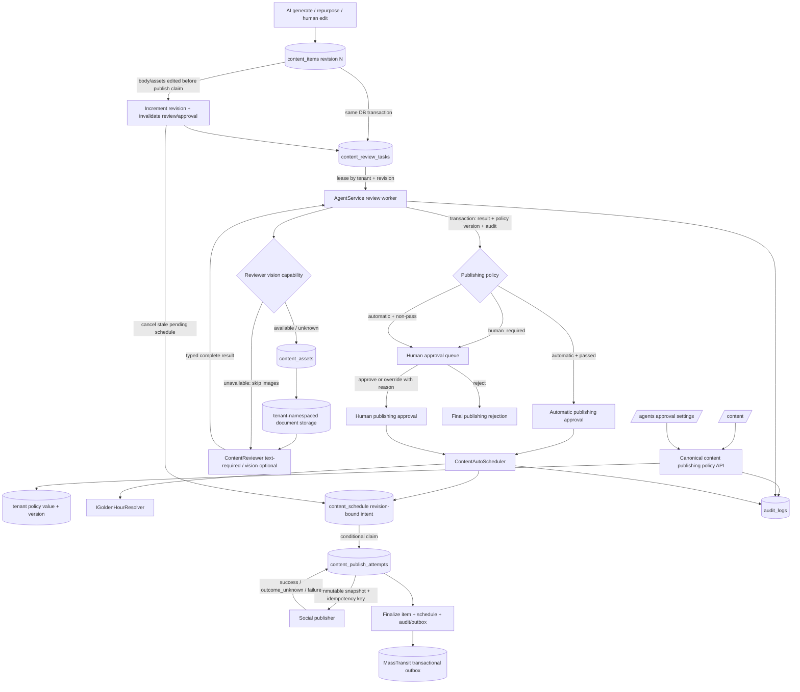

# System Design & Architecture — `content-publishing-approval-policy`

## Architecture Overview
**What is the high-level system structure?**

Thiết kế tách ba concern độc lập:

1. **Content revision** — bản text + assets cụ thể đang được xét.
2. **Agent quality review** — text luôn bắt buộc và gắn với revision; ảnh được review best-effort khi reviewer/model hỗ trợ vision.
3. **Publishing approval policy** — tenant chọn tự động hoặc cần người; chỉ quyết định ai cấp quyền phát hành sau review.



Key responsibilities:

- **`ContentItem`** owns revision, current Agent review state and publishing approval state. `MarkPublished` always enforces current-revision review and approval; no tenant flag can bypass it.
- **`ContentReviewTask`** is the durable cross-host command. API edits and AgentService generation persist one unique task per item/revision in the same database transaction as revision invalidation. An AgentService worker leases and processes tasks by explicit tenant id.
- **`ContentReviewCoordinator`** runs inside that worker, loads server-owned assets, invokes the reviewer, rejects stale results, snapshots policy value/version and routes to auto approval or human fallback.
- **`ContentReviewer`** keeps mandatory KB-aware text review. When the resolved binding supports vision, it receives decoded images/frames and must return a typed completeness outcome; otherwise it reviews text only and returns `skipped_unsupported`.
- **`ContentAutoScheduler`** creates the revision-bound `content_schedule` intent in the same transaction as publishing approval, persists the initially selected golden time, and never recreates a user-canceled intent implicitly.
- **`ContentPublishAttempt`** atomically claims a due schedule, freezes the exact body/assets snapshot and stable idempotency key before the external call, and records `succeeded|failed|outcome_unknown`.
- **Canonical policy API** is the sole writer. Both `/content` and `/agents` use it and the same React Query key.
- **Explicit business audit** is committed with each state transition; notifications are explicitly enlisted in the MassTransit transactional outbox. Outbox enlistment errors for these events must propagate/retain the event rather than use the current swallow-and-clear behavior. Generic audit excludes body/assets/provider payloads.

No new runtime service is introduced. Existing .NET hosts, EF Core, SQL Server, Hangfire, document storage, publisher and notification infrastructure are reused.

## Data Models
**What data do we need to manage?**

### Tenant publishing policy

Add to `tenants`:

| Column | Type | Rules |
|---|---|---|
| `content_publishing_approval_policy` | `nvarchar(32)` | NOT NULL, default `human_required`; allowed: `automatic`, `human_required` |
| `content_publishing_policy_version` | `bigint` | NOT NULL, monotonic; increment on every policy mutation |
| `content_publishing_policy_updated_at` | `datetimeoffset` | NOT NULL; source for API `updatedAt` |

Domain API:

- `Tenant.ContentPublishingApprovalPolicy`
- `Tenant.ContentPublishingPolicyVersion`
- `Tenant.ContentPublishingPolicyUpdatedAt`
- `Tenant.SetContentPublishingApprovalPolicy(string policy, DateTimeOffset at)` validates the closed set and increments version only when value changes.

Review completion and policy mutation both acquire the tenant row with SQL Server `UPDLOCK,HOLDLOCK` inside one transaction. The worker reads policy value/version under that lock, then commits review routing, approval/schedule intent and applied version before releasing it. If conditional affected-row checks fail, retry evaluation; merely storing an expected version without locking/conditional SQL is insufficient.

`RequireContentReview` is deprecated because its semantics are incompatible. During one compatibility release:

- New code ignores it for gating.
- Deprecated GET shapes report Agent review as mandatory.
- `/api/content/settings/publishing-policy` is the sole mutation API. Legacy PUT containing `RequireContentReview` returns one stable `content.review_setting_deprecated` error and mutates neither old nor new policy state.
- Remove the old column/property only after old workers and clients are retired.

### SQL-enforced runtime write gate

Add a singleton `content_workflow_runtime_gate` row with `publication_paused`, `minimum_writer_version`, `updated_at` and operator metadata. A bridge release makes every API/AgentService/Hangfire DB connection set `SESSION_CONTEXT('clawbot_content_writer_version')`. SQL triggers on content workflow write tables reject absent/lower writer versions once `minimum_writer_version` is raised; this prevents a stopped old binary from silently resuming writes. `publication_paused` blocks schedule claims/attempt creation and external delivery, but still permits new-version review/classification/audit work during cutover.

Cutover order: deploy bridge everywhere while minimum is permissive → verify every live connection reports a version → set `publication_paused=1`, raise minimum and activate outbound fencing → drain/stop old instances → deploy new compatibility build → classify/smoke → remove outbound fence and clear pause for the new version. Reads remain available.

SQL fencing alone cannot stop an old binary that calls a provider before its final DB write. During pause, block social-provider egress at firewall/service-mesh level or temporarily revoke/deactivate publisher credentials, and disable Hangfire/AdminJobs manual trigger endpoints. Restore egress/credentials only after old processes are proven stopped and the new due worker is active.

### `ContentItem` revision-bound review and approval

Recommended additive fields:

| Column | Type | Meaning |
|---|---|---|
| `content_revision` | `int` NOT NULL default 1 | Increments whenever body or assets change |
| `agent_review_status` | `nvarchar(24)` NOT NULL default `pending` | `pending`, `running`, `passed`, `rejected`, `needs_human`, `failed`, `legacy_exempt` |
| `agent_reviewed_revision` | `int` NULL | Revision the stored result applies to |
| `reviewed_by_agent_id` | `uniqueidentifier` NULL | Reviewer `agent_definition` id |
| `agent_review_started_at` | `datetimeoffset` NULL | Start timestamp |
| `agent_reviewed_at` | `datetimeoffset` NULL | Completion timestamp |
| `agent_review_reason` | `nvarchar(1024)` NULL | Short redacted reason/error code |
| `image_review_status` | `nvarchar(24)` NOT NULL default `pending` | `pending`, `running`, `reviewed`, `not_applicable`, `skipped_unsupported`, `failed` |
| `reviewed_image_count` | `int` NOT NULL default 0 | Số asset/frame IDs adapter đã gửi và reviewer structured output liệt kê khớp đầy đủ |
| `agent_review_attempt_count` | `int` NOT NULL default 0 | Bounded recovery/retry |
| `publishing_policy_applied` | `nvarchar(32)` NULL | Policy snapshot at review completion |
| `publishing_policy_version_applied` | `bigint` NULL | Tenant policy version used for this decision |
| `human_approval_requirement_reason` | `nvarchar(32)` NULL | `tenant_policy`, `agent_non_pass`, `migration_cutover`; forces human when non-null |
| `approved_revision` | `int` NULL | Revision authorized for publishing |
| `approval_mode` | `nvarchar(16)` NULL | `automatic`, `human`, `human_override` |
| `approval_reason` | `nvarchar(1024)` NULL | Required for non-pass human override |
| `active_publish_attempt_id` | `uniqueidentifier` NULL | Conditional edit/publish mutual exclusion; retained during `outcome_unknown` |
| `row_version` | `rowversion` | Optimistic concurrency across edit/review/approve/claim |

Clarify existing fields:

- `CreatedByAgentId`: generator identity, stamped on every Agent generation path.
- `ApprovedBy`: human publishing approver/overrider only; NULL for automatic approval.
- `ApprovedAt`: publishing approval time, not Agent review time.
- `RejectedReason`: final human publishing rejection only.
- `ApprovedByAgentId`: legacy field. Stop treating it as proof that review ran and stop writing new review decisions to it after cutover. Keep read-only only until cleanup because historical backfill stamped rows without actual review.

Do not overload the single `Status` field with detailed workflow meaning. Keep its coarse lifecycle (`draft`, `approved`, `scheduled`, `published`, `rejected`) for compatibility, while the API derives an explicit `workflowState` from revision/review/approval/schedule state.

### `content_review_tasks` durable work queue

One immutable task per `(tenant_id, content_item_id, content_revision)`:

| Column | Purpose |
|---|---|
| `id`, `tenant_id`, `content_item_id`, `content_revision` | identity and explicit tenant scope |
| `status` | `pending`, `leased`, `completed`, `failed`, `canceled_stale` |
| `lease_token`, `lease_expires_at` | single-winner processing across AgentService replicas |
| `attempt_count`, `next_attempt_at`, `last_error_code` | bounded retry/backoff |
| `created_at`, `started_at`, `completed_at` | operational timing |

API edits/uploads and AgentService generation insert/upsert this task in the same transaction as changing the item revision. The AgentService worker scans by explicit tenant id and claims with a conditional update. No gRPC queue command is required for correctness; an optional wake signal may reduce latency but the database row is the source of truth.

### Content revision invariants

Domain methods should be equivalent to:

- `BeginAgentReview(expectedRevision, at)`
- `RecordAgentReview(expectedRevision, reviewStatus, imageReviewStatus, reviewedImageCount, reviewerAgentId, reason, at)`
- `ApproveAutomatically(expectedRevision, appliedPolicy, appliedPolicyVersion, at)`
- `ApproveForPublishing(expectedRevision, userId, appliedPolicy, appliedPolicyVersion, overrideReason, at)`
- `RejectForPublishing(expectedRevision, userId, reason, at)`
- `ReviseBody(body, at)`
- `ReviseAssets(assetsJson, at)`
- `CanScheduleCurrentRevision()`
- `CanPublishCurrentRevision()`
- `MarkScheduled(at)` with current review/approval checks
- `MarkPublished(at)` with unconditional checks

Editing an unpublished item atomically:

1. Increment revision.
2. Clear Agent review result and publishing approval.
3. Return coarse status to `draft`.
4. Cancel stale pending schedules with reason `stale_content_revision`.
5. Queue review for the new revision.

Editing a published item is rejected. A new post/revision entity must be created instead.

`human_approval_requirement_reason=migration_cutover` overrides tenant `automatic`: even a passed fresh review remains human-pending. It clears only after a human approve/reject or when a post-cutover user edit creates a new revision that is evaluated normally.

### Server-owned `content_assets`

Do not treat editable `AssetsJson` as an authorization boundary. Add a canonical asset table:

| Column | Purpose |
|---|---|
| `id`, `tenant_id`, `content_item_id` | ownership and join boundary |
| `storage_key` | immutable server-generated key: `tenants/{tenantId}/content/{itemId}/{assetId}` |
| `status` | `uploading`, `ready`, `delete_pending`, `failed` |
| `sha256`, `size_bytes`, `content_type`, `original_file_name` | integrity/validation metadata |
| `created_at`, `ready_at`, `deleted_at`, `last_error_code` | lifecycle/cleanup |

`AssetsJson` remains a derived compatibility/view payload containing asset IDs and display URLs, not trusted storage keys. Clients cannot create or replace `storage_key`.

Rules:

- Reserve `content_assets(status=uploading)` and server key first; upload/validate object outside SQL transaction; then one DB transaction marks `ready`, updates the server-managed item asset list, increments revision and creates the review task.
- Upload failure marks `failed`/`delete_pending`; DB failure after object upload schedules compensation. Cleanup removes abandoned/orphan objects.
- The authoritative current asset set is all tenant/item `content_assets` rows in `ready` state. Add/remove/reorder operations are server endpoints; removal transitions the row out of `ready` and atomically increments `ContentRevision` plus creates the review task.
- Review workers lease only when the current ready set is stable; publish claim snapshots ready asset rows directly and never constructs payload from `AssetsJson`.
- Storage read APIs require tenant id, item id and asset id, support metadata/stat plus bounded streaming, canonicalize paths and reject absolute paths, dot segments, encoded separators, backslashes and mismatches.
- Legacy external URLs are not fetched automatically by reviewer or publisher. Import them into managed storage or force human reconciliation before publication.
- Resolve reviewer capability before decoding. If vision is unavailable, skip asset reads and set `skipped_unsupported`.
- In the vision path, revalidate hash, magic bytes, MIME, dimensions, size and count. Any mismatch yields `failed` and human fallback.
- GIFs are decoded and sampled evenly up to a named frame cap. Each sampled frame has deterministic order/index.

### Schedule and publish consistency

`content_schedule` is the durable publishing intent and must add:

| Column | Purpose |
|---|---|
| `content_revision` | NOT NULL for all new rows; immutable revision authorized for this schedule |
| `approval_mode`, `publishing_policy_version_applied` | audit context |
| `desired_publish_at`/existing `scheduled_at` | initial golden time persisted once from approval timestamp |
| existing `status` (expanded; sole source) | `pending`, `held`, `publishing`, `outcome_unknown`, `posted`, `failed`, `canceled` |
| `next_attempt_at`, `last_error_code`, existing retry count | bounded recovery; `last_error_code=canceled_by_user` distinguishes explicit cancel |
| `publish_target_id` | nullable until a target is available; does not erase the intent |

Specific reason codes include `held_for_agent_review`, `held_for_human_approval`, `stale_content_revision`, `auto_schedule_target_missing`, `auto_schedule_failed` and `publish_outcome_unknown`.

Automatic/human approval and a `status=pending` schedule intent commit in the same transaction. Recovery works from the schedule row. `status=canceled` with `last_error_code=canceled_by_user` is terminal for automatic recovery; only explicit reschedule/requeue can reactivate/create an intent.

`content_revision` is mandatory and publication requires:

```text
schedule.ContentRevision == item.ContentRevision
  == item.AgentReviewedRevision
  == item.ApprovedRevision
```

Replace `ix_content_schedule_pending_item` with a revision-aware unique active-intent index covering `status IN ('pending','held','publishing','outcome_unknown')`. Legacy NULL-revision rows are held for explicit classification, never assumed revision 1.

### `content_publish_attempts`

A schedule row prevents duplicate intents, not duplicate external side effects. Add a durable attempt table:

| Column | Purpose |
|---|---|
| `id`, `tenant_id`, `schedule_id`, `content_item_id`, `content_revision` | identity/scope |
| `attempt_token`, `idempotency_key` | stable single-winner claim and provider key |
| `body_snapshot`, `assets_snapshot_json`, `snapshot_sha256` | exact immutable payload sent externally |
| `status` | `claimed`, `transmitted`, `succeeded`, `failed`, `outcome_unknown`, `reconciled` |
| `provider_request_id`, `external_post_id` | reconciliation evidence |
| `claimed_at`, `transmitted_at`, `completed_at`, `last_error_code` | timing/outcome |

The due worker transactionally changes schedule `pending -> publishing`, creates the attempt and freezes the snapshot before any network call. Edits are rejected while an active claim exists; if an edit commits first, the conditional claim fails on revision. Provider-native idempotency uses `idempotency_key` where available. Timeout/process loss after transmission becomes `outcome_unknown`; never automatically repost until provider reconciliation or a privileged `content:publish` command resolves it.

### Audit idempotency and hourly rollups

Extend `audit_logs`:

| Column | Purpose |
|---|---|
| `event_key` | nullable deterministic business-event key |
| `state_sequence` | optional monotonic sequence within item/revision |

Add a filtered unique index `(tenant_id, event_key) WHERE event_key IS NOT NULL`. `BusinessAuditWriter` uses stable keys so worker retries cannot duplicate events; generic audit remains separate and excludes content payloads.

Add `content_workflow_metrics_hourly` with unique `(tenant_id, hour_utc)` and bounded aggregates: review status/image status counts, fallback/override/reject counts, held schedule count, publish success/failure/outcome_unknown counts, latency sums/counts and LLM token/cost totals. Upsert hourly, retain 180 days and delete older rows via a recurring retention job.

## API Design
**How do components communicate?**

### Canonical publishing policy API

Add a dedicated endpoint group, preferably `ContentPublishingPolicyEndpoints.cs`:

```http
GET /api/content/settings/publishing-policy
PUT /api/content/settings/publishing-policy
```

Response:

```json
{
  "agentReviewRequired": true,
  "agentReviewMode": "text_required_vision_optional",
  "reviewerVisionCapability": "available",
  "publishingApprovalPolicy": "human_required",
  "updatedAt": "2026-07-20T...Z"
}
```

Update request:

```json
{
  "publishingApprovalPolicy": "automatic"
}
```

Authorization:

- GET: `content:read` so content users can see the active mode.
- PUT: `system:config` so only tenant admins can change a tenant-wide safety policy.

The old `/api/admin/tenant/orchestration` shape may expose a deprecated compatibility field for one release, but both new UI surfaces must read/write only the canonical content endpoint.

Policy mutation must write an audit event containing old/new values, actor and timestamp. It does not scan or re-evaluate queued items.

### Content item DTO

Extend `ContentItemDto` with explicit state rather than forcing the frontend to infer from `status`:

```json
{
  "id": "...",
  "contentRevision": 2,
  "agentReview": {
    "status": "passed",
    "reviewedRevision": 2,
    "reviewedByAgentId": "...",
    "reviewedAt": "...",
    "reason": "Nội dung chữ phù hợp; model hiện tại không hỗ trợ vision",
    "imageReviewStatus": "skipped_unsupported",
    "reviewedImageCount": 0
  },
  "publishingApproval": {
    "status": "pending",
    "policyApplied": "human_required",
    "policyVersionApplied": 12,
    "approvedRevision": null,
    "mode": null,
    "approvedBy": null,
    "approvedAt": null,
    "reason": null
  },
  "workflowState": "awaiting_human_approval",
  "canApprove": true,
  "canReject": true,
  "canRetryReview": false,
  "canSchedule": false,
  "canPublish": false
}
```

Capability booleans are calculated server-side from workflow state and authorization. UI must not determine eligibility solely from coarse status strings.

Recommended workflow states:

- `awaiting_agent_review`
- `agent_review_running`
- `awaiting_human_approval`
- `agent_review_non_pass`
- `approved_awaiting_schedule`
- `scheduled`
- `published`
- `rejected`
- `review_failed`
- `schedule_failed`

### Human publishing decisions

Keep route compatibility but redefine semantics explicitly:

```http
POST /api/content/items/{id}/approve
POST /api/content/items/{id}/reject
```

Approve request:

```json
{
  "expectedRevision": 2,
  "overrideReason": "Đã xác minh thủ công nội dung trước khi phát hành."
}
```

Rules:

- Agent review must have completed for `expectedRevision`; a stale request returns `409 content.revision_changed`.
- `overrideReason` is mandatory when review status is not `passed`.
- Human approval records `human` or `human_override`, then calls the same auto-scheduler used by automatic approval.
- Human reject records a final publishing rejection and cancels pending schedule.
- Use a canonical `content:approve` permission for approve/reject; `content:write` remains edit/retry. Seed role grants and retain legacy dot-code only during transition.

Add:

```http
POST /api/content/items/{id}/agent-review/retry
```

It is rate-limited/idempotent and only upserts the current-revision review task. It never grants publishing approval.

Replace the current immediate-publish retry with a privileged reconciliation command:

```http
POST /api/content/schedules/{id}/publish/retry
POST /api/content/schedules/{id}/publish/reconcile
```

Both require `content:publish`. They never call the provider inline from the HTTP request: they transition the durable schedule/attempt state for the worker. `content:write` alone cannot create an external side effect.

### Capability-aware vision interface

Current `IClaudeChatClient.CompleteAsync` lacks terminal/refusal/truncation metadata, so it is insufficient for automatic approval. Add a review-specific provider-neutral contract without changing every general chat caller:

```text
IContentReviewCompletionClient.CompleteTextAsync(trustedInstructions, untrustedTextParts, ct)
IContentReviewCompletionClient.CompleteVisionAsync(trustedInstructions, untrustedContentParts, ct)

ReviewCompletionEnvelope = rawText + observedTerminalSuccess
  + finishReason + refusal/contentFilter + isTruncated
  + requestedPartIds + sentPartIds

ILlmVisionCapabilityResolver.ResolveAsync(tenantId, agentCode)
  -> available | unavailable | unknown

LlmContentPart = TextPart | ImageBytesPart(assetOrFrameId, mediaType, bytes)
```

Mandatory text-review acceptance:

- Automatic approval requires `observedTerminalSuccess=true`, allowed terminal finish reason, no refusal/content filter, no truncation and non-empty output.
- Anthropic/OpenAI Chat/Responses/custom transports preserve trusted system/developer instructions in a distinct role/field from tenant content. The current OpenAI-compatible fallback that concatenates system + user into one user message must be replaced; a gateway that cannot preserve roles is review-incompatible and routes human.
- Responses/SSE adapters require the provider's explicit completed terminal event. EOF, malformed stream, partial event sequence, `length|max_tokens`, empty output or unknown finish state routes human.
- Parse the entire trimmed output as exactly one JSON object under a closed schema. Reject prose/fences/prefix/suffix/trailing data/multiple objects/duplicate or unknown properties/type mismatches/oversized reason. Use structured-output mode where supported, with strict local validation everywhere.

Capability source of truth:

1. Explicit nullable `llm_configs.supports_vision` override for custom/openai-compatible gateways.
2. Known provider/model capability registry for maintained first-party models.
3. Otherwise `unknown`; attempt once and cache only the typed observed result for that LLM config version.

Add the nullable column to `LlmConfig`, EF/SQL/repair, LLM config GET/PUT DTOs and the existing provider/admin form. Validation accepts null/true/false. Binding/model/config updates increment/invalidate the capability cache key.

Agent rebind or LLM config/model update invalidates capability cache. Never label a binding `available` from provider name alone.

Execution rules:

1. No assets: call `CompleteTextAsync`; `imageReviewStatus=not_applicable`.
2. Assets + capability `unavailable`: call `CompleteTextAsync`; `imageReviewStatus=skipped_unsupported`; auto approval is allowed only when the typed terminal/text/schema checks pass.
3. Assets + capability `available`: adapter builds canonical duplicate-free requested IDs, sends exactly that duplicate-free set, and transport accepts the request. Automatic acceptance requires `requestedPartIds == sentPartIds == reviewedPartIds` as sets with equal cardinality; response must be non-refused/non-filtered, complete and untruncated before setting `reviewed`.
4. Capability `unknown`: attempt once. Typed unsupported falls back to text-only. Missing/mismatched reviewed IDs, refusal/content-filter, truncation or image/provider errors become `failed`/`needs_human`. This is a self-reported completeness check, not a claim that the provider cryptographically proves semantic attention.

Adapter requirements:

- Every review adapter preserves trusted instructions separately from untrusted user/content parts and returns typed terminal/refusal/truncation metadata.
- Anthropic maps images to image blocks; OpenAI Chat maps image content parts; Responses maps `input_image` and requires explicit `response.completed`.
- OpenAI-compatible direct fallback must send a real system/developer role. If the gateway cannot preserve roles or terminal semantics, mark it review-incompatible and route human.
- Vision capability/unsupported uses typed results, not generic string matching.
- General agents may keep `IClaudeChatClient`; `ContentReviewer` and automatic KB/content gates use the stricter review completion client as appropriate.
- Cost/usage flows through the same `ILlmCallScope` and cost tracker.

Reviewer request order is deterministic: platform and body text first, then numbered images/frames with MIME metadata when vision is active, then KB evidence and learned reviewer memories as explicitly delimited untrusted data. Do not concatenate tenant-derived Agent memories into system/developer instructions. The fixed system prompt states that content, OCR-visible text, images, KB and memories are data, not instructions; suspicious embedded instructions force `needs_human`.

The policy settings API may expose `reviewerVisionCapability` for transparency, but lack of vision does not block enabling `automatic` under the finalized product decision.

### Internal execution contract

Review input includes:

- `tenantId`
- `contentItemId`
- `expectedRevision`
- platform/body/assets snapshot
- generator agent id

Before applying a result, reload the item with row version and discard if revision changed. Record `content.agent_review.stale_result_discarded`; do not overwrite the new revision.

The database-backed `content_review_tasks` row is the cross-process command contract. API host and AgentService both write tasks transactionally; only the AgentService review worker executes LLM review. A system dispatcher enumerates active tenant IDs and invokes `RunTenantAsync(tenantId)`; each claim/query filters and cross-validates tenant on task, item, assets, policy and audit. gRPC remains for existing generation/repurpose APIs, not for correctness of review queue delivery.

## Component Breakdown
**What are the major building blocks?**

### Domain and persistence

- `src/shared/Clawbot.Domain/Tenants/Tenant.cs`
  - Add validated publishing policy; deprecate optional content review flag.
- `src/shared/Clawbot.Domain/Content/ContentItem.cs`
  - Add revision-bound review and publishing approval state; unconditional publish invariant.
- `src/shared/Clawbot.Domain/Content/ContentSchedule.cs`
  - Add mandatory scheduled revision, scheduling/publish claim state and precise hold/error reasons.
- New domain/persistence entities: `ContentReviewTask`, `ContentAsset`, `ContentPublishAttempt`.
- `src/shared/Clawbot.Infrastructure/Persistence/Configurations/DomainModelConfigurations.cs`
  - Map defaults, lengths, rowversion, leases, idempotency/event keys and indexes.
- Replace `IContentReviewPolicyResolver`/`EfContentReviewPolicyResolver` conceptually with `IContentPublishingApprovalPolicyResolver` returning value + version.

### Review and scheduling

- `ContentReviewCoordinator` (new, AgentService worker dependency)
  - process a leased review task; policy value/version snapshot; fallback; atomic audit; scheduler handoff.
- `ContentAssetReader` (new)
  - load server-owned `content_assets` through tenant/item-scoped bounded storage reads; validate and return immutable content parts.
- `ContentReviewer`
  - mandatory text review plus optional vision path; preserve KB evidence and fail-closed parse behavior; return image review status/count; normalize legacy verdict `approve` to internal `passed`.
- `ContentAgentGrpcService`
  - stamp generator id for Generate and Repurpose; persist review-pending and queue every variant.
- `ContentTools`
  - generation persists a review task; canonical `content.review` only requests/retries review. Remove direct outward behavior from `content.publish`; remove `content.schedule` from autonomous defaults or make it a wrapper over the same automatic schedule intent. Keep old aliases only as non-publishing delegators during migration.
- `ContentAutoScheduler` (new, shared infrastructure)
  - create one revision-bound schedule intent in the approval transaction, persist golden time once, preserve user cancel/reschedule intent.
- Tenant-dispatched review worker/job
  - enumerate active tenant IDs, then lease/process `content_review_tasks` with explicit tenant filters and bounded attempts.
- `ContentPublishJob`
  - tenant-dispatched due scan; conditional publish claim, immutable snapshot, stable idempotency key, outcome reconciliation and unconditional review/approval checks.
- `ContentPublishAttemptReconciliationJob`
  - never blind-retry `outcome_unknown`; query provider evidence or require privileged manual reconciliation.
- `ContentReviewSlaJob`
  - no tenant flag filter; distinguish delayed Agent review from delayed human approval.

### HTTP API and RBAC

- `ContentPublishingPolicyEndpoints.cs` (new)
- `ContentEndpoints.cs`
  - human approval semantics, review retry, edit invalidation, auto-schedule handoff, expanded DTO.
- `ContentDtos.cs`
  - policy/review/approval/workflow/capability DTOs.
- `LlmConfig` domain/EF, `LlmConfigsEndpoints`, `shared/api/llmConfigs.ts`, provider/admin form
  - nullable `supportsVision` override with validation and cache invalidation.
- `AdminEndpoints.cs`
  - temporary compatibility only; remove misleading primary control.
- `RbacSeeder.cs`
  - exact role matrix: Admin gets `content:read|write|approve|publish` + `system:config`; Marketer gets `content:read|write|approve` only; no other built-in role gains these by inference. Update Matrix, LegacyRolePermissions and existing-db grants; legacy `content.approve` never grants `content:publish`.
- `ToolRegistry.cs`, `AgentToolDefaults`, AgentService DI registration, `DevDataSeeder`, `deploy/seed/agent-definitions.sql`
  - canonical `content.review`; any temporary `content.approve` alias delegates to review only. Remove direct `content.publish`/caller-time `content.schedule` grants from autonomous defaults.

### Frontend

Create a reusable `ContentPublishingPolicyControl`:

- fixed status row: “Agent review nội dung chữ: Luôn bắt buộc”; thêm dòng capability “Review hình ảnh: Có hỗ trợ / Model hiện tại không hỗ trợ (sẽ bỏ qua ảnh)”;
- radio/segmented choices: “Tự động phát hành” and “Cần người duyệt”;
- concise explanation that both modes auto-select a golden hour after the approval gate;
- read-only rendering without `system:config`;
- warning that policy changes do not apply retroactively to waiting items.

Use it in:

- `ContentWorkspacePage.tsx`, near queue/calendar operational controls;
- `AgentDashboardPage.tsx`, in the approval configuration area, visually separated from orchestration/chat/KB policies.

Both screens use `shared/api/content.ts` and one query key:

```text
["content", "publishing-policy"]
```

Queue/editor updates:

- explicit Agent review badge and reason;
- explicit human approval state;
- “Duyệt phát hành” terminology;
- override reason dialog when non-pass;
- edit warning that review/approval will reset;
- “Đã tự lên lịch lúc …” result;
- không yêu cầu bước lên lịch thủ công trong approval flow; sau khi hệ thống tạo lịch giờ vàng, quyền reschedule/cancel hiện có vẫn được giữ như thao tác tùy chọn.

## Design Decisions
**Why did we choose this approach?**

### Recommended: orthogonal review state + tenant publishing policy

This is the middle approach: explicit review fields on `ContentItem`, separate human/automatic publishing approval, and no new workflow tables in v1.

Advantages:

- Directly models the product semantics.
- Supports stale result rejection and edit invalidation.
- Reuses item, schedule, publisher, notification and golden-hour infrastructure.
- Moderate migration and operational cost.
- Leaves a clean path to immutable attempt/history tables later.

Trade-off: coordinated changes span domain, API, AgentService, jobs, frontend, migrations and tests.

### Alternatives considered

1. **Minimal boolean retrofit (`RequireHumanContentApproval`)**
   - Pro: smallest diff.
   - Con: keeps overloading `Status`, `ApprovedAt` and Agent approval fields; cannot safely bind decisions to revisions or explain fallback. Rejected.
2. **Separate immutable review-attempt and publishing-decision tables**
   - Pro: strongest audit and multi-review history.
   - Con: more joins, workflow orchestration and migration complexity than required for two modes. Deferred as a future evolution.
3. **Require vision for every image-bearing post**
   - Pro: strongest assurance that all pixels were reviewed.
   - Con: blocks automatic publishing whenever the reviewer binding/gateway lacks vision. Rejected by product decision; v1 reviews images when capability exists and otherwise records `skipped_unsupported`.
4. **Review only image metadata**
   - Pro: low provider work.
   - Con: can imply visual review without seeing pixels. Rejected; the optional vision path uses actual bytes/frames.
5. **Fetch asset URLs directly from AgentService**
   - Pro: simple for public images.
   - Con: SSRF and credential leakage risk, brittle local URLs. Rejected; use internal storage keys.

### Policy snapshot timing

Snapshot policy when review completes, not at generation or publish:

- reflects the policy active at the decision boundary;
- avoids changing already-waiting items when admin flips settings;
- provides an auditable `publishing_policy_applied` per revision.

A policy change never scans/mass-schedules existing items. A new revision/review completion is required to enter the new policy automatically.

### Human override semantics

Agent review is mandatory but advisory for a privileged human. A human with `content:approve` may override a non-pass result only with a reason. This preserves accountability and avoids deadlock when the reviewer lacks context, while ensuring automatic mode can never override the reviewer.

### Rollout compatibility

Use a fail-closed cutover; do not permit a mixed-version publish window:

1. Add schema while publication remains operational only until the planned cutover window.
2. Before classification, pause due publishing, HTTP publish retry and direct Agent publish/schedule tools; remove/supersede `backfill_content_agent_review.sql` invocation.
3. Drain and stop every old API/AgentService/Hangfire worker that understands `ApprovedByAgentId` as a valid signoff. SQL SESSION_CONTEXT version triggers reject old writers, while outbound fencing prevents old binaries from reaching providers during cutover.
4. Treat every unpublished/scheduled legacy row as unreviewed and unapproved for revision publishing. Queue real review and set `human_approval_requirement_reason='migration_cutover'`; do not inherit human approval because legacy revision identity cannot be proven.
5. Mark already-published historical rows `legacy_exempt` only for history, never for republishing.
6. Deploy the compatibility build containing unconditional review/approval checks, durable publish claims and new tools/endpoints.
7. Resume publishing only after classification and invariant smoke tests pass.
8. Ship both UI surfaces on the canonical API.
9. Remove old flag/fields/tool aliases in cleanup. Rollback first reactivates outbound fence/credential deactivation and manual-trigger disable, reconciles attempts while fenced, then uses only a prepared backstop build; restore provider access before clearing pause last.

Migration number must be the next free number at implementation time; current checkout suggests `0076`, but uncommitted `0072`–`0075` work requires rechecking immediately before adding the file. Because the runner executes one batch per file, add columns/tables in one numbered migration and create/replace dependent indexes/constraints in a later numbered migration. The existing table name is singular `content_schedule`, and `ix_content_schedule_pending_item` must be intentionally migrated rather than duplicated.

## Non-Functional Requirements
**How should the system perform?**

### Reliability and consistency

- Every transition is idempotent by item id + expected revision.
- Rowversion/optimistic concurrency rejects stale edit/review/approval races.
- Database uniqueness prevents duplicate active schedule intents; it does not by itself guarantee external idempotency.
- Text reviewer timeout/error becomes `needs_human` or `failed`, never pass. Missing vision capability is not a text-review failure: record `skipped_unsupported`; vision-path load/provider failures route to human.
- Review tasks and held schedule intents have bounded, tenant-scoped recovery; user-canceled schedules are excluded.
- Publish job uses a conditional claim and immutable snapshot. A transmitted request with unknown outcome is reconciled, never blind-retried.
- Caller-side checks are not trusted; HTTP and Agent tools only mutate durable state for workers.

### Security

- `system:config` changes policy; `content:approve` performs human decisions; `content:publish` retries/reconciles external delivery. `content:write` alone cannot cause an external post.
- Reviewer agent must differ from generator agent when generator attribution exists.
- Assets are server-owned rows with tenant/item-scoped bounded storage reads; no client-supplied key and no arbitrary URL fetch.
- Every publisher/provider adapter uses guarded outbound transport: HTTPS, no URI credentials/redirects, `UseProxy=false` by default, connect-time validation of every resolved A/AAAA address, mixed-answer/DNS-rebinding rejection and bounded responses. Private gateway access is never a tenant/blanket boolean: only operator-controlled exact-origin + CIDR allowlists are permitted, with the same per-connection validation. Any required proxy must enforce equivalent destination validation.
- Validate hash, MIME, magic bytes, dimensions, size and asset/frame count before vision calls.
- `skipped_unsupported` must be visible in DTO/UI/audit; never label a text-only verdict as “đã review hình ảnh”.
- Content, KB, learned reviewer memory, metadata, assets and OCR text are delimited untrusted data, never concatenated into system instructions; suspicious instructions force `needs_human`.
- State transition and business audit event commit together with deterministic event key/sequence. Generic audit excludes Body, AssetsJson, prompts, signed URLs and provider payloads.
- Persist stable error codes and bounded redacted reasons; never persist raw `Exception.Message`, provider response bodies or secrets in schedules/notifications/DTOs.
- Tenant dispatcher calls `RunTenantAsync(tenantId)`; every task/item/asset/policy/schedule/audit query cross-validates tenant explicitly.
- Dedicated distributed/business limits: one task per item/revision, per-item cooldown, per-tenant reviewer concurrency, low-volume policy mutations and privileged publish reconciliation.

### Performance and cost

- Do not base64-persist image bytes in SQL or audit logs.
- Cap image count and total decoded bytes per review; reuse the upload limit as an upper bound and define a stricter aggregate cap if needed.
- Images may be resized/re-encoded to a review-safe resolution before LLM submission while preserving deterministic revision association.
- One review per revision; duplicate queue messages coalesce.
- All optional vision usage goes through current cost ledger and tenant monthly cap; text-only fallback does not perform unnecessary asset reads.
- Policy GET is a small indexed tenant lookup; no separate cache initially to avoid API/AgentService drift.

### Observability

Structured business events:

- `content.agent_review.started`
- `content.agent_review.completed`
- `content.agent_review.stale_result_discarded`
- `content.agent_review.vision_skipped_unsupported`
- `content.publishing_approval.automatic`
- `content.publishing_approval.human`
- `content.publishing_approval.override`
- `content.publishing_rejected`
- `content.publishing_policy.changed`
- `content.auto_schedule.created`
- `content.auto_schedule.held`
- `content.publish.claimed`
- `content.publish.external_accepted`
- `content.publish.outcome_unknown`
- `content.publish.reconciled`
- `content.publish.blocked`
- `content.publish.completed`

Metrics should distinguish review pass/non-pass/failure, `imageReviewStatus` distribution, vision capability/unsupported rate, GIF frames sampled, fallback rate, human override rate, approved-but-unscheduled count, review latency/cost and publish blocks by reason.

### Accessibility and UX

- Policy control is a labeled radio/segmented group with keyboard focus and explanatory text, not color-only state.
- Badges include text labels and accessible descriptions.
- Override/reject reason dialogs require explicit labels and inline validation.
- Both `/content` and `/agents` render consistent copy from a shared component.
