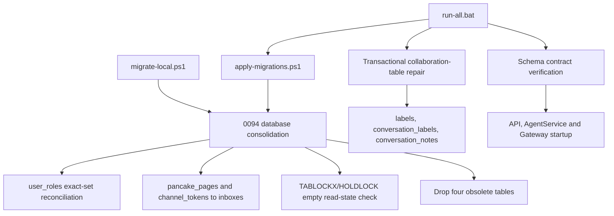

# System Design & Architecture

## Architecture Overview

`run-all.bat` tiếp tục là entrypoint local chính. Cả `deploy/apply-migrations.ps1` và `migrate-local.ps1` đều bọc nội dung migration cùng ledger insert trong một transaction; migration `0094` tự fail nếu không có transaction. Runtime repair khôi phục các bảng collaboration active nhưng không được phép tái tạo bảng legacy. Verification chạy trước service startup và coi contract flags là gate, còn table counts là thông tin.

## Data Models

### Canonical role assignment

- Nguồn cũ: `user_roles(user_id, role_id)` trỏ tới tenant-scoped `roles`.
- Đích: `AspNetUserRoles(user_id, role_id)` trỏ tới Identity `AspNetRoles`.
- Role chỉ được map khi user tồn tại, legacy role cùng tenant, `is_system = 1`, và normalized role name khớp đúng một Identity role.
- Reconciliation dùng exact-set equality: canonical set phải bằng desired legacy set, không chỉ chứa đủ legacy rows.
- Missing hoặc extra canonical assignment đều fail closed. Desired set rỗng là một trạng thái hợp lệ để thu hồi toàn bộ role, không được tự phục hồi quyền từ bảng legacy.
- Unmappable, ambiguous hoặc conflicting state làm migration `THROW`; transaction rollback và ledger không được ghi.

### Canonical channel credential

`inboxes` là aggregate canonical cho page/channel. Migration chuẩn hóa:

- `pancake_pages.page_access_token_encrypted` sang `inboxes.encrypted_access_token` khi target chưa có token.
- `channel_tokens.access_token_encrypted` sang `inboxes.encrypted_access_token` khi target chưa có token.
- `channel_tokens.refresh_token_encrypted` sang `inboxes.encrypted_refresh_token`.
- `channel_tokens.webhook_secret_encrypted` sang `inboxes.encrypted_webhook_secret`.
- `channel_tokens.token_expires_at` sang `inboxes.token_expires_at`.
- `inboxes.encrypted_access_token` được nới thành `NVARCHAR(MAX)` để không truncate ciphertext legacy.

Canonical target hiện có luôn thắng khi field đã có giá trị. Với Pancake, một matching inbox đang inactive hoặc soft-deleted là authoritative khi không có active canonical match: migration giữ nguyên disconnected state, có thể điền credential còn thiếu, nhưng không tạo hoặc kích hoạt một active duplicate.

### Active inbox collaboration tables

Repair transactional khôi phục và kiểm tra contract của:

- `labels`
- `conversation_labels`
- `conversation_notes`

DDL dùng checks riêng cho table, column, PK, FK và index; malformed existing object làm fail closed thay vì bị ghi đè. Repair có thể chạy lặp lại và không sửa dữ liệu collaboration hiện hữu.

## API Design

Không có API mới và không đổi response contract. Các endpoint hiện tại tiếp tục dùng cùng `AppDbContext`:

- Authentication dùng ASP.NET Identity role store.
- Pancake resolver/service dùng `Inboxes`.
- Label và note endpoints dùng ba bảng collaboration đã được restore.

## Component Breakdown

### Database migration

- `deploy/migrations/0094_database_table_consolidation.sql` thực hiện one-shot data/schema consolidation.
- Không chứa `GO`.
- Bắt buộc `@@TRANCOUNT > 0`; runner không bọc transaction sẽ nhận `database_consolidation_transaction_required`.
- Có fail-closed guards cho Identity role exact equality, orphan token, ambiguous inbox và incomplete copy.
- `conversation_read_state` được đếm dưới `TABLOCKX, HOLDLOCK`; chỉ được drop khi vẫn rỗng trong cùng transaction.

### Migration runners and ledger

- `deploy/apply-migrations.ps1` bọc migration và `schema_migrations` insert trong cùng transaction.
- `migrate-local.ps1` dùng cùng transactional-ledger contract thay vì chạy migration và ghi ledger ở hai transaction tách biệt.
- Migration thất bại không để lại ledger row.

### Runtime repair

- `deploy/repair_inbox_collaboration_tables.sql` restore ba bảng collaboration active trong transaction riêng.
- `run-all.bat` chạy migration, runtime repairs, rồi verification trước build/startup.
- Legacy-table recreation đã được loại khỏi runtime model/seeder/repair path.

### EF model cleanup

- Stale `DbSet<ChannelToken>` và `DbSet<PancakePage>` cùng configuration/entity legacy đã được loại bỏ.
- `Inbox` là runtime model canonical cho credential và trạng thái channel.
- Không còn runtime reference tới `user_roles`, `channel_tokens`, `conversation_read_state` hoặc `pancake_pages` ngoài historical migration/consolidation logic.

### Environment consistency

- `run-all.bat` đọc `JWT_SIGNING_KEY` và `ENCRYPTION_BASE64_KEY` từ `deploy/.env`, với local defaults khớp app settings.
- API và Gateway nhận cùng `Jwt__SigningKey`.
- API và AgentService nhận cùng `Encryption__Base64Key`.
- Docker Compose forward `JWT_SIGNING_KEY` tới API/Gateway và `ENCRYPTION_BASE64_KEY` tới API container; non-Compose AgentService nhận encryption key từ local runner.

### Verification

`deploy/verify_database_table_consolidation.sql` trả:

- 15 binary flags cho legacy-table absence, collaboration-table presence/contracts và inbox credential columns.
- dbo table count và total user-defined table count sau dấu `|`.

Live result là `111111111111111|91|102`. Chỉ 15 flags là correctness gate; `91` và `102` là informational vì infrastructure tables như HangFire có thể được tạo sau pre-start verification.

## Design Decisions

### Chỉ xóa bảng có bằng chứng kép

Một bảng chỉ được xóa khi không có runtime read/write và có nguồn canonical thay thế hoặc dữ liệu derived state đã được chứng minh rỗng dưới lock. Row count bằng 0 ở một thời điểm không đủ làm bằng chứng.

### Giữ các bảng infrastructure và optional

- `HangFire.*` có job/state active.
- `InboxState`, `OutboxState`, `OutboxMessage` được MassTransit cấu hình.
- `AspNet*` được Identity quản lý.
- Các bảng feature rỗng vẫn giữ nếu có endpoint/job/entity active.
- `content_render_tasks` và `content_workflow_metrics_hourly` không được xem là legacy chỉ vì hiện chưa có row.

### Fail closed cho RBAC exact equality

Authorization state không được merge theo kiểu additive. Reconciliation phải phát hiện cả missing lẫn extra assignment; zero-role revocation phải được giữ nguyên. Bất kỳ sai khác nào cũng rollback thay vì drop `user_roles`.

### Canonical disconnected state thắng legacy active state

Legacy Pancake page không được re-activate một inbox mà operator đã disconnect. Matching canonical inactive/deleted inbox được giữ nguyên state và credential; chỉ tạo inbox khi không có canonical identity phù hợp.

### Transaction và lock là bắt buộc

Data move, read-state emptiness check, table drops và ledger insert phải cùng transaction. `TABLOCKX, HOLDLOCK` đóng race giữa check và drop cho `conversation_read_state`.

### Không decrypt credential

Migration chỉ di chuyển ciphertext. Không có secret trong output, log, error hoặc migration ledger.

### Count chỉ mang tính thông tin

Schema correctness dựa trên object contracts, không dựa trên một số lượng bảng cố định có thể thay đổi theo infrastructure startup hoặc migration mới.

## Non-Functional Requirements

- **Reliability:** toàn bộ consolidation và ledger commit atomically; rollback giữ nguyên bốn legacy tables.
- **Idempotency:** migration ledger ngăn apply lại; repair và verification chạy lặp lại an toàn.
- **Security:** ciphertext giữ nguyên, không log secret, exact role equality ngăn privilege restoration/escalation.
- **Concurrency:** exclusive held lock bảo vệ read-state check/drop.
- **Performance:** DML set-based, không cursor; table counts chỉ phục vụ observability.
- **Recovery:** lỗi rollback tự động; backup vẫn là rollback path cho destructive migration đã commit.
