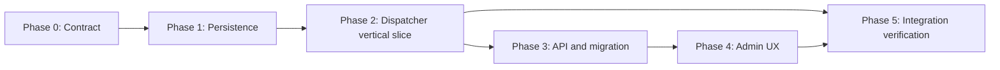

# Background Job Execution Tracking Plan

## Milestones

- [x] **M0 — Contract approved:** status vocabulary, scope, retention, idempotency and vertical slice are decided.
- [x] **M1 — Lifecycle core proven:** execution/attempt persistence, transitions and safe persistence tests pass.
- [x] **M2 — One real recurring job tracked end-to-end:** scheduled/success/retry/final failure work through dispatcher; failure finalization reconciles only durable post-commit Hangfire state.
- [ ] **M3 — Admin APIs and registrations migrated:** no migrated recurring job emits a fake completed trigger record.
- [x] **M4 — Admin experience complete:** operator can follow the release-one health-check execution from acceptance through terminal outcome.
- [ ] **M5 — Release-ready:** automated tests, security review, migration rehearsal, monitoring and rollback procedure are complete.

## Task Breakdown

### Phase 0: Discovery, contracts and safety boundaries — 0.5–1 day

- [x] Inventory every registration in `HangfireModule.ScheduleClawbotJobs`: stable ID, concrete target, queue, cron, timezone, retries, lock/overlap behavior, side effects and whether manual dispatch is allowed. Inventory result: 30 direct registrations; all use no-argument job methods, and `health-check` is the sole release-one tracked definition.
- [x] Select `health-check` as the vertical slice: it has a deterministic safe database-response result, no tenant mutation/outbound effect, and is safe to observe. Force retries/final failure only with a test-only executor, never by intentionally failing production health checks.
- [x] Finalize `RecurringJobExecution` / attempt status transitions, terminal-state rules, maximum field lengths, result-link policy and PII redaction policy.
- [x] Finalize `scheduled`, `manual`, `manual_retry` source semantics; require client-generated UUID `Idempotency-Key` header and reuse only for equivalent transport retries.
- [x] Confirm 180-day retention/observable batch cleanup and acceptance label copy: trigger acknowledgment must read “Đã xếp hàng” or equivalent, never success.
- [x] Inventory effective Hangfire attributes/filters, not just schedule metadata: definition-specific dispatcher wrappers must preserve source retry, `DisableConcurrentExecution` and custom filters. The direct registrations use default retry except explicit `AutomaticRetry` on daily KPI/report/summary variants; lock attributes are method-level and must be copied to each tracked wrapper. `health-check` requires the existing 60-second lock.
- [x] Verify current migration ledger and active deployment branch before reserving a unique migration filename; record whether SQLite test schema requires provider-specific configuration. The repository migration runner accepts only unique full filenames and applies each in its own transaction; `0120_recurring_job_executions.sql` is free in the checkout but must still be verified against production `schema_migrations` during release. `AppDbContext` already normalizes `nvarchar(max)`, filtered indexes and `DateTimeOffset` mappings for SQLite.

**Dependencies:** product/operations decision on retention and vertical slice.

**Exit gate:** approved contract answers all open items that influence schema or API shape.

### Phase 1: Persistence and lifecycle foundation — 1.5–2.5 days

- [x] Add domain entities, status/source constants and invariant methods for `RecurringJobExecution` and `RecurringJobExecutionAttempt`.
- [x] Implement immutable retry-slot allocation from Hangfire `RetryCount`; enforce unique `(ExecutionId, AttemptNumber)`, scheduled correlation uniqueness `(DefinitionId, HangfireBackgroundJobId)` and no terminal execution overwrite.
- [x] Add EF configuration, `AppDbContext` sets, query indexes and SQLite-compatible model handling.
- [x] Add additive SQL migration with no `GO`; validate it through the project migration runner and a clean database. Migration execution against SQL Server remains a Phase 5 release gate.
- [x] Implement `RecurringJobExecutionService` for create/reuse request, attach enqueue ID, begin/complete/fail attempt and finalization. Detail/history queries and stale-request reconciliation remain Phase 3 API work.
- [x] Ensure `IPiiRedactor` and length bounds apply before every persisted/displayed progress note, result summary and error.
- [x] Design a safe relative result-link validator; reject external URLs or untrusted values.

**Tests first (RED):** state machine, terminal rewrite prevention, attempt uniqueness/immutability, redaction/bounds, manual retry linkage, enqueue failure state, duplicate request idempotency.

**Exit gate:** lifecycle core passes unit/persistence tests independently of live Hangfire registration.

### Phase 2: Dispatcher vertical slice — 1.5–2.5 days

- [x] Define `RecurringJobDefinitionRegistry`, `IRecurringJobExecutor`, `RecurringJobExecutionContext` and safe result contract.
- [x] Implement `RecurringJobDispatcher` wrappers accepting definition ID or execution ID plus `PerformContext`; scheduled runs correlate by `PerformContext.BackgroundJob.Id`, manual runs verify the persisted enqueue ID.
- [x] Adapt `health-check` behind its first executor/wrapper; retain the legacy 60-second concurrency resource, existing retry behavior, deterministic safe summary and cancellation behavior.
- [x] Implement safe progress/result reporting. If no safe metric exists, report only lifecycle phases and terminal summary.
- [x] Add final-failure reconciliation: every dispatcher exception persists failed attempt + `retrying` then rethrows; a minutely job reads only the committed Hangfire state name/retry count and terminalizes the parent exactly once using persisted redacted error. If tracking persistence failed, finalization recovers only the matching running slot with a fixed approved error; it never reads Hangfire exception/arguments.
- [x] Update `JobFailureNotificationFilter` ownership rules so tracked dispatcher wrapper jobs do not emit raw exception text or duplicate notifications.
- [x] Register the vertical slice through dispatcher wrapper, preserve queue/cron/retry and an explicit legacy-compatible concurrency resource, add 180-day execution retention, and add test-only failure executor coverage.

**Tests first (RED):** dispatcher success, retryable exception/rethrow, automatic retry attempt history, final failure, cancellation, duplicate delivery, safe single final notification.

**Exit gate:** a scheduled and manual run of the selected real definition reaches `queued → running → succeeded`; controlled failure records multiple attempts then exactly one safe final failure.

### Phase 3: Admin APIs and full backend migration — 2–4 days

- [x] Replace `AdminJobsEndpoints.TriggerRecurringAsync` fake `BackgroundJob` completion with manual execution creation + `IBackgroundJobClient.Enqueue` response contract.
- [x] Add detail, per-definition history and terminal retry endpoints with `system:config`, validation, cursor/page size bounds and safe DTO projection.
- [x] Add latest tracked execution summary to the overview query only if bounded/index-backed; retain Hangfire `lastState` as diagnostics with explicit naming.
- [ ] Convert remaining recurring job registrations in safe batches through registry/dispatcher adapters; preserve registration semantics verified in Phase 0.
- [ ] Implement/review stale `requested` reconciliation, `enqueue_failed` behavior and metrics/log correlation.
- [x] Modify Admin Agent schedule run-now endpoint to call Orchestrator gRPC manual-run path, propagate run ID/optional session ID and map not-found/overlap outcomes.
- [x] Add tenant-constrained Admin schedule-run detail endpoint; it is usable with `SessionId = null` for trend scans and avoids raw stored error text.
- [x] Extend AgentService `ManualRunResult` and gRPC `RunScheduleResponse` only as necessary to expose real `AgentScheduleRun.Id` plus optional session ID; preserve locking, heartbeat and reaper behavior.
**Tests first (RED):** permission/unknown definition rejection, accepted response content, status URL, no fake `BackgroundJob`, history paging, retry authorization/state, enqueue failure, run-now gRPC path, `404`, `409 skipped_overlap`.

**Exit gate:** every migrated recurring job has a durable execution ID; no Admin trigger response or record claims success before actual completion.

### Phase 4: Admin tracking UX — 1.5–2.5 days

- [x] Add immutable TypeScript contracts in `shared/api/admin.ts` for accepted responses, status unions, detail, attempt history and Agent schedule manual result.
- [x] Change trigger and run-now mutations to return/server-store tracking results rather than discard responses.
- [x] Build an accessible execution detail panel/drawer in `AdminJobsTab`: source, initiator, lifecycle timestamps, progress, safe summary/link, safe error, attempt timeline and retry linkage.
- [x] On trigger, focus/open the tracking detail and display “Đã xếp hàng”; use query invalidation plus active detail polling every approximately three seconds until terminal.
- [x] Render Hangfire last state in a distinct diagnostic field, not as the tracked execution outcome.
- [x] Add **Chạy lại** for allowed terminal execution; bind its returned new tracking ID and show lineage without mutating old history.
- [x] Implement Agent schedule run-now success/conflict UI with returned real tracking ID and primary schedule-run detail polling; expose **Mở phiên điều phối** only when session ID exists.
- [x] Verify loading/error/disabled state is keyed by execution/definition so one action does not freeze all rows.

**Tests first (RED):** typed API response contracts and focused source-contract tests; then Playwright route-mocked UI flows.

**Exit gate:** an administrator can run, observe and inspect a terminal execution without using Hangfire Dashboard or server logs for normal triage.

### Phase 5: Verification, rollout and operational readiness — 1–2 days

- [ ] Run targeted unit, API/integration and frontend tests; verify 80%+ coverage for new/changed code. Focused infrastructure (110 total) and API (53 total) suites pass, but coverage and browser-flow coverage are still pending.
- [x] Run API/AgentService release builds and frontend lint/type/build using project scripts. The Release solution build and frontend production build pass; ESLint reports one pre-existing non-blocking hook-dependency warning in `PixelAgentsOfficePage.tsx`.
- [x] Run security review of admin input validation, authorization, redaction, links, exception handling and notification ownership. The API-key pre-tenant lookup issue was fixed and regression-tested; final reviewed tracking changes have no Critical, High or Medium finding.
- [ ] Run Playwright at required responsive breakpoints for Admin Jobs detail: 320, 768, 1024, 1440; verify keyboard navigation and status announcements. This environment uses Node 25.6.1, which is incompatible with the repository's Playwright 1.52 ESM test runner; run under Node 20.19+ or Node 22 LTS.
- [ ] Rehearse migration on a production-like copy, inspect migration ledger and verify no duplicate/invalid filename or `GO` separator. The static migration guard passes for 135 migration files.
- [ ] Roll out registry conversion behind a controlled flag/batch, beginning with vertical slice. Compare registration metadata and live execution metrics after each batch.
- [ ] Publish operations runbook: inspect execution, distinguish acknowledgment from outcome, investigate stale states, retry an execution and revert a definition registration safely.

**Exit gate:** no unresolved Critical/High review finding; production check confirms tracking, notifications, data redaction and unchanged cron/queue semantics.

## Implementation Order and Dependencies

- Registry/dispatcher depends on the final state model and persistence transaction rules.
- Endpoint response contract depends on tracking entity and manual enqueue behavior.
- UI depends on stable typed APIs; stub API responses may be used only in focused frontend tests before backend contract completion.
- Full registration conversion is blocked until vertical-slice success/retry/final-failure behavior is verified.
- Migration deployment is blocked until full migration filename/ledger inspection and test-schema compatibility verification.
- Final security/code review is blocked until automated gates are green.

## File and Symbol Map

| Area | Primary implementation locations | Planned change |
|---|---|---|
| Admin trigger and overview | `src/api/Clawbot.Api/Endpoints/AdminJobsEndpoints.cs` | Replace fake completion; typed APIs and safe projections. |
| Existing generic lifecycle reference | `src/shared/Clawbot.Domain/Jobs/BackgroundJob.cs`; `src/shared/Clawbot.Infrastructure/Jobs/JobRunner.cs` | Preserve behavior; reuse redaction/realtime patterns only, not entity semantics. |
| Recurring registration | `src/shared/Clawbot.Infrastructure/Jobs/HangfireModule.cs` | Register definition-specific dispatcher wrappers and preserve schedule metadata **plus effective retry/concurrency/custom filters**. |
| Tracked finalization | `RecurringJobExecutionFailureReconciliationJob` beside `src/shared/Clawbot.Infrastructure/Jobs/JobFailureNotificationFilter.cs` | After Hangfire commits terminal `Failed`, reconcile only state name/retry count by `BackgroundJob.Id`; persist one terminal safe failure/notification. || Legacy failure handling | `src/shared/Clawbot.Infrastructure/Jobs/JobFailureNotificationFilter.cs` | Exclude tracked dispatcher wrapper jobs; prevent raw/duplicate failure notifications. |
| EF persistence | `src/shared/Clawbot.Infrastructure/Persistence/AppDbContext.cs` and entity configurations | Add execution/attempt data model and indexes. |
| Agent schedule real run | `src/agents/Clawbot.AgentService/Services/AgentScheduleRunner.cs` plus gRPC service/contracts | Return actual run tracking ID via existing manual-run route. |
| Admin web API/UI | `src/frontend/clawbot-web/src/shared/api/admin.ts`; `src/frontend/clawbot-web/src/features/admin/AdminJobsTab.tsx` | Returned mutation DTOs and accessible execution monitoring. |
| Schema deployment | `deploy/migrations/<unique>_*.sql`; migration runner validation | Additive, transaction-compatible migration. |
| Tests | existing API, infrastructure, AgentService, frontend E2E locations | Lifecycle, dispatcher, endpoint, security and UI coverage. |

## Testing and Validation Matrix

| Layer | Required coverage |
|---|---|
| Domain/persistence | Valid/invalid transitions, terminal immutability, attempts, idempotency, bounded redaction, lineage. |
| Dispatcher/Hangfire integration | Scheduled/manual correlation, retry preserved, finalization, cancellation, duplicate handling, safe notification once. |
| Admin API | Permission, allowlist, 202 contract, error mapping, history/detail paging and terminal retry. |
| Agent schedule API | Real gRPC manual run, returned `AgentScheduleRun.Id` plus optional session ID, tenant-scoped run detail (including no-session trend scan), not-found/overlap mapping. |
| Frontend unit/source contract | API type use, mutation result consumed, distinct acknowledgment/result labels, no mutable cache updates. |
| Playwright | Trigger → queued → running → succeeded; retry timeline; safe failure; run again; schedule conflict; focus/keyboard/live region. |
| Regression | Existing generic `BackgroundJob` launcher/Job Center workflows unchanged; Hangfire registration metadata unchanged. |

## Risks & Mitigation

| Risk | Impact | Mitigation |
|---|---|---|
| EF saved request but process crashes before enqueue | Stale record and uncertain intent | Durable `requested`, idempotency, reconciliation, truthful `enqueue_failed`; consider outbox only if stronger guarantee is required. |
| Migration changes job schedule behavior | Missed/duplicated or wrongly queued work | Inventory/copy all registration semantics; direct-target attributes do not transfer to generic dispatcher, so use definition wrappers/equivalent filter provider; vertical slice and batch rollout; compare metadata **and effective filters**. |
| Retry states overwrite evidence or terminalize early | Poor incident diagnosis | Immutable attempts keyed by `RetryCount`; dispatcher rethrows every error; post-commit reconciliation terminalizes only a durably stored final Hangfire `Failed` state. || Raw exception/output leakage | Security/privacy incident | Mandatory `IPiiRedactor`, bounds, safe DTOs, state-filter ownership tests, no raw Hangfire arguments. |
| Duplicate failure notification | Operator noise and mistrust | Explicit dispatcher/filter ownership; terminal notification idempotency. |
| System/global data reaches tenant Job Center | Authorization/data boundary failure | Separate entity/APIs under `system:config`; do not implement `ITenantOwned`; test negative access. |
| Execution tables grow without limit | DB and query degradation | Approved retention, indexed cursor pagination, metrics and cleanup policy before broad rollout. |
| Legacy executor has no progress/output contract | UI appears incomplete | Report only truthful lifecycle phases; add safe counters incrementally. |
| Agent schedule run regression | Duplicate/overlapping schedule effects | Reuse `AgentScheduleRunner.RunNowAsync` and its locks; cover 409 overlap and no `NextRunAt`-only workaround. |

## Estimated Effort

| Phase | Estimate | Notes |
|---|---:|---|
| Phase 0 | 0.5–1 day | Requires final operational decisions. |
| Phase 1 | 1.5–2.5 days | Includes migration and persistence test depth. |
| Phase 2 | 1.5–2.5 days | Vertical slice and Hangfire retry integration. |
| Phase 3 | 2–4 days | Scales with count/complexity of recurring definitions. |
| Phase 4 | 1.5–2.5 days | Detail UI, polling, E2E and accessibility. |
| Phase 5 | 1–2 days | Review, rollout rehearsal and operations. |
| **Total** | **8–14 days** | Excludes surprises in legacy job adapter migration. |

## Resources Needed

- API, Infrastructure, AgentService and frontend maintainers for cross-project contract changes.
- SQL Server-compatible test environment and the repository’s SQLite test harness.
- Controlled Hangfire storage/test configuration for retry/final-state coverage.
- A safe vertical-slice recurring definition and non-production failure injection strategy.
- Existing `IPiiRedactor`, notification/realtime primitives, admin test user with `system:config`, and Playwright route mocks.

## Definition of Done

- [ ] Every migrated recurring execution has an execution tracking ID and immutable attempt history.
- [ ] Manual trigger acknowledgement cannot be mistaken for business success in API, storage or UI.
- [ ] Operators can see a safe final result or redacted failure, including retry history, from Admin Jobs.
- [ ] Generic tenant/user `BackgroundJob` behavior and Job Center remain compatible.
- [ ] Agent schedule manual run returns a real run tracking ID rather than only moving next-run time.
- [ ] Automated quality/security gates pass, rollout has retention/monitoring/runbook, and no Critical/High finding remains.
