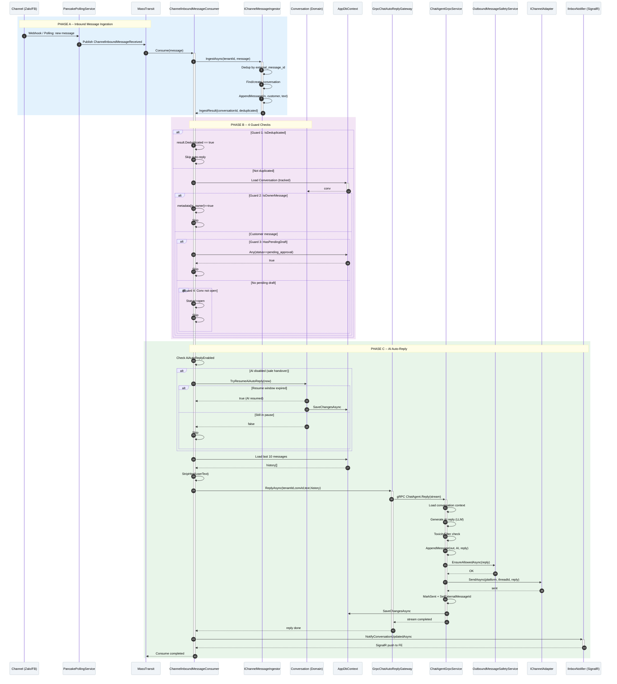

# SC-SA / Diagram 1 -- AI Auto-Reply Engine

> **Automation Type:** Event-Driven Inbound Processing + Background gRPC Call
> **Module:** Sale Assistant > Inbox Channel Processing
> **Trigger:** Customer message arrives via channel webhook/poller (Zalo, Facebook)
> **Traces to:** ChannelInboundMessageConsumer, IChannelMessageIngestor, IChatAutoReplyGateway, ChatAgentGrpcService, GrpcChatAutoReplyGateway, IInboxNotifier, Conversation (Domain)

---

## 1. Tổng quan (Overview)

Luồng này mô tả **toàn bộ pipeline auto-reply** -- từ khi tin nhắn khách đến qua channel adapter, qua 4 guard checks, đến khi AI sinh reply và đẩy trả khách.

**4 Guard Checks** (bắt buộc đều pass mới gọi AI):

1. **IsDeduplicated?** -- `IChannelMessageIngestor.IngestAsync()` dedup theo `external_message_id`. At-least-once delivery từ MassTransit -> tin trùng bị skip.
2. **IsOwnerMessage?** -- Check `metadata["is_owner"] == "true"` và `sender_id == page_id`. AI không tự trả lời tin của page hoặc nhân viên.
3. **HasPendingDraft?** -- Kiểm tra `Messages.Where(status == "pending_approval")`. Nếu đã có draft chờ review -> skip, tránh draft chồng draft.
4. **IsConversationOpen?** -- `conv.Status != "open"` -> skip. Chỉ conversation `open` mới nhận auto-reply.

**Cơ chế Handover (Bàn giao):**
- Sale gửi tay -> `PauseAiAutoReplyUntil(N min)` -> AI tạm tắt trong N phút
- Khách reply tiếp sau N phút -> `TryResumeAiAutoReply()` tự khôi phục
- Sale escalate -> `AiAutoReplyEnabled = false` vĩnh viễn (không tự resume)

**Key Insight:** `ChannelInboundMessageConsumer` là MassTransit consumer (`IConsumer<ChannelInboundMessageReceived>`), chạy `ConcurrentMessageLimit = 1` per consumer -> đảm bảo thứ tự xử lý (ordering) cho mỗi conversation. Retry policy: 1s, 5s, 15s backoff.

### 1.1 Kiến trúc tham gia

| Tầng | Thành phần | Vai trò |
|---|---|---|
| Channel | PancakePollingService / Webhook | Nhận tin từ Zalo/FB, publish `ChannelInboundMessageReceived` |
| Consumer | ChannelInboundMessageConsumer | MassTransit consumer: ingest + kích hoạt auto-reply |
| Ingestor | IChannelMessageIngestor | Dedup + lưu inbound message, trả conversationId |
| AI Gateway | GrpcChatAutoReplyGateway | Thin wrapper bọc lấy ChatAgent gRPC stream (deadline 100s) |
| gRPC Agent | ChatAgentGrpcService | Core AI logic: sinh reply, lưu out-message, gửi tới channel |
| Safety | OutboundMessageSafetyService | Toxicity check trước khi gửi |
| Channel Adapter | IChannelAdapter (Pancake/Zalo) | Gửi tin trả lời qua channel gốc |
| Domain | Conversation | Lưu trạng thái: `AiAutoReplyEnabled`, `Status`, `AiAutoReplyResumeAt` |
| Notification | IInboxNotifier | Push thông báo cập nhật về FE qua SignalR |
| Database | AppDbContext | Luân chuyển dữ liệu với `Conversations`, `Messages` |

### 1.2 Tham chiếu mã nguồn theo tầng (Code Map)

```
PancakePollingService.cs            -> Poll Zalo/FB, publish ChannelInboundMessageReceived
ChannelInboundMessageConsumer.cs    -> MassTransit consumer: 4 guards + auto-reply trigger
ChannelMessageIngestor.cs           -> Ingest + dedup (external_message_id), append message
GrpcChatAutoReplyGateway.cs         -> Thin gRPC client: ChatAgent.Reply()
ChatAgentGrpcService.cs             -> gRPC server: load context, generate reply, persist, send
OutboundMessageSafetyService.cs     -> Toxicity filter: EnsureAllowedAsync()
IChannelAdapter.cs                  -> SendAsync(tenantId, platform, threadId, content)
AiAutoReplyResumer.cs               -> ReplyToHangingCustomerMessageAsync (toggle/sweep/regen)
Conversation.cs                     -> AiAutoReplyEnabled, PauseAiAutoReplyUntil, TryResumeAiAutoReply
AiAutoReplyResumeJob.cs             -> Hangfire sweep: resume AI cho conversation quá hạn resumeAt
SignalR (IInboxNotifier)            -> NotifyMessageAsync, NotifyConversationUpdatedAsync
AppDbContext.cs                     -> Conversations, Messages
```

---

## 2. Mermaid Sequence Diagram



**Ghi chú cho diagram:**

- Guard checks dùng alt fragments xếp lớp (nested alt)
- AI disabled + `TryResume` là optional path bên trong PHASE C
- SignalR notify cuối flow push update realtime cho inbox UI
- Database cylinders: Conversations, Messages
- Retry policy: MassTransit retry 1s, 5s, 15s (ConsumerDefinition)

---

## 3. Giải thích từng Phase (Step-by-Step Detail)

### Phase A: Inbound Message Ingestion

| Step | Actor | Hành động | Code Map | Giải thích nghiệp vụ |
|---|---|---|---|---|
| 1 | Channel (Zalo/FB) | Khách gửi tin nhắn | Webhook/Poller | Tin từ khách đến qua platform adapter |
| 2 | PancakePollingService | Poll hoặc nhận webhook, parse message | `RunAsync()` | Long-poll Facebook/Zalo API mỗi N giây |
| 3 | MassTransit | Publish(`ChannelInboundMessageReceived`) | Bus publish | Đẩy tin vào message bus, consumer lắng nghe |
| 4 | ChannelInboundMessageConsumer | Consume(context) | `Consume()` | Consumer nhận tin, bắt đầu pipeline |
| 5 | IChannelMessageIngestor | IngestAsync(tenantId, message) | `IngestAsync()` | Dedup theo `external_message_id` (strict) |
| 6 | IChannelMessageIngestor | Tìm/Tạo mới Conversation | Conversation lookup | Nếu chưa có tạo mới, có rồi thì reuse |
| 7 | Conversation | AppendMessage(in, customer, content) | Domain method | Ghi tin inbound, cập nhật `LastMessageAt` |
| 8 | IChannelMessageIngestor | Trả IngestResult | Return result | `deduplicated=true` nếu tin đã từng ingest |

### Phase B: 4 Guard Checks

| Step | Actor | Hành động | Code Map | Giải thích nghiệp vụ |
|---|---|---|---|---|
| 9 | ChannelInboundMessageConsumer | Kiểm tra `result.Deduplicated` | Guard 1 | At-least-once delivery: tin trùng bị skip |
| 10 | ChannelInboundMessageConsumer | Load Conversation (tracked entity) | `db.Conversations` | Cần tracked entity cho `TryResume` sau |
| 11 | ChannelInboundMessageConsumer | Kiểm tra `metadata[is_owner]` | Guard 2 | Tin từ page/nhân viên -> AI không reply |
| 12 | ChannelInboundMessageConsumer | So sánh `sender_id == page_id` | Guard 2 (echo) | Page tự echo -> AI skip |
| 13 | ChannelInboundMessageConsumer | `Any(status == pending_approval)` | Guard 3 | Đang có draft chờ review -> không sinh thêm |
| 14 | ChannelInboundMessageConsumer | `conv.Status != open` | Guard 4 | Conversation resolved/escalated -> skip |

### Phase C: AI Auto-Reply Execution

| Step | Actor | Hành động | Code Map | Giải thích nghiệp vụ |
|---|---|---|---|---|
| 15 | ChannelInboundMessageConsumer | Kiểm tra `AiAutoReplyEnabled` | Handover check | Sale đang xử lý -> kiểm tra resume |
| 16 | Conversation | TryResumeAiAutoReply(now) | Domain method | Nếu quá mốc hẹn -> resume AI tự động |
| 17 | ChannelInboundMessageConsumer | SaveChangesAsync (nếu resume) | EF Core | Lưu `AiAutoReplyEnabled = true` |
| 18 | ChannelInboundMessageConsumer | Load 10 tin gần nhất (excl blocked) | `db.Messages` | Lấy context cho AI |
| 19 | ChannelMessageIngestor | StripHtml(userText) | Strip HTML | Pancake bọc div/br -> strip trước khi đưa LLM |
| 20 | GrpcChatAutoReplyGateway | ReplyAsync(tenantId, convId, text, history) | gRPC call | Thin wrapper, deadline 100s |
| 21 | ChatAgentGrpcService | Load context + history | `LoadContextAsync()` | Lấy platform, contact, turns |
| 22 | ChatAgentGrpcService | Generate AI reply qua LLM | Claude/GPT call | Sinh reply dựa trên history + KB |
| 23 | ChatAgentGrpcService | ToxicityFilter.IsBlockedAsync(reply) | Safety check | Block reply chứa độc hại |
| 24 | ChatAgentGrpcService | Conversation.AppendMessage(out, AI, reply) | Domain method | Ghi reply vào conversation |
| 25 | ChatAgentGrpcService | OutboundMessageSafetyService.EnsureAllowedAsync() | Safety gate | Toxicity check trước khi gửi qua channel |
| 26 | ChatAgentGrpcService | IChannelAdapter.SendAsync(platform, threadId, reply) | Channel delivery | Gửi reply qua Zalo/FB |
| 27 | ChatAgentGrpcService | MarkSent + SetExternalMessageId | Status update | Đánh dấu tin đã gửi thành công |
| 28 | AppDbContext | SaveChangesAsync() | EF Core | Flush out-message + conversation |
| 29 | IInboxNotifier | NotifyConversationUpdatedAsync() | SignalR | Push update realtime cho inbox UI |
| 30 | ChannelInboundMessageConsumer | Consume completed | Return | Giải phóng concurrent slot |

### Phase C.1: AI Resume After Handover (Optional Sweep Path)

| Step | Actor | Hành động | Code Map | Giải thích nghiệp vụ |
|---|---|---|---|---|
| 31 | Hangfire | AiAutoReplyResumeJob.RunAsync() | Cron sweep | Chạy định kỳ, quét conversation quá hạn resume |
| 32 | AiAutoReplyResumeJob | Query: `AiAutoReplyResumeAt <= now AND AiAutoReplyEnabled == false` | DB query | Tìm conversation sale im lặng quá lâu |
| 33 | AiAutoReplyResumer | ReplyToHangingCustomerMessageAsync() | Resumer logic | Kiểm tra tin cuối có phải tin khách |
| 34 | AiAutoReplyResumer | Load tin cuối: `direction == in` (excl blocked) | Last message check | Nếu tin cuối là out -> skip |
| 35 | AiAutoReplyResumer | `Any(status == pending_approval)` | Guard | Đang có draft chờ review -> skip |
| 36 | AiAutoReplyResumer | GrpcChatAutoReplyGateway.ReplyAsync() | gRPC call | Trigger AI reply cho tin khách bị treo |

---

## 4. Hướng dẫn vẽ trên draw.io

### 4.1 Layout

- Hàng ngang (trái -> phải): Channel -> PollingService -> MassTransit -> Consumer -> Ingestor -> Conversation -> ChatAgent gRPC -> Safety -> ChannelAdapter -> SignalR
- Hàng dọc (trên -> dưới): Thời gian chạy từ trên xuống
- Khoảng cách giữa lifelines: ~120px mỗi cột
- DB cylinders đặt bên dưới Conversation và Consumer

### 4.2 Ký hiệu

| Thành phần draw.io | Shape |
|---|---|
| Channel (Zalo/FB) | Actor (hình người que) hoặc Cloud shape |
| PancakePollingService | Participant + note Long-poll webhook |
| MassTransit Bus | Participant + note Message Bus (InMemory) |
| ChannelInboundMessageConsumer | Participant + note IConsumer, ConcurrentLimit=1 |
| IChannelMessageIngestor | Participant + note Dedup + persist inbound |
| Conversation (Domain) | Participant + note AiAutoReplyEnabled, Status |
| GrpcChatAutoReplyGateway | Participant + note Thin wrapper, deadline 100s |
| ChatAgentGrpcService | Participant + note gRPC: generate + persist + send |
| OutboundMessageSafetyService | Participant + note Toxicity check |
| IChannelAdapter | Participant + note Zalo / Facebook |
| IInboxNotifier | Participant + note SignalR realtime push |
| DB | Database cylinders (Conversations, Messages) |

### 4.3 Phân tách vùng (Region)

Sử dụng Combined Fragment trong draw.io:

1. Rect/Region lớn ở Phase A: Inbound Ingestion
2. Nested Alt fragments ở Phase B: `IsDeduplicated?` > `IsOwnerMessage?` > `HasPendingDraft?` > `IsConversationOpen?`
3. Alt fragment ở Phase C: AI enabled vs AI disabled (sale handover)
4. Opt fragment bên trong: `TryResumeAiAutoReply` -> resume window expired
5. Note bên cạnh Consumer: 4 guard checks must ALL pass
6. Note bên cạnh ChatAgent: Deadline: 100s, Linked CTS
7. Note bên cạnh MassTransit: Retry: 1s, 5s, 15s backoff
8. Dashed line ngang phân tách Phase A, B, C

### 4.4 Màu sắc gợi ý

| Phase | Màu background |
|---|---|
| Phase A: Inbound Ingestion | Light blue #E3F2FD |
| Phase B: Guard Checks | Light purple #F3E5F5 |
| Phase C: AI Auto-Reply | Light green #E8F5E9 |
| Guard Check (skip) | Light red #FFEBEE |
| AI Resume (optional) | Light yellow #FFFDE7 |

---

## 5. Code Map Summary (File -> Responsibility)

```
ChannelInboundMessageConsumer.cs    -> MassTransit consumer: 4 guards + auto-reply trigger
ChannelMessageIngestor.cs           -> Dedup (external_message_id) + persist inbound message
PancakePollingService.cs            -> Poll Zalo/FB, publish ChannelInboundMessageReceived
GrpcChatAutoReplyGateway.cs         -> Thin gRPC client wrapper: ChatAgent.Reply() with 100s deadline
ChatAgentGrpcService.cs             -> gRPC server: load context, generate reply via LLM, persist, send
OutboundMessageSafetyService.cs     -> Toxicity filter: EnsureAllowedAsync() before send
AiAutoReplyResumer.cs               -> ReplyToHangingCustomerMessageAsync: toggle/sweep/regen paths
AiAutoReplyResumeJob.cs             -> Hangfire sweep: resume AI cho conversation quá hạn resumeAt
Conversation.cs                     -> AiAutoReplyEnabled, PauseAiAutoReplyUntil, TryResumeAiAutoReply
Message.cs                          -> AppendMessage, MarkSent, MarkBlocked, MarkSendFailed
IChannelAdapter.cs                  -> SendAsync(platform, threadId, content) per channel
IInboxNotifier.cs                   -> NotifyMessageAsync, NotifyConversationUpdatedAsync (SignalR)
AppDbContext.cs                     -> Conversations, Messages DbSets
```

---

## 6. Gap Analysis

| Feature | Status | Mô tả |
|---|---|---|
| Distributed lock for concurrent draft guard | **CHƯA CÓ** | `ConcurrentMessageLimit=1` giữ ordering per-host; 2 host cùng lúc vẫn có thể slip 2 draft |
| AI reply retry on channel send failure | **CHƯA CÓ** | Nếu `ChannelAdapter.SendAsync()` fail -> `MarkSendFailed()`, consumer swallow, tin không retry |
| Escalation event consumer | **ĐÃ CÓ** | `ConversationEscalatedConsumer` xử lý `ConversationEscalated` domain event |
| Out-of-hours auto-reply restriction | **CHƯA CÓ** | BR-25: restrict outbound timing theo timezone khách hàng |