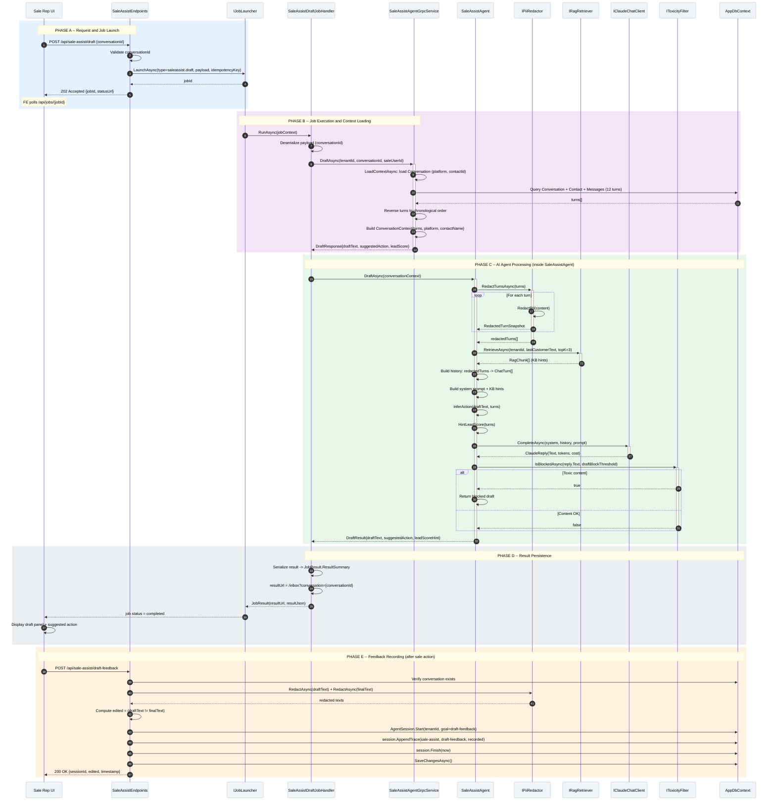

# SC-SA / Diagram 2 -- RAG-Powered AI Draft Generation and Behavior Feedback

> **Automation Type:** Job-Queued LLM Orchestration + Feedback Loop
> **Module:** Sale Assistant > Draft Tool (Co-pilot Mode)
> **Trigger:** Sale rep clicks Draft button in inbox UI
> **Traces to:** SaleAssistEndpoints, SaleAssistDraftJobHandler, SaleAssistAgentGrpcService, SaleAssistAgent, IRagRetriever, IClaudeChatClient, IToxicityFilter, SaleAssistDraftFeedbackService, AgentSession

---

## 1. Tổng quan (Overview)

Luồng này mô tả **cơ chế AI soạn tin trả lời** cho sale rep. Sale nhấn nút Draft, hệ thống qua job -> gRPC -> RAG + PII redaction + LLM -> trả về draft text, suggested action, và lead score hint.

**3 output chính của Draft:**
1. **DraftText** -- Tin AI soạn, tối đa 80 từ, tiếng Việt (hoặc Trung nếu khách dùng Trung)
2. **SuggestedAction** -- Hành động đề xuất: `book_trial`, `send_quote`, `ask_goal`, `follow_up`
3. **LeadScoreHint** -- Điểm ước tính dựa vào số lượt customer messages (30/50/70)

**Idempotency:** Draft dùng key `saleassist.draft:{conversationId}` để đảm bảo 1 đợt nhiều lần nhấn chỉ chạy 1 job duy nhất.

**Feedback Loop:** Sale thực hiện hành động (Gửi/Sửa/Bỏ draft) -> FE gọi `POST /api/sale-assist/draft-feedback` -> lưu vào `AgentSession` trace với outcome (`sent`/`edited`/`discarded`).

**Key Insight:** 3 việc LLM (draft/summary/upsell) đều chạy ngầm qua job, không phụ thuộc vào thời gian response. Draft có thể mất 2-5s nhưng không làm treo UI.

### 1.1 Kiến trúc tham gia

| Tầng | Thành phần | Vai trò |
|---|---|---|
| API Layer | SaleAssistEndpoints | `POST /api/sale-assist/draft`, `POST /api/sale-assist/draft-feedback` |
| Job System | SaleAssistDraftJobHandler | Job handler: gọi gRPC, trả kết quả vào `JobResult.ResultSummary` |
| gRPC Service | SaleAssistAgentGrpcService | Load context (12 turns), gọi `SaleAssistAgent` |
| AI Agent | SaleAssistAgent | Core logic: PII redaction, RAG, LLM call, toxicity check |
| RAG | IRagRetriever | Tìm 3 chunks phù hợp từ knowledge base |
| LLM | IClaudeChatClient | Claude API call với system prompt + history + KB hints |
| Safety | IToxicityFilter | Kiểm tra độc hại trước khi trả draft cho sale |
| PII | IPiiRedactor | Redact PII trước khi đưa vào LLM context |
| Feedback | SaleAssistDraftFeedbackService | Ghi nhận hành động sale với draft (`sent`/`edited`/`discarded`) |
| Domain | AgentSession | Lưu trace: goal, draft text, outcome, timestamp |
| Database | AppDbContext | Conversations, Messages, AgentSessions, QuickReplyTemplates |

### 1.2 Tham chiếu mã nguồn theo tầng (Code Map)

```
SaleAssistEndpoints.cs              -> POST /draft, POST /draft-feedback, POST /summary, GET /quick-replies
SaleAssistDraftJobHandler.cs        -> Job handler: type=saleassist.draft, NotifyOnSuccess=false
SaleAssistAgentGrpcService.cs       -> gRPC: Draft(), Summarize(), Upsell(), AutoSummaryOnResolve()
SaleAssistAgent.cs                  -> DraftAsync: PII + RAG + Claude + Toxicity
SaleAssistDraftFeedbackService.cs   -> RecordAsync: PII redact + AgentSession trace
AgentSession.cs                     -> Domain: Start, AppendTrace, Finish
```

---

## 2. Mermaid Sequence Diagram



---

## 3. Giải thích từng Phase (Step-by-Step Detail)

### Phase A: Request and Job Launch

| Step | Actor | Hành động | Code Map | Giải thích nghiệp vụ |
|---|---|---|---|---|
| 1 | Sale Rep | Nhấn nút Draft trong inbox UI | FE click | Trigger yêu cầu soạn tin trả lời |
| 2 | SaleAssistEndpoints | POST /api/sale-assist/draft {conversationId} | `DraftAsync()` | Validate conversationId không rỗng |
| 3 | SaleAssistEndpoints | Kiểm tra rate limiting | `RequireRateLimiting(GeneralPolicy)` | Giới hạn tốc độ request |
| 4 | SaleAssistEndpoints | `jobs.LaunchAsync(type, title, payload, userId, idempotencyKey)` | `IJobLauncher` | Tạo job với key: `saleassist.draft:{conversationId}` |
| 5 | SaleAssistEndpoints | Trả 202 Accepted {jobId, statusUrl} | Return | FE nhận ngay, không chờ LLM |

### Phase B: Job Execution and Context Loading

| Step | Actor | Hành động | Code Map | Giải thích nghiệp vụ |
|---|---|---|---|---|
| 6 | Job Scheduler | Chạy `SaleAssistDraftJobHandler.RunAsync()` | Hangfire/InMemory | Job được scheduled chạy |
| 7 | SaleAssistDraftJobHandler | Deserialize `SaleAssistConversationJobPayload` | JsonSerializer | Lấy conversationId từ payload |
| 8 | SaleAssistDraftJobHandler | `grpc.DraftAsync(tenantId, conversationId, saleUserId)` | gRPC call | Gọi Agent Service |
| 9 | SaleAssistAgentGrpcService | `LoadContextAsync`: load Conversation | `db.Conversations` | Lấy platform, contactId |
| 10 | SaleAssistAgentGrpcService | Load contact name | `db.Contacts` | Lấy tên khách hàng |
| 11 | SaleAssistAgentGrpcService | Load 12 turns gần nhất (order by SentAt DESC, Take 12, Reverse) | `db.Messages` | Lấy lịch sử hội thoại |
| 12 | SaleAssistAgentGrpcService | Build `ConversationContext` | Record init | Tạo context object cho agent |

### Phase C: AI Agent Processing (inside SaleAssistAgent)

| Step | Actor | Hành động | Code Map | Giải thích nghiệp vụ |
|---|---|---|---|---|
| 13 | SaleAssistAgent | Begin LLM call scope (tenantId, agentCode=sale-assist) | `ILlmScope.Begin()` | Bắt đầu track chi phí LLM |
| 14 | SaleAssistAgent | `RedactTurnsAsync(turns)` | `IPiiRedactor.RedactAsync()` | Redact PII trước khi đưa vào LLM |
| 15 | SaleAssistAgent | `RetrieveAsync(tenantId, lastCustomerText, topK=3)` | `IRagRetriever` | Tìm 3 chunks phù hợp từ KB |
| 16 | SaleAssistAgent | Build history: `redactedTurns` -> `ChatTurn[]` | `ChatTurn{role, content}` | Chuẩn bị lịch sử cho LLM |
| 17 | SaleAssistAgent | Build system prompt + KB hints | `AppendKb()` | Ghép thêm KB hints vào system prompt |
| 18 | SaleAssistAgent | `InferAction(draftText, turns)` | `InferAction()` | Xác định hành động đề xuất |
| 19 | SaleAssistAgent | `HintLeadScore(turns)` | `HintLeadScore()` | Tính điểm ước tính từ số lượt customer messages |
| 20 | SaleAssistAgent | `Claude.CompleteAsync(system, history, prompt)` | `IClaudeChatClient` | Gọi Claude LLM |
| 21 | SaleAssistAgent | `IsBlockedAsync(reply, threshold)` | `IToxicityFilter` | Kiểm tra độc hại trước khi trả |
| 22 | SaleAssistAgent | `RecordCostAsync(tenantId, reply)` | `ILlmCostTracker` | Ghi nhận chi phí LLM |

### Phase D: Result Persistence

| Step | Actor | Hành động | Code Map | Giải thích nghiệp vụ |
|---|---|---|---|---|
| 23 | SaleAssistDraftJobHandler | Serialize result -> JSON | `JsonSerializerOptions.Web` | Dùng camelCase cho FE parse |
| 24 | SaleAssistDraftJobHandler | Tạo `JobResult(resultUrl, resultJson)` | `JobResult` | Kết quả chứa trong `ResultSummary` |
| 25 | Job Scheduler | Mark job completed, push result | Hangfire | FE nhận kết quả qua polling |
| 26 | FE | Parse `resultJson` -> display draft panel | FE UI | Hiển thị draft + suggested action + lead score |

### Phase E: Feedback Recording (after sale action)

| Step | Actor | Hành động | Code Map | Giải thích nghiệp vụ |
|---|---|---|---|---|
| 27 | Sale Rep | Thực hiện hành động: Gửi/Sửa/Bỏ draft | FE action | Sale quyết định sử dụng draft |
| 28 | FE | POST /api/sale-assist/draft-feedback {conversationId, draftText, outcome, finalText} | `DraftFeedbackAsync()` | Gửi feedback |
| 29 | SaleAssistDraftFeedbackService | Kiểm tra conversation tồn tại | `db.Conversations` | Validate |
| 30 | SaleAssistDraftFeedbackService | `RedactAsync(draftText)` + `RedactAsync(finalText)` | `IPiiRedactor` | Redact PII trước khi lưu trace |
| 31 | SaleAssistDraftFeedbackService | Compute `edited = (draftText != finalText)` | String comparison | Xác định sale có sửa draft không |
| 32 | SaleAssistDraftFeedbackService | `AgentSession.Start(tenantId, goal=sale-assist-draft-feedback)` | Domain | Tạo session trace |
| 33 | SaleAssistDraftFeedbackService | `session.AppendTrace(sale-assist, draft-feedback, recorded, payload)` | Domain | Lưu kết quả: outcome, edited, piiSpanCount |
| 34 | SaleAssistDraftFeedbackService | `session.Finish(now)` + `SaveChangesAsync()` | EF Core | Persist trace |

---

## 4. Hướng dẫn vẽ trên draw.io

### 4.1 Layout

- Hàng ngang (trái -> phải): FE -> API -> JobHandler -> gRPC Service -> Agent -> PII -> RAG -> LLM -> Toxicity -> DB
- Hàng dọc (trên -> dưới): Thời gian chạy từ trên xuống
- Khoảng cách giữa lifelines: ~120px mỗi cột
- DB cylinders đặt bên dưới gRPC Service và Feedback Service

### 4.2 Ký hiệu

| Thành phần draw.io | Shape |
|---|---|
| Sale Rep UI | Actor (hình người que) |
| SaleAssistEndpoints | Participant + note POST /draft, /draft-feedback |
| SaleAssistDraftJobHandler | Participant + note Job: type=saleassist.draft |
| SaleAssistAgentGrpcService | Participant + note gRPC: load 12 turns, call agent |
| SaleAssistAgent | Participant + note Core: PII + RAG + Claude + Toxicity |
| IRagRetriever | Participant + note RAG: topK=3 chunks from KB |
| IClaudeChatClient | Participant + note LLM: Claude API |
| IToxicityFilter | Participant + note Safety: draft block threshold |
| IPiiRedactor | Participant + note PII redaction before LLM |
| SaleAssistDraftFeedbackService | Participant + note Feedback: sent/edited/discarded |
| AgentSession (Domain) | Participant + note Trace: goal, outcome, timestamp |
| DB | Database cylinders (Conversations, Messages, AgentSessions) |

### 4.3 Phân tách vùng (Region)

1. Region Phase A: Request and Job Launch
2. Region Phase B: Job Execution and Context Loading
3. Region Phase C: AI Agent Processing
4. Loop fragment trong Phase C: For each turn (PII redaction)
5. Alt fragment: Toxic content vs Content OK
6. Region Phase E: Feedback Recording
7. Note bên cạnh JobHandler: NotifyOnSuccess=false (không thông báo khi xong)
8. Note bên cạnh LLM: Idempotency key: `saleassist.draft:{conversationId}`

### 4.4 Màu sắc gợi ý

| Phase | Màu background |
|---|---|
| Phase A: Request and Job Launch | Light blue #E3F2FD |
| Phase B: Job Execution | Light purple #F3E5F5 |
| Phase C: AI Agent Processing | Light green #E8F5E9 |
| Phase D: Result Persistence | Light gray #ECEFF1 |
| Phase E: Feedback Recording | Light orange #FFF3E0 |

---

## 5. Code Map Summary (File -> Responsibility)

```
SaleAssistEndpoints.cs              -> MapPost("/draft"), MapPost("/draft-feedback")
SaleAssistDraftJobHandler.cs        -> Type="saleassist.draft", calls gRPC, returns JSON summary
SaleAssistAgentGrpcService.cs       -> gRPC server: LoadContextAsync (12 turns), calls SaleAssistAgent
SaleAssistAgent.cs                  -> DraftAsync: PII redact + RAG retrieve + Claude call + Toxicity check
SaleAssistDraftFeedbackService.cs   -> RecordAsync: Compute edited flag + PII redact + AgentSession trace
AgentSession.cs                     -> AppendTrace("sale_assist_draft_feedback", payload)
IRagRetriever.cs                    -> RetrieveAsync: topK=3 KB chunks per tenant
IClaudeChatClient.cs                -> GenerateReplyAsync: Claude API wrapper
IToxicityFilter.cs                  -> Safety: IsBlockedAsync(text, threshold)
IPiiRedactor.cs                     -> PII: RedactAsync(text)
```

---

## 6. Gap Analysis

| Feature | Status | Mô tả |
|---|---|---|
| RAG vector search in SQLite dev env | **DÙNG KEYWORD** | SQLite fallback sang keyword search; Postgres/pgvector dùng vector search |
| Feedback trace offline training pipeline | **CHƯA CÓ** | Trace được lưu vào `AgentSession` nhưng chưa có pipeline export tự động cho fine-tuning |
| Multi-language draft auto-detect | **ĐÃ CÓ** | Detect tiếng Trung dựa trên Unicode range trong customer message |