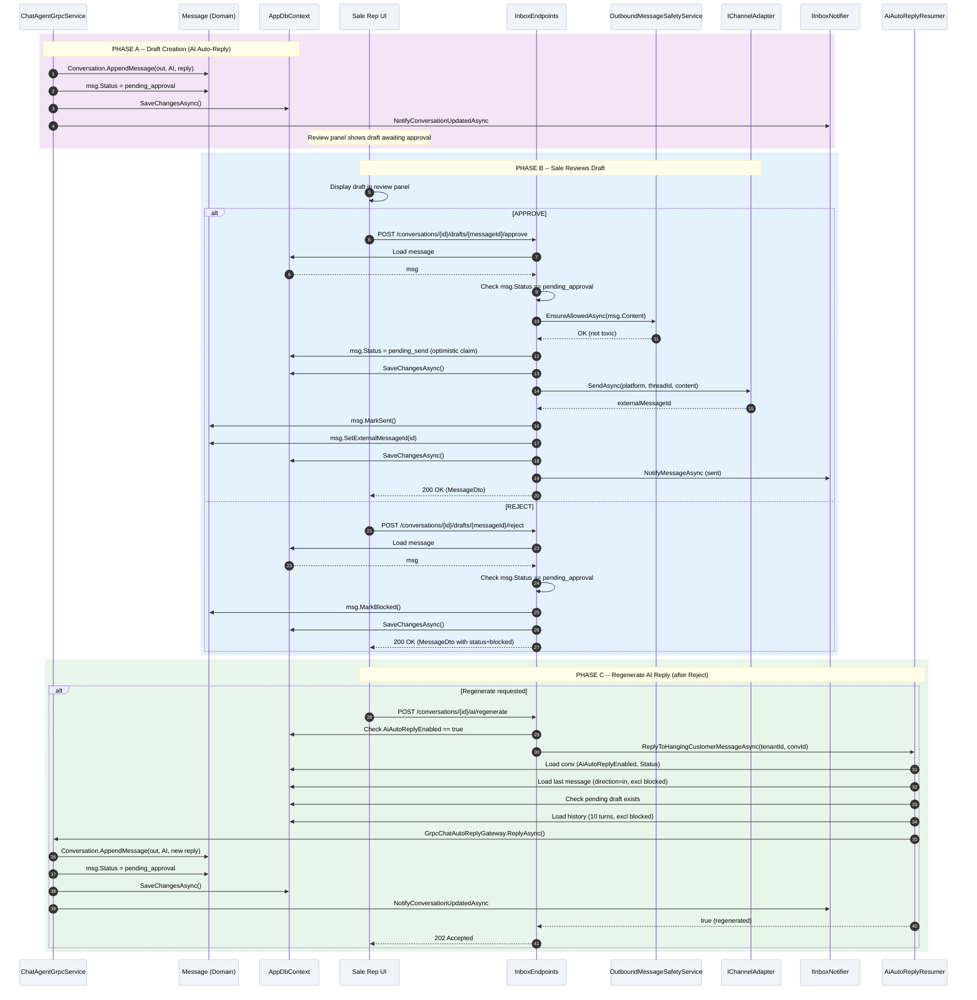

# SC-SA / Diagram 3 -- AI Draft Review and Approval Safety Gate

> **Automation Type:** Human-in-the-Loop Approval Workflow
> **Module:** Sale Assistant > Inbox Draft Review
> **Trigger:** AI auto-reply generates message with status=pending_approval (from ChatAgentGrpcService, NOT SaleAssistAgent.Draft)
> **Traces to:** ChatAgentGrpcService, InboxEndpoints (ApproveDraftAsync, RejectDraftAsync, RegenerateAiReplyAsync), OutboundMessageSafetyService, IChannelAdapter, IInboxNotifier, AiAutoReplyResumer

---

## 1. Tổng quan (Overview)

Luồng này mô tả **cơ chế duyệt/từ chối AI draft** -- khi AI tự trả lời khách qua auto-reply, tin nhắn có trạng thái pending_approval. Sale rep xem trên review panel, chọn Approve hoặc Reject.

**Nguồn gốc draft pending_approval:**
- Draft đến từ **ChatAgentGrpcService** (AI auto-reply), KHÔNG phải từ SaleAssistAgent.Draft() (Draft Tool)
- ChatAgentGrpcService tạo Message với status=pending_approval khi AI auto-reply được activate
- Draft Tool (SaleAssistAgent.Draft()) trả draft text qua JobResult.ResultSummary, KHÔNG tạo Message

**Approve path:** Safety re-check -> ChannelAdapter.SendAsync -> MarkSent -> SignalR notify
**Reject path:** MarkBlocked -> FE gọi RegenerateAiReplyAsync -> AiAutoReplyResumer -> trigger AI reply mới

**Key Insight:** Guard `HasPendingDraft` (Diagram 1) đảm bảo chỉ có 1 draft pending_approval mỗi conversation tại thời điểm nào đó. Approve/reject mở khóa guard này để flow tiếp tục.

### 1.1 Kiến trúc tham gia

| Tầng | Thành phần | Vai trò |
|---|---|---|
| gRPC Agent | ChatAgentGrpcService | Tạo tin với status=pending_approval khi AI auto-reply |
| API Layer | InboxEndpoints | POST /approve, POST /reject, POST /ai/regenerate |
| Safety | OutboundMessageSafetyService | Toxicity re-check trước khi gửi (Approve path) |
| Channel | IChannelAdapter | Gửi tin qua channel gốc (Approve path) |
| Notification | IInboxNotifier | SignalR push update cho inbox UI |
| Domain | Message | Status transitions: pending_approval -> pending_send -> sent/blocked |
| Resumer | AiAutoReplyResumer | ReplyToHangingCustomerMessageAsync (Regenerate path) |
| Database | AppDbContext | Messages, Conversations |

### 1.2 Tham chiếu mã nguồn theo tầng (Code Map)

```
ChatAgentGrpcService.cs             -> Tạo Message với status=pending_approval
InboxEndpoints.cs                   -> ApproveDraftAsync, RejectDraftAsync, RegenerateAiReplyAsync
OutboundMessageSafetyService.cs     -> EnsureAllowedAsync (toxicity re-check)
IChannelAdapter.cs                  -> SendAsync (gửi tin qua channel)
IInboxNotifier.cs                   -> NotifyMessageAsync (SignalR push)
Message.cs                          -> MarkSent, MarkBlocked, MarkSendFailed
AiAutoReplyResumer.cs               -> ReplyToHangingCustomerMessageAsync
AppDbContext.cs                     -> Messages DbSets
```

---

## 2. Mermaid Sequence Diagram



---

## 3. Giải thích từng Phase (Step-by-Step Detail)

### Phase A: Draft Creation (AI Auto-Reply)

| Step | Actor | Hành động | Code Map | Giải thích nghiệp vụ |
|---|---|---|---|---|
| 1 | ChatAgentGrpcService | Conversation.AppendMessage(out, AI, reply) | Domain method | Tạo tin AI trả lời |
| 2 | ChatAgentGrpcService | msg.Status = pending_approval | Message init | Gán trạng thái chờ review |
| 3 | ChatAgentGrpcService | SaveChangesAsync() | EF Core | Lưu tin vào DB |
| 4 | ChatAgentGrpcService | NotifyConversationUpdatedAsync() | SignalR | Push update cho FE |
| 5 | FE | Hiển thị draft trong review panel | FE UI | Sale nhìn thấy tin AI đang chờ duyệt |

### Phase B: Sale Reviews Draft

| Step | Actor | Hành động | Code Map | Giải thích nghiệp vụ |
|---|---|---|---|---|
| 6 | Sale Rep | Chọn Approve hoặc Reject trên review panel | FE action | Sale quyết định sử dụng draft |
| 7 | FE | POST /conversations/{id}/drafts/{messageId}/approve hoặc reject | API call | Gửi yêu cầu duyệt/từ chối |
| 8 | InboxEndpoints | Load message từ DB | db.Messages | Lấy tin cần xử lý |
| 9 | InboxEndpoints | Kiểm tra msg.Status == pending_approval | Status guard | Chỉ xử lý tin đang chờ review |
| 10a | InboxEndpoints (Approve) | OutboundMessageSafetyService.EnsureAllowedAsync(msg.Content) | Safety check | Toxicity re-check trước khi gửi |
| 11a | InboxEndpoints (Approve) | msg.Status = pending_send (optimistic claim) | Status transition | Claim tin để tránh concurrent approve |
| 12a | InboxEndpoints (Approve) | IChannelAdapter.SendAsync(platform, threadId, content) | Channel delivery | Gửi tin qua Zalo/FB |
| 13a | InboxEndpoints (Approve) | msg.MarkSent() + SetExternalMessageId() | Domain method | Đánh dấu tin đã gửi thành công |
| 14a | InboxEndpoints (Approve) | NotifyMessageAsync() | SignalR push | Thông báo tin đã gửi |
| 10b | InboxEndpoints (Reject) | msg.MarkBlocked() | Domain method | Đánh dấu tin bị từ chối |
| 11b | InboxEndpoints (Reject) | SaveChangesAsync() | EF Core | Lưu trạng thái blocked |

### Phase C: Regenerate AI Reply (after Reject)

| Step | Actor | Hành động | Code Map | Giải thích nghiệp vụ |
|---|---|---|---|---|
| 15 | Sale Rep | Nhấn nút Tạo lại phản hồi AI | FE action | Yêu cầu AI soạn lại |
| 16 | FE | POST /conversations/{id}/ai/regenerate | RegenerateAiReplyAsync() | Gửi yêu cầu |
| 17 | InboxEndpoints | Kiểm tra AiAutoReplyEnabled == true | Guard | AI phải đang bật mới tạo lại được |
| 18 | AiAutoReplyResumer | ReplyToHangingCustomerMessageAsync(tenantId, convId) | Resumer | Kiểm tra tin khách đang treo |
| 19 | AiAutoReplyResumer | Load conv + last message + pending draft check | DB query | Đảm bảo không có draft pending + tin cuối là tin khách |
| 20 | AiAutoReplyResumer | Load history (10 turns, excl blocked) | DB query | Context cho AI |
| 21 | AiAutoReplyResumer | GrpcChatAutoReplyGateway.ReplyAsync() | gRPC call | Gọi AI soạn tin mới |
| 22 | ChatAgentGrpcService | Tạo Message với status=pending_approval | Domain method | Draft mới cho review |
| 23 | ChatAgentGrpcService | SaveChangesAsync() + NotifyConversationUpdatedAsync() | EF Core + SignalR | Lưu + push update |

---

## 4. Hướng dẫn vẽ trên draw.io

### 4.1 Layout

- Hàng ngang (trái -> phải): ChatAgent -> Message -> DB -> FE -> API -> Safety -> ChannelAdapter -> SignalR -> Resumer
- Hàng dọc (trên -> dưới): Thời gian chạy từ trên xuống
- Khoảng cách giữa lifelines: ~120px mỗi cột

### 4.2 Ký hiệu

| Thành phần draw.io | Shape |
|---|---|
| ChatAgentGrpcService | Participant + note Tạo tin với status=pending_approval |
| Message (Domain) | Participant + note Status: pending_approval -> sent/blocked |
| Sale Rep UI | Actor (hình người que) |
| InboxEndpoints | Participant + note ApproveDraft, RejectDraft, RegenerateAiReply |
| OutboundMessageSafetyService | Participant + note Toxicity re-check |
| IChannelAdapter | Participant + note Zalo / Facebook |
| IInboxNotifier | Participant + note SignalR push |
| AiAutoReplyResumer | Participant + note ReplyToHangingCustomerMessage |
| DB | Database cylinders (Messages, Conversations) |

### 4.3 Phân tách vùng (Region)

1. Region Phase A: Draft Creation
2. Region Phase B: Sale Reviews Draft
3. Alt fragment: APPROVE vs REJECT
4. Region Phase C: Regenerate AI Reply
5. Opt fragment: Regenerate requested
6. Note bên cạnh Message: Status: pending_approval -> pending_send -> sent/blocked
7. Note bên cạnh ChatAgent: Nguồn tin pending_approval là ChatAgentGrpcService, KHÔNG phải SaleAssistAgent.Draft()
8. Note bên cạnh Approve: Safety re-check trước khi gửi (double-check toxicity)

### 4.4 Màu sắc gợi ý

| Phase | Màu background |
|---|---|
| Phase A: Draft Creation | Light purple #F3E5F5 |
| Phase B: Review (Approve) | Light green #E8F5E9 |
| Phase B: Review (Reject) | Light red #FFEBEE |
| Phase C: Regenerate | Light blue #E3F2FD |

---

## 5. Code Map Summary (File -> Responsibility)

```
ChatAgentGrpcService.cs         -> Tạo Message với status=pending_approval khi AI auto-reply
InboxEndpoints.cs               -> ApproveDraftAsync: safety check + send + MarkSent
InboxEndpoints.cs               -> RejectDraftAsync: MarkBlocked
InboxEndpoints.cs               -> RegenerateAiReplyAsync: gọi AiAutoReplyResumer
OutboundMessageSafetyService.cs -> Toxicity re-check trước khi gửi
IChannelAdapter.cs              -> SendAsync(platform, threadId, content)
IInboxNotifier.cs               -> NotifyMessageAsync, NotifyConversationUpdatedAsync
Message.cs                      -> Status transitions: pending_approval -> pending_send -> sent/blocked
AiAutoReplyResumer.cs           -> ReplyToHangingCustomerMessageAsync: guard + gRPC call
AppDbContext.cs                 -> Messages, Conversations DbSets
```

---

## 6. Gap Analysis

| Feature | Status | Mô tả |
|---|---|---|
| Draft timeout auto-reject | **CHƯA CÓ** | Nếu sale không duyệt draft quá lâu (vd 2h), draft vẫn pending_approval, chặn flow AI tiếp theo |
| Multi-reviewer race condition | **CHƯA CÓ** | 2 sale cùng nhấn Approve cùng lúc -> optimistic lock (pending_send) chặn 1 người, nhưng chưa có UI error message rõ ràng |
| Draft edit before approve | **CHƯA CÓ** | Sale không thể sửa trực tiếp draft trước khi approve, chỉ có thể Reject -> Regenerate |
| Audit trail for approve/reject | **CHƯA CÓ** | Approve/Reject không ghi vào AgentSession trace như feedback của Draft Tool |