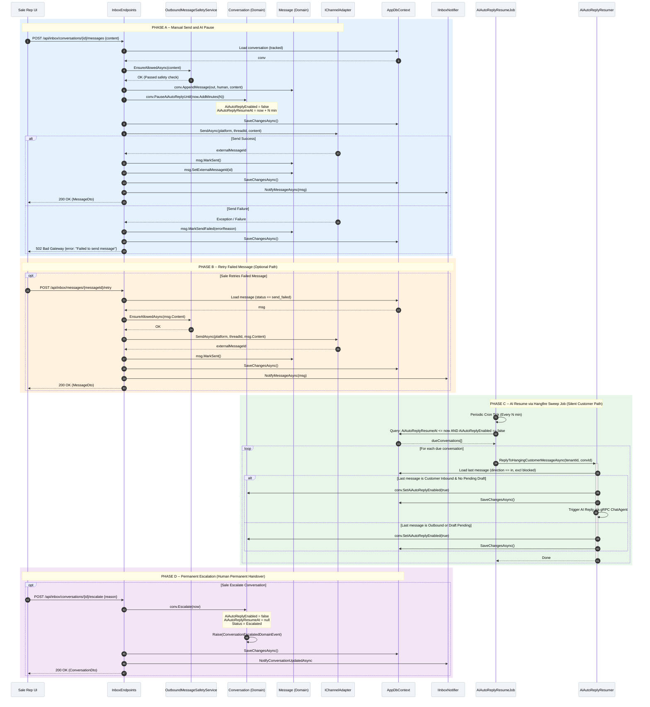

# SC-SA / Diagram 4 -- Manual Send & Dynamic AI Handover

> **Automation Type:** Human Operation + Dynamic Control Handover + Sweep Job Recovery
> **Module:** Sale Assistant > Inbox Communication
> **Trigger:** Sale rep manually sends a message via Inbox UI (`POST /api/inbox/conversations/{id}/messages`)
> **Traces to:** InboxEndpoints, OutboundMessageSafetyService, IChannelAdapter, Conversation (Domain), AiAutoReplyResumer, AiAutoReplyResumeJob, ConversationEscalatedConsumer, IInboxNotifier

---

## 1. Tổng quan (Overview)

Luồng này mô tả **cơ chế chuyển giao quyền kiểm soát giữa Nhân viên Sale và AI (Human-AI Handover)** khi nhân viên thực hiện nhắn tin trực tiếp tới khách hàng từ Inbox UI.

**Cơ chế Tạm dừng và Khôi phục AI (Pause & Resume Handover):**
- Khi Sale gửi tin nhắn tay $\rightarrow$ Gọi `conv.PauseAiAutoReplyUntil(now.AddMinutes(N))` (mặc định 60 phút).
- Hệ thống thiết lập `AiAutoReplyEnabled = false` và `AiAutoReplyResumeAt = now + N min`.
- **Đường khôi phục 1 (Customer Reply):** Nếu khách phản hồi sau mốc N phút $\rightarrow$ `TryResumeAiAutoReply(now)` kích hoạt lại AI tự động.
- **Đường khôi phục 2 (Silent Customer Sweep Job):** Nếu khách im lặng qua mốc N phút $\rightarrow$ Hangfire Job `AiAutoReplyResumeJob` quét định kỳ, gọi `ReplyToHangingCustomerMessageAsync()` để AI tự động nhắn tin hâm nóng.

**Phân biệt Tạm dừng (Pause) và Leo thang (Escalate):**
- **Manual Send (Pause):** Tắt AI tạm thời trong N phút, AI có thể tự khôi phục lại khi hết hạn.
- **Escalate (Chuyển ca khó):** Gọi `conv.Escalate()`, thiết lập `AiAutoReplyEnabled = false` vĩnh viễn (xóa `AiAutoReplyResumeAt`), phát ra sự kiện `ConversationEscalated` để xử lý hạ cấp hoặc bàn giao cố định.

**Xử lý lỗi gửi tin (Send Failure & Retry):**
- Nếu `IChannelAdapter.SendAsync()` gặp lỗi $\rightarrow$ Gọi `msg.MarkSendFailed(reason)` $\rightarrow$ Trả mã HTTP 502/500 kèm lỗi.
- Sale có thể kích hoạt gửi lại từ UI qua endpoint `/messages/{messageId}/retry` (`RetryFailedMessageAsync`).

### 1.1 Kiến trúc tham gia

| Tầng | Thành phần | Vai trò |
|---|---|---|
| API Layer | InboxEndpoints | `POST /conversations/{id}/messages`, `POST /messages/{id}/retry`, `POST /conversations/{id}/escalate` |
| Safety Gate | OutboundMessageSafetyService | Kiểm tra độc hại (Toxicity check) đối với nội dung sale nhập |
| Channel Adapter | IChannelAdapter | Gửi tin trực tiếp sang Zalo OA / Facebook Page API |
| Domain Model | Conversation | Quản lý state handover: `PauseAiAutoReplyUntil`, `TryResumeAiAutoReply`, `Escalate` |
| Domain Model | Message | Quản lý trạng thái tin nhắn: `pending_send` $\rightarrow$ `sent` / `send_failed` |
| Sweep Job | AiAutoReplyResumeJob | Hangfire job quét định kỳ các conversation bị treo quá hạn `resumeAt` |
| Resumer | AiAutoReplyResumer | Thực thi gửi tin AI cho tin nhắn khách đang bị treo |
| Notification | IInboxNotifier | Push thông báo cập nhật về FE qua SignalR |
| Database | AppDbContext | Conversations, Messages |

### 1.2 Tham chiếu mã nguồn theo tầng (Code Map)

```
InboxEndpoints.cs                   -> SendMessageAsync, RetryFailedMessageAsync, EscalateConversationAsync
OutboundMessageSafetyService.cs     -> EnsureAllowedAsync (Toxicity check trước khi gửi)
IChannelAdapter.cs                  -> SendAsync(tenantId, platform, threadId, content)
Conversation.cs                     -> PauseAiAutoReplyUntil, TryResumeAiAutoReply, Escalate
Message.cs                          -> AppendMessage, MarkSent, MarkSendFailed
AiAutoReplyResumeJob.cs             -> Hangfire job sweep: AiAutoReplyResumeAt <= now AND AiAutoReplyEnabled == false
AiAutoReplyResumer.cs               -> ReplyToHangingCustomerMessageAsync
ConversationEscalatedConsumer.cs    -> Consumer xử lý sự kiện ConversationEscalated
AppDbContext.cs                     -> Conversations, Messages
```

---

## 2. Mermaid Sequence Diagram



---

## 3. Giải thích từng Phase (Step-by-Step Detail)

### Phase A: Manual Send and AI Pause

| Step | Actor | Hành động | Code Map | Giải thích nghiệp vụ |
|---|---|---|---|---|
| 1 | Sale Rep UI | Nhập nội dung tin nhắn và bấm Gửi | FE Action | Sale chủ động nhắn tin cho khách hàng |
| 2 | InboxEndpoints | `POST /api/inbox/conversations/{id}/messages` | `SendMessageAsync()` | Tiếp nhận request từ FE |
| 3 | OutboundMessageSafetyService | `EnsureAllowedAsync(content)` | Safety Gate | Kiểm tra toxicity đối với nội dung do sale nhập |
| 4 | Conversation | `AppendMessage(out, human, content)` | Domain Method | Tạo entity Message mới với trạng thái `pending_send` |
| 5 | Conversation | `PauseAiAutoReplyUntil(now.AddMinutes(N))` | Domain Method | Đặt `AiAutoReplyEnabled = false` và set mốc `resumeAt` |
| 6 | AppDbContext | `SaveChangesAsync()` | EF Core | Flush thay đổi bước đầu vào Database |
| 7 | IChannelAdapter | `SendAsync(platform, threadId, content)` | Channel Adapter | Đẩy tin nhắn thật qua API của Zalo/Facebook |
| 8a | Message | `msg.MarkSent()` + `SetExternalMessageId()` | Domain Method | Nếu gửi thành công: cập nhật status `sent` |
| 8b | Message | `msg.MarkSendFailed(errorReason)` | Domain Method | Nếu gửi lỗi: cập nhật status `send_failed` |
| 9 | IInboxNotifier | `NotifyMessageAsync()` | SignalR | Push sự kiện cập nhật tin nhắn về giao diện FE |

### Phase B: Retry Failed Message (Optional Error Path)

| Step | Actor | Hành động | Code Map | Giải thích nghiệp vụ |
|---|---|---|---|---|
| 10 | Sale Rep UI | Nhấn nút "Gửi lại" trên tin nhắn bị lỗi | FE Action | Khôi phục từ sự cố đứt mạng/channel lỗi |
| 11 | InboxEndpoints | `POST /api/inbox/messages/{messageId}/retry` | `RetryFailedMessageAsync()` | Kiểm tra status tin nhắn có phải `send_failed` |
| 12 | OutboundMessageSafetyService | `EnsureAllowedAsync(msg.Content)` | Safety Gate | Re-check an toàn trước khi gửi lại |
| 13 | IChannelAdapter | `SendAsync(platform, threadId, content)` | Channel Adapter | Thực hiện gửi lại qua Zalo/FB API |
| 14 | Message | `msg.MarkSent()` + `SaveChangesAsync()` | EF Core | Đánh dấu tin nhắn đã gửi thành công |

### Phase C: AI Resume via Hangfire Sweep Job (Silent Customer Path)

| Step | Actor | Hành động | Code Map | Giải thích nghiệp vụ |
|---|---|---|---|---|
| 15 | Hangfire | Kích hoạt `AiAutoReplyResumeJob.RunAsync()` | Scheduled Cron Job | Quét định kỳ các hội thoại bị treo quá hạn |
| 16 | AiAutoReplyResumeJob | Query: `AiAutoReplyResumeAt <= now AND AiAutoReplyEnabled == false` | DB Query | Lọc danh sách hội thoại cần khôi phục AI |
| 17 | AiAutoReplyResumer | `ReplyToHangingCustomerMessageAsync(tenantId, convId)` | Resumer Logic | Kiểm tra điều kiện tin nhắn cuối cùng |
| 18 | AiAutoReplyResumer | Load last message (`direction == in`, excl blocked) | DB Query | Nếu tin cuối là của khách $\rightarrow$ AI tự trả lời hâm nóng |
| 19 | Conversation | `conv.SetAiAutoReplyEnabled(true)` | Domain Method | Khôi phục trạng thái AI Auto-Reply |
| 20 | GrpcChatAutoReplyGateway | `ReplyAsync()` | gRPC Call | Sinh tin nhắn AI tự động nếu khách đang chờ |

### Phase D: Permanent Escalation (Human Permanent Handover)

| Step | Actor | Hành động | Code Map | Giải thích nghiệp vụ |
|---|---|---|---|---|
| 21 | Sale Rep UI | Nhấn nút "Chuyển ca khó / Escalate" | FE Action | Bàn giao vĩnh viễn cho nhân viên xử lý thủ công |
| 22 | InboxEndpoints | `POST /api/inbox/conversations/{id}/escalate` | `EscalateConversationAsync()` | Tiếp nhận yêu cầu leo thang hội thoại |
| 23 | Conversation | `conv.Escalate(now)` | Domain Method | Set `AiAutoReplyEnabled = false`, xóa `resumeAt` vĩnh viễn |
| 24 | Domain Event | Raise `ConversationEscalatedDomainEvent` | Domain Event | Phát sự kiện chuyển ca cho hệ thống ghi log |
| 25 | IInboxNotifier | `NotifyConversationUpdatedAsync()` | SignalR | Cập nhật badge/trạng thái trên UI của Sale |

---

## 4. Hướng dẫn vẽ trên draw.io

### 4.1 Layout

- Hàng ngang (trái $\rightarrow$ phải): Sale Rep UI $\rightarrow$ InboxEndpoints $\rightarrow$ SafetyService $\rightarrow$ Conversation $\rightarrow$ Message $\rightarrow$ ChannelAdapter $\rightarrow$ SignalR $\rightarrow$ Hangfire Sweep Job $\rightarrow$ Resumer
- Hàng dọc (trên $\rightarrow$ dưới): Thời gian chạy từ trên xuống
- Khoảng cách giữa các lifelines: ~120px mỗi cột

### 4.2 Ký hiệu

| Thành phần draw.io | Shape |
|---|---|
| Sale Rep UI | Actor (hình người que) |
| InboxEndpoints | Participant + note API Endpoint cho Send, Retry, Escalate |
| OutboundMessageSafetyService | Participant + note Safety Gate (Toxicity check) |
| Conversation (Domain) | Participant + note State: Pause, Resume, Escalate |
| Message (Domain) | Participant + note Status: pending_send, sent, send_failed |
| IChannelAdapter | Participant + note Zalo OA / Facebook Page API |
| IInboxNotifier | Participant + note SignalR Push Notifier |
| AiAutoReplyResumeJob | Participant + note Hangfire Scheduled Sweep Job |
| AiAutoReplyResumer | Participant + note Trigger AI Reply cho tin treo |
| DB | Database cylinders (Conversations, Messages) |

### 4.3 Phân tách vùng (Region)

1. Region Phase A: Manual Send & AI Pause (HTTP Response + Async Channel Send)
2. Alt fragment trong Phase A: Send Success vs Send Failure
3. Opt fragment Phase B: Sale Retries Failed Message
4. Region Phase C: AI Resume via Hangfire Sweep Job (Loop cho từng conversation quá hạn)
5. Opt fragment Phase D: Permanent Escalation (Human Permanent Handover)

### 4.4 Màu sắc gợi ý

| Phase | Màu background |
|---|---|
| Phase A: Manual Send | Light blue #E3F2FD |
| Phase B: Send Retry | Light yellow #FFFDE7 |
| Phase C: Sweep Job Resume | Light green #E8F5E9 |
| Phase D: Escalation | Light red #FFEBEE |

---

## 5. Code Map Summary (File -> Responsibility)

```
InboxEndpoints.cs                   -> SendMessageAsync, RetryFailedMessageAsync, EscalateConversationAsync
OutboundMessageSafetyService.cs     -> EnsureAllowedAsync: Toxicity filter trước khi gửi
IChannelAdapter.cs                  -> SendAsync(tenantId, platform, threadId, content)
Conversation.cs                     -> PauseAiAutoReplyUntil(N min), TryResumeAiAutoReply(), Escalate()
Message.cs                          -> MarkSent(), MarkSendFailed(reason), SetExternalMessageId()
AiAutoReplyResumeJob.cs             -> Hangfire sweep job: quét AiAutoReplyResumeAt <= now
AiAutoReplyResumer.cs               -> ReplyToHangingCustomerMessageAsync: check last message & trigger AI
ConversationEscalatedConsumer.cs    -> MassTransit consumer xử lý sự kiện ConversationEscalated
IInboxNotifier.cs                   -> NotifyMessageAsync, NotifyConversationUpdatedAsync (SignalR)
AppDbContext.cs                     -> Conversations, Messages DbSets
```

---

## 6. Gap Analysis

| Feature | Status | Mô tả |
|---|---|---|
| Custom Pause Duration UI | **ĐÃ CÓ** | API chấp nhận param `pauseMinutes` từ FE (mặc định 60 phút) |
| Auto-retry on channel timeout | **CHƯA CÓ** | Hệ thống đánh dấu `send_failed` và chờ Sale bấm nút "Gửi lại" thủ công |
| Escalation Audit Trail | **ĐÃ CÓ** | Lưu vết qua `ConversationEscalatedDomainEvent` |
