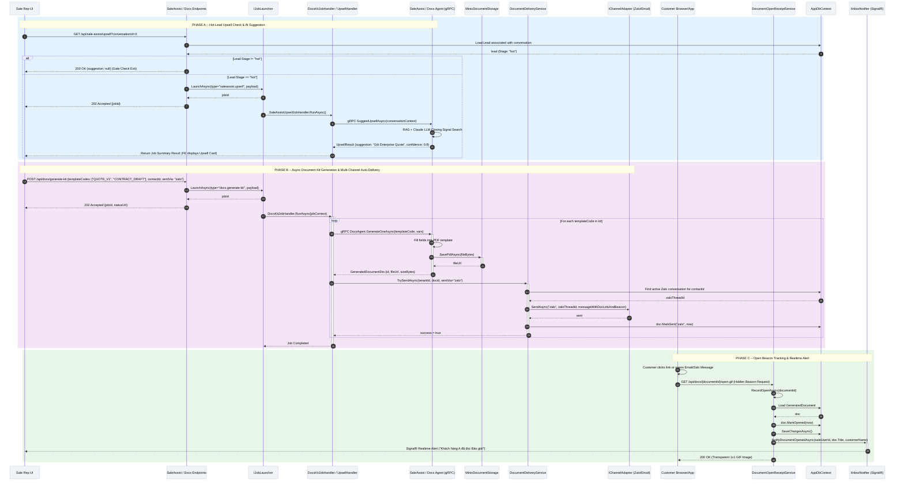

# SC-SA / Diagram 5 -- Hot Lead Upsell, Proposal Kit Generation, Auto-Delivery & Beacon Tracking

> **Automation Type:** Gate-Controlled AI Suggestion + Async Document Kit Generation + Multi-Channel Delivery + Open Beacon Tracking
> **Module:** Sale Assistant > Upsell & Document Generation
> **Trigger:** Sale rep requests upsell suggestions or generates proposal documents for a Lead in Inbox UI
> **Traces to:** SaleAssistEndpoints, SaleAssistUpsellJobHandler, SaleAssistAgentGrpcService, SaleAssistAgent, DocumentsEndpoints, DocsKitJobHandler, DocsGenerateJobHandler, DocsAgentGrpcService, MinioDocumentStorage, DocumentDeliveryService, DocumentOpenReceiptService, IInboxNotifier

---

## 1. Tổng quan (Overview)

Luồng này mô tả **chuỗi giá trị bán hàng nâng cao (Sales Enablement Pipeline)** kết hợp giữa AI Sale Assistant và Hệ thống Sinh tài liệu (Document Generation & Delivery Engine).

**Ba Pha Tự động hóa Liên hoàn (Pha A $\rightarrow$ Pha B $\rightarrow$ Pha C):**

1. **Pha A (Hot Lead Gate & AI Upsell Suggestion):**
   - API kiểm tra điều kiện kinh doanh `lead.Stage == "hot"`. Nếu Lead chưa đạt Hot $\rightarrow$ Trả HTTP 200 rỗng (tiết kiệm chi phí LLM).
   - Nếu Lead là Hot $\rightarrow$ Khởi chạy job ngầm `SaleAssistUpsellJobHandler`, gọi gRPC `SaleAssistAgent.SuggestUpsellAsync()` (RAG + Claude LLM) để quét tín hiệu chốt sale và đưa ra sản phẩm/dịch vụ gợi ý nâng cấp.

2. **Pha B (Async Proposal Kit Generation & Multi-Channel Delivery):**
   - Khi Sale duyệt gợi ý và yêu cầu tạo hồ sơ báo giá $\rightarrow$ Gọi `POST /api/docs/generate-kit` với `sentVia: "zalo"` hoặc `"email"`.
   - `DocsKitJobHandler` chạy ngầm, gọi gRPC `DocsAgent.GenerateOneAsync()` tạo hàng loạt file PDF từ Template, lưu vào MinIO Storage.
   - `DocumentDeliveryService.TrySendAsync()` tự động tra cứu conversation thread của khách $\rightarrow$ Đẩy link tải tài liệu kèm Tracking Beacon qua Zalo/Email.

3. **Pha C (Open Beacon Tracking & Realtime Alert):**
   - Khách hàng click mở link hoặc đọc email $\rightarrow$ Trình duyệt tự động load ảnh ẩn `GET /api/docs/{id}/open.gif`.
   - `DocumentOpenReceiptService.RecordOpenAsync()` ghi nhận thời điểm mở file `doc.MarkOpened()` $\rightarrow$ Đẩy thông báo SignalR thời gian thực báo cho Sale Rep: *"Khách hàng X vừa xem Báo giá!"*.

---

### 1.1 Kiến trúc tham gia

| Tầng | Thành phần | Vai trò |
|---|---|---|
| API Layer | SaleAssistEndpoints / DocumentsEndpoints | Endpoints cho Upsell, Generate Document Kit, và Beacon Tracking |
| Job System | SaleAssistUpsellJobHandler / DocsKitJobHandler | Hangfire/Background Job Handlers xử lý công việc nặng ngầm |
| gRPC Agent | SaleAssistAgentGrpcService / DocsAgentGrpcService | gRPC Agents phụ trách AI Upsell và Sinh file PDF từ Template |
| AI Core | SaleAssistAgent / DocsAgent | RAG search, Claude LLM call, và render tài liệu |
| Storage | MinioDocumentStorage | Lưu trữ file PDF an toàn và sinh URL tải về |
| Delivery | DocumentDeliveryService | Tra cứu kênh giao tiếp (Zalo/Email) và tự động đẩy link tài liệu |
| Beacon Tracking | DocumentOpenReceiptService | Xử lý tracking pixel `open.gif` khi khách mở tài liệu |
| Notification | IInboxNotifier | Push cảnh báo thời gian thực về FE qua SignalR khi khách đọc tài liệu |
| Database | AppDbContext | Leads, Conversations, GeneratedDocuments, DocumentTemplates |

### 1.2 Tham chiếu mã nguồn theo tầng (Code Map)

```
SaleAssistEndpoints.cs              -> GET /api/sale-assist/upsell (Gate check lead.Stage == "hot")
SaleAssistUpsellJobHandler.cs        -> Type="saleassist.upsell", calls gRPC SuggestUpsellAsync
SaleAssistAgent.cs                  -> SuggestUpsellAsync (RAG + Claude LLM closing signal search)
DocumentsEndpoints.cs               -> POST /api/docs/generate-kit, GET /api/docs/{id}/open.gif
DocsKitJobHandler.cs                -> Type="docs.generate-kit", loops templates & calls DocsAgent
DocsAgentGrpcService.cs             -> gRPC server: GenerateOneAsync()
MinioDocumentStorage.cs             -> Upload file PDF lên MinIO, tạo public/presigned URL
DocumentDeliveryService.cs          -> TrySendByZaloAsync, TrySendByEmailAsync qua IChannelAdapter
DocumentOpenReceiptService.cs       -> RecordOpenAsync: MarkOpened & trigger notification
SignalR (IInboxNotifier)            -> NotifyDocumentOpenedAsync push realtime cho Sale
```

---

## 2. Mermaid Sequence Diagram



---

## 3. Giải thích từng Phase (Step-by-Step Detail)

### Phase A: Hot Lead Upsell Check & AI Suggestion

| Step | Actor | Hành động | Code Map | Giải thích nghiệp vụ |
|---|---|---|---|---|
| 1 | Sale Rep UI | Mở giao diện Inbox hội thoại | FE Action | Trigger kiểm tra cơ hội bán hàng |
| 2 | SaleAssistEndpoints | `GET /api/sale-assist/upsell` | `MapGet("/upsell")` | Tiếp nhận yêu cầu kiểm tra Upsell |
| 3 | AppDbContext | Check `lead.Stage == "hot"` | DB Query | Gate check: Chỉ xử lý nếu Lead ở trạng thái Hot |
| 4 | IJobLauncher | `LaunchAsync(type="saleassist.upsell")` | `IJobLauncher` | Khởi chạy job ngầm sinh gợi ý Upsell |
| 5 | SaleAssistAgent | `SuggestUpsellAsync()` | gRPC Agent | RAG search tài liệu bán hàng + Claude LLM tìm tín hiệu chốt sale |
| 6 | Sale Rep UI | Render thẻ gợi ý Upsell trên UI | FE UI | Hiển thị gợi ý nâng cấp dịch vụ cho Sale xem |

### Phase B: Async Document Kit Generation & Multi-Channel Auto-Delivery

| Step | Actor | Hành động | Code Map | Giải thích nghiệp vụ |
|---|---|---|---|---|
| 7 | Sale Rep UI | Nhấn nút "Tạo & Gửi Bộ Báo Giá" | FE Action | Chấp nhận gợi ý, yêu cầu xuất tài liệu gửi khách |
| 8 | DocumentsEndpoints | `POST /api/docs/generate-kit` | `GenerateKitAsync()` | Tiếp nhận request sinh bộ tài liệu |
| 9 | IJobLauncher | `LaunchAsync(type="docs.generate-kit")` | `IJobLauncher` | Đẩy job nặng vào hàng chờ Hangfire (trả HTTP 202) |
| 10 | DocsKitJobHandler | `RunAsync(jobContext)` | `IJobHandler` | Duyệt qua từng `templateCode` trong kit |
| 11 | DocsAgentGrpcService | `GenerateOneAsync()` | gRPC Agent | Đổ dữ liệu Lead/Contact vào mẫu PDF |
| 12 | MinioDocumentStorage | `SavePdfAsync(fileBytes)` | Storage Service | Upload file PDF lên MinIO server, tạo File URL |
| 13 | DocumentDeliveryService | `TrySendAsync(tenantId, docId, "zalo")` | Delivery Service | Tìm Thread Zalo/Email tương ứng của Contact |
| 14 | IChannelAdapter | `SendAsync("zalo", threadId, content)` | Channel Adapter | Gửi tin nhắn chứa Link xem tài liệu + Tracking Beacon |
| 15 | AppDbContext | `doc.MarkSent("zalo", now)` + `SaveChangesAsync()` | EF Core | Đánh dấu tài liệu đã gửi thành công qua kênh |

### Phase C: Open Beacon Tracking & Realtime Alert

| Step | Actor | Hành động | Code Map | Giải thích nghiệp vụ |
|---|---|---|---|---|
| 16 | Customer Browser | Khách hàng mở link hoặc đọc email | Customer Action | Kích hoạt nạp ảnh đính kèm trong nội dung |
| 17 | DocumentsEndpoints | `GET /api/docs/{id}/open.gif` | `OpenBeaconAsync()` | Endpoint công khai nhận request tracking pixel |
| 18 | DocumentOpenReceiptService | `RecordOpenAsync(id)` | Tracking Service | Ghi nhận lượt mở file và mốc thời gian |
| 19 | AppDbContext | `doc.MarkOpened(now)` + `SaveChangesAsync()` | EF Core | Cập nhật `OpenedAt` và tăng số lượt mở (`OpenCount`) |
| 20 | IInboxNotifier | `NotifyDocumentOpenedAsync()` | SignalR | Push thông báo tức thì lên màn hình làm việc của Sale |
| 21 | DocumentsEndpoints | Trả về `TransparentGif` (1x1 pixel) | HTTP Result | Trả về ảnh GIF 1x1 trong suốt cho trình duyệt |

---

## 4. Hướng dẫn vẽ trên draw.io

### 4.1 Layout

- Hàng ngang (trái $\rightarrow$ phải): FE UI $\rightarrow$ API Endpoints $\rightarrow$ JobLauncher $\rightarrow$ JobHandlers $\rightarrow$ gRPC Agents $\rightarrow$ MinIO Storage $\rightarrow$ DeliveryService $\rightarrow$ ChannelAdapter $\rightarrow$ Customer Browser $\rightarrow$ OpenBeaconService $\rightarrow$ SignalR
- Hàng dọc (trên $\rightarrow$ dưới): Thời gian chạy từ trên xuống
- Khoảng cách giữa các lifelines: ~110px mỗi cột

### 4.2 Ký hiệu

| Thành phần draw.io | Shape |
|---|---|
| Sale Rep UI / Customer Browser | Actor (hình người que) |
| API Endpoints | Participant + note SaleAssistEndpoints & DocumentsEndpoints |
| IJobLauncher / JobHandlers | Participant + note Background Job Engine |
| gRPC Agents | Participant + note SaleAssistAgent & DocsAgent |
| MinioDocumentStorage | Participant + note S3/MinIO Document Storage |
| DocumentDeliveryService | Participant + note Auto Delivery Router (Zalo/Email) |
| IChannelAdapter | Participant + note Channel Integration |
| DocumentOpenReceiptService | Participant + note Open Beacon Tracking Pixel |
| IInboxNotifier | Participant + note SignalR Realtime Alert |
| DB | Database cylinders (Leads, GeneratedDocuments) |

### 4.3 Phân tách vùng (Region)

1. Region Phase A: Hot Lead Upsell Check (Alt fragment: Lead Stage != hot vs Lead Stage == hot)
2. Region Phase B: Async Document Kit Generation & Delivery (Loop fragment cho từng template trong kit)
3. Region Phase C: Open Beacon Tracking & Realtime Alert (Tracking pixel request & SignalR notification)

### 4.4 Màu sắc gợi ý

| Phase | Màu background |
|---|---|
| Phase A: Hot Lead Upsell Check | Light blue #E3F2FD |
| Phase B: Doc Kit Generation & Delivery | Light purple #F3E5F5 |
| Phase C: Open Beacon Tracking | Light green #E8F5E9 |

---

## 5. Code Map Summary (File -> Responsibility)

```
SaleAssistEndpoints.cs              -> GET /api/sale-assist/upsell (Stage Gate Check)
SaleAssistUpsellJobHandler.cs        -> Job type="saleassist.upsell", calls gRPC SuggestUpsellAsync
SaleAssistAgent.cs                  -> SuggestUpsellAsync: RAG + Claude LLM closing signal detection
DocumentsEndpoints.cs               -> POST /api/docs/generate-kit, GET /api/docs/{id}/open.gif
DocsKitJobHandler.cs                -> Job type="docs.generate-kit", loops templates & handles kit progress
DocsAgentGrpcService.cs             -> gRPC server: GenerateOneAsync()
MinioDocumentStorage.cs             -> SavePdfAsync: upload PDF to MinIO storage bucket
DocumentDeliveryService.cs          -> TrySendByZaloAsync, TrySendByEmailAsync via IChannelAdapter
DocumentOpenReceiptService.cs       -> RecordOpenAsync: mark opened timestamp & trigger SignalR alert
IInboxNotifier.cs                   -> NotifyDocumentOpenedAsync: push realtime notification to Sale
AppDbContext.cs                     -> Leads, Contacts, GeneratedDocuments DbSets
```

---

## 6. Gap Analysis

| Feature | Status | Mô tả |
|---|---|---|
| Open Count Analytics | **ĐÃ CÓ** | `GeneratedDocument` đếm chính xác số lần khách mở file (`OpenCount`) |
| Document Link Expiry | **ĐÃ CÓ** | Link tải có thời gian hết hạn (`ExpiresAt`), tự động trả HTTP 410 Gone nếu quá hạn |
| Direct PDF Preview in Zalo | **ĐÃ CÓ** | Gửi kèm link tải trực tiếp và thumbnail thông qua Zalo Card / Email template |
