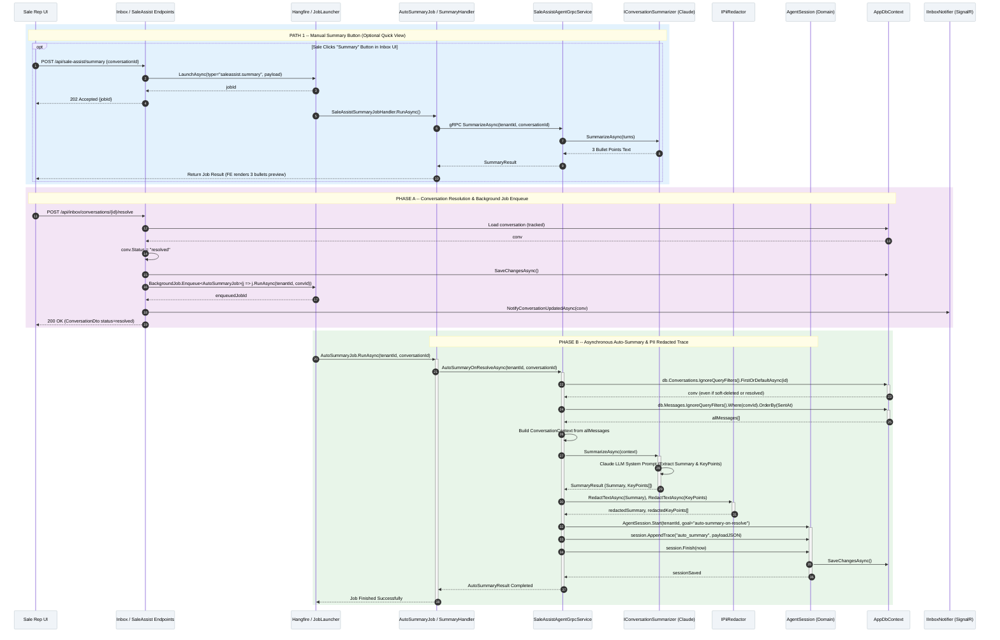

# SC-SA / Diagram 6 -- Conversation Closure & Asynchronous Auto-Summary

> **Automation Type:** Event-Triggered Background Job Analytics + LLM Conversation Summarization
> **Module:** Sale Assistant > Conversation Analytics & Resolution
> **Trigger:** Sale rep resolves a conversation via Inbox UI (`POST /api/inbox/conversations/{id}/resolve`)
> **Traces to:** InboxEndpoints, AutoSummaryJob, SaleAssistAgentGrpcService, SaleAssistAgent, IConversationSummarizer, AgentSession, AppDbContext, IInboxNotifier

---

## 1. Tổng quan (Overview)

Luồng này mô tả **quy trình đóng hội thoại và tự động tóm tắt phân tích (Conversation Resolution & Auto-Summarization Pipeline)**.

**Phân biệt hai luồng Tóm tắt (Manual Summary vs Auto-Summary on Resolve):**

1. **Luồng Tóm tắt Thủ công (Manual Summary Button):**
   - Sale rep bấm nút "Tóm tắt" trên Inbox UI $\rightarrow$ Gọi `POST /api/sale-assist/summary`.
   - Khởi chạy job ngầm `SaleAssistSummaryJobHandler`, gọi gRPC `SaleAssistAgent.SummarizeAsync()`.
   - Trả về 3 dòng gạch đầu dòng (bullet points) hiển thị tức thì trên UI panel cho Sale đọc nhanh.

2. **Luồng Tóm tắt Tự động khi Đóng Hội thoại (Auto-Summary on Resolve - Luồng trọng tâm):**
   - Sale rep chuyển trạng thái hội thoại sang Đã giải quyết $\rightarrow$ Gọi `POST /api/inbox/conversations/{id}/resolve`.
   - API cập nhật `conv.Status = "resolved"` và đẩy ngay Hangfire background job: `BackgroundJob.Enqueue<AutoSummaryJob>(j => j.RunAsync(tenantId, conversationId))`.
   - `AutoSummaryJob` chạy ngầm, gọi gRPC `SaleAssistAgentGrpcService.AutoSummaryOnResolveAsync()`.
   - **Đặc điểm kỹ thuật quan trọng:** Dùng `IgnoreQueryFilters()` để truy vấn toàn bộ lịch sử tin nhắn (bao gồm cả hội thoại đã đóng/soft-deleted).
   - Gọi `IConversationSummarizer` (Claude LLM) trích xuất nội dung tóm tắt (`Summary`) và danh sách điểm then chốt (`KeyPoints`).
   - Khởi tạo `AgentSession` với `goal = "auto-summary-on-resolve"`, lưu `AgentSessionTrace` (đã qua PII Redaction) để phục vụ kiểm toán và báo cáo phân tích.

> 📌 **Lưu ý phân định:** Mốc watermark `MemoryExtractedAt` thuộc về phân hệ **AI Self-Learning Memory** (Trích xuất trí nhớ dài hạn), KHÔNG nằm trong luồng Auto-Summary này. Auto-Summary tập trung duy nhất vào việc tổng hợp kết quả hội thoại và lưu vết `AgentSession` trace.

---

### 1.1 Kiến trúc tham gia

| Tầng | Thành phần | Vai trò |
|---|---|---|
| API Layer | InboxEndpoints / SaleAssistEndpoints | Endpoints xử lý `/resolve` và `/summary` |
| Background Job | AutoSummaryJob / SaleAssistSummaryJobHandler | Hangfire background jobs xử lý tóm tắt ngầm |
| gRPC Agent | SaleAssistAgentGrpcService | gRPC Service bọc lấy logic tóm tắt hội thoại |
| AI Summarizer | IConversationSummarizer / SaleAssistAgent | Gọi Claude LLM với system prompt chuyên biệt cho tóm tắt |
| PII Redaction | IPiiRedactor | Redact PII (sĐT, email, tên) trước khi lưu trace |
| Domain Model | AgentSession / Conversation | Quản lý phiên làm việc AI, lưu vết `AgentSessionTrace` |
| Notification | IInboxNotifier | Push thông báo cập nhật về FE qua SignalR |
| Database | AppDbContext | Conversations, Messages, AgentSessions (truy vấn qua `IgnoreQueryFilters`) |

### 1.2 Tham chiếu mã nguồn theo tầng (Code Map)

```
InboxEndpoints.cs                   -> POST /api/inbox/conversations/{id}/resolve (Chuyển resolved & Enqueue job)
AutoSummaryJob.cs                   -> Hangfire job: type="inbox.auto-summary", calls AutoSummaryOnResolveAsync
SaleAssistEndpoints.cs              -> POST /api/sale-assist/summary (Luồng manual summary button)
SaleAssistSummaryJobHandler.cs        -> Type="saleassist.summary", calls gRPC SummarizeAsync
SaleAssistAgentGrpcService.cs       -> AutoSummaryOnResolveAsync (IgnoreQueryFilters DB query + calls Agent)
SaleAssistAgent.cs                  -> SummarizeAsync & AutoSummaryAsync via IConversationSummarizer
IConversationSummarizer.cs          -> SummarizeAsync: Claude LLM call (returns SummaryResult {Summary, KeyPoints})
IPiiRedactor.cs                     -> RedactTextAsync trước khi ghi vào AgentSession trace
AgentSession.cs                     -> Start(goal="auto-summary-on-resolve"), AppendTrace, Finish
AppDbContext.cs                     -> Conversations, Messages, AgentSessions (IgnoreQueryFilters query)
```

---

## 2. Mermaid Sequence Diagram



---

## 3. Giải thích từng Phase (Step-by-Step Detail)

### Path 1: Manual Summary Button (Optional Path)

| Step | Actor | Hành động | Code Map | Giải thích nghiệp vụ |
|---|---|---|---|---|
| 1 | Sale Rep UI | Nhấn nút "Tóm tắt" trên giao diện | FE Action | Yêu cầu tóm tắt nhanh để đọc lại lịch sử |
| 2 | SaleAssistEndpoints | `POST /api/sale-assist/summary` | `MapPost("/summary")` | Tiếp nhận request từ FE |
| 3 | SaleAssistSummaryJobHandler | `RunAsync(jobContext)` | `IJobHandler` | Khởi chạy job ngầm tóm tắt |
| 4 | IConversationSummarizer | `SummarizeAsync(turns)` | gRPC / LLM Call | Trích xuất 3 dòng gạch đầu dòng ngắn gọn cho UI |

### Phase A: Conversation Resolution & Background Job Enqueue

| Step | Actor | Hành động | Code Map | Giải thích nghiệp vụ |
|---|---|---|---|---|
| 5 | Sale Rep UI | Bấm nút "Giải quyết / Resolve" | FE Action | Đóng hội thoại sau khi hoàn thành hỗ trợ |
| 6 | InboxEndpoints | `POST /api/inbox/conversations/{id}/resolve` | `ResolveConversationAsync()` | Tiếp nhận yêu cầu đóng hội thoại |
| 7 | Conversation | `conv.Status = "resolved"` | Domain Method | Chuyển trạng thái hội thoại sang Đã giải quyết |
| 8 | AppDbContext | `SaveChangesAsync()` | EF Core | Flush cập nhật trạng thái vào DB |
| 9 | Hangfire | `BackgroundJob.Enqueue<AutoSummaryJob>()` | Background Job Engine | Đẩy job tóm tắt ngầm vào hàng chờ, không làm trễ HTTP response |
| 10 | IInboxNotifier | `NotifyConversationUpdatedAsync()` | SignalR | Push thông báo cập nhật badge trên UI |

### Phase B: Asynchronous Auto-Summary & PII Redacted Trace

| Step | Actor | Hành động | Code Map | Giải thích nghiệp vụ |
|---|---|---|---|---|
| 11 | AutoSummaryJob | `RunAsync(tenantId, conversationId)` | `IJobHandler` | Thao tác chạy job ngầm từ Hangfire |
| 12 | SaleAssistAgentGrpcService | `AutoSummaryOnResolveAsync()` | gRPC Service Method | Bắt đầu quy trình tự động tóm tắt khi đóng hội thoại |
| 13 | AppDbContext | Query `Conversations.IgnoreQueryFilters()` | EF Core Query | Đọc dữ liệu hội thoại xuyên suốt (bỏ qua query filters) |
| 14 | AppDbContext | Query `Messages.IgnoreQueryFilters()` | EF Core Query | Lấy toàn bộ lịch sử tin nhắn kể cả các tin đã lưu trữ |
| 15 | IConversationSummarizer | `SummarizeAsync(context)` | Claude LLM Call | LLM phân tích toàn bộ cuộc đối thoại, sinh Summary + KeyPoints |
| 16 | IPiiRedactor | `RedactTextAsync(summary, keyPoints)` | PII Redactor | Khử thông tin nhạy cảm (PII) trước khi lưu vết |
| 17 | AgentSession | `AgentSession.Start(goal="auto-summary-on-resolve")` | Domain Method | Tạo phiên làm việc AI để ghi log kiểm toán |
| 18 | AgentSession | `session.AppendTrace("auto_summary", payload)` | Domain Method | Ghi vết dữ liệu tóm tắt vào `AgentSessionTrace` |
| 19 | AppDbContext | `session.Finish(now)` + `SaveChangesAsync()` | EF Core | Hoàn tất lưu vết vào Database |

---

## 4. Hướng dẫn vẽ trên draw.io

### 4.1 Layout

- Hàng ngang (trái $\rightarrow$ phải): FE UI $\rightarrow$ Endpoints $\rightarrow$ Hangfire Job $\rightarrow$ JobHandler $\rightarrow$ gRPC Service $\rightarrow$ Summarizer (Claude) $\rightarrow$ PII Redactor $\rightarrow$ AgentSession $\rightarrow$ DB $\rightarrow$ SignalR
- Hàng dọc (trên $\rightarrow$ dưới): Thời gian chạy từ trên xuống
- Khoảng cách giữa các lifelines: ~115px mỗi cột

### 4.2 Ký hiệu

| Thành phần draw.io | Shape |
|---|---|
| Sale Rep UI | Actor (hình người que) |
| Inbox / SaleAssist Endpoints | Participant + note API Minimal Endpoints |
| Hangfire / JobLauncher | Participant + note Background Job Queue |
| AutoSummaryJob / Handlers | Participant + note Async Job Handlers |
| SaleAssistAgentGrpcService | Participant + note gRPC Agent Service |
| IConversationSummarizer | Participant + note Claude LLM Summarizer |
| IPiiRedactor | Participant + note PII Masking Engine |
| AgentSession (Domain) | Participant + note Audit Trace Persistence |
| DB | Database cylinders (IgnoreQueryFilters Query) |

### 4.3 Phân tách vùng (Region)

1. Opt fragment Path 1: Manual Summary Button (Chỉ chạy khi Sale bấm nút Tóm tắt trên UI)
2. Region Phase A: Conversation Resolution & Job Enqueue (HTTP 200 Response)
3. Region Phase B: Asynchronous Auto-Summary & PII Redacted Trace (Async execution trong Hangfire Worker)

### 4.4 Màu sắc gợi ý

| Phase | Màu background |
|---|---|
| Path 1: Manual Summary | Light yellow #FFFDE7 |
| Phase A: Resolution & Enqueue | Light blue #E3F2FD |
| Phase B: Async Auto-Summary | Light green #E8F5E9 |

---

## 5. Code Map Summary (File -> Responsibility)

```
InboxEndpoints.cs                   -> POST /api/inbox/conversations/{id}/resolve (Status = resolved & Enqueue job)
AutoSummaryJob.cs                   -> Hangfire job: type="inbox.auto-summary", calls AutoSummaryOnResolveAsync
SaleAssistEndpoints.cs              -> POST /api/sale-assist/summary (Manual summary button)
SaleAssistSummaryJobHandler.cs        -> Job type="saleassist.summary", calls gRPC SummarizeAsync
SaleAssistAgentGrpcService.cs       -> AutoSummaryOnResolveAsync: IgnoreQueryFilters DB query + calls summarizer
SaleAssistAgent.cs                  -> SummarizeAsync & AutoSummaryAsync via IConversationSummarizer
IConversationSummarizer.cs          -> SummarizeAsync: Claude LLM call returning SummaryResult {Summary, KeyPoints}
IPiiRedactor.cs                     -> RedactTextAsync: khử PII trước khi lưu AgentSessionTrace
AgentSession.cs                     -> Start(goal="auto-summary-on-resolve"), AppendTrace, Finish
AppDbContext.cs                     -> Conversations, Messages, AgentSessions DbSets (IgnoreQueryFilters query)
```

---

## 6. Gap Analysis

| Feature | Status | Mô tả |
|---|---|---|
| IgnoreQueryFilters Read | **ĐÃ CÓ** | Đọc đầy đủ tin nhắn ngay cả khi conversation đã được đóng/chuyển trạng thái |
| PII Masking on Trace | **ĐÃ CÓ** | Tóm tắt được lọc PII kỹ càng trước khi ghi vào `AgentSessionTrace` |
| Key Points Extraction | **ĐÃ CÓ** | Trích xuất các gạch đầu dòng điểm quan trọng (`KeyPoints`) phục vụ báo cáo CRM |
