# SC-06 / Diagram 1 — Lead Orchestrated Automation

> **Automation Type:** Scheduled-Job + AI-Driven Orchestration + Manual Trigger
> **Module:** CRM → Lead Agent Orchestration
> **Trigger:** (A) Cron Schedule — `AgentScheduleWorker` tick mỗi 1 phút **HOẶC** (B) Manager gõ task trực tiếp — `OrchestratorGrpcService.Submit()`
> **Traces to:** AgentScheduleWorker, AgentScheduleRunner, OrchestratorGrpcService, AutonomousOrchestrator, AutonomousPlanner, LeadOrchestrationAdapter, LeadAgentRunner, LeadBatchRescorer, AutonomousRunSink

---

## 1. Tổng quan (Overview)

Luồng này mô tả cách hệ thống **tự động thực thi các lead operations** qua orchestrator. Có **2 entry points** hội tụ tại cùng 1 method `AutonomousOrchestrator.RunAsync()`:

1. **Cron Trigger:** `AgentScheduleWorker` quét schedule đến hạn → dispatch task tự động
2. **Manual Trigger:** Manager nhập goal trực tiếp vào Agent Hub UI → `OrchestratorGrpcService.Submit()` → dispatch task

Cả 2 paths đều hội tụ tại **cùng 1 method**: `AutonomousOrchestrator.RunAsync()`. Từ đó trở xuống, toàn bộ flow giống hệt: **Planner LLM → Cost Guard → Adapter Dispatch → Task Execution**.

### 1.1 Điều gì xảy ra từ Orchestrator trở xuống

Orchestrator dispatch task đến `LeadOrchestrationAdapter` — adapter này thực hiện **3 loại operation**:

| Operation | Mô tả | Code entry |
|---|---|---|
| **Batch Rescore** | Quét tất cả leads, classify tin nhắn inbound, tính lại điểm → `AdjustScore()` tự động raise domain events (`LeadBecameHot`, `LeadBecameWarm`) | `LeadBatchRescorer.RescoreTenantAsync()` |
| **Create with Intelligence** | Tạo lead mới: spam detection + dedup + enrichment + timezone detection | `LeadAgentRunner.CreateWithSkillsAsync()` |
| **List/Query** | Lấy danh sách leads theo stage/inactive days cho downstream tasks | `LeadOrchestrationAdapter.ListLeadsAsync()` |

> **Điểm mấu chốt (Key Insight):** Batch rescore gọi `lead.AdjustScore()` → domain method này tự động raise `LeadBecameHot` hoặc `LeadBecameWarm` events → MassTransit dispatch → trigger toàn bộ event chain của **Diagram 2** (auto-assign) và **Diagram 3** (drip email).

### 1.2 Bảng thành phần kiến trúc (Participants)

| Tầng | Thành phần | Vai trò |
|---|---|---|
| Manual Entry | `OrchestratorGrpcService.Submit()` | Manager gọi goal trực tiếp từ Agent Hub UI |
| Background Worker | `AgentScheduleWorker` (BackgroundService) | Quét schedule đến hạn mỗi 1 phút |
| Runner | `AgentScheduleRunner` | Tạo `AgentScheduleRun` + `AgentSession`, gọi orchestrator |
| Orchestrator | `AutonomousOrchestrator` | Plan → Execute DAG tasks |
| LLM Planner | `AutonomousPlanner` → `SemanticKernelPlanGenerator` | Gọi LLM sinh `OrchestrationPlanDocument` |
| Lead Adapter | `LeadOrchestrationAdapter` | Route task đến LeadAgentRunner / LeadBatchRescorer |
| Lead Agent Runner | `LeadAgentRunner` | Create with skills (spam + dedup + enrich + tz) |
| Batch Rescorer | `LeadBatchRescorer` | Rescore toàn bộ leads từ inbound messages |
| Scoring Engine | `LeadScoringEngine.Evaluate()` | Tính delta từ scoring rules |
| Domain | `Lead.AdjustScore()` | Cập nhật score, phát domain events |
| Run Sink | `AutonomousRunSink` | Ghi trace, persist plan, notify complete |
| Cost Guard | `OrchestratorCostGuard` | Kiểm tra cost cap trước mỗi task |
| Database | `AppDbContext` | Leads, LeadScoringRules, Messages, LeadActivities |

### 1.3 Design decision: Manual trigger trả về ngay

Manual trigger tạo session placeholder **TRƯỚC** khi planner chạy → trả về `sessionId` ngay cho UI → FE lưu vào URL, progress tồn tại qua F5. Sau đó chạy nền `Task.Run` với scope mới để planner + executor chạy offline. Cron trigger chạy trực tiếp trong schedule worker scope.

### 1.4 Tham chiếu mã nguồn theo tầng (Code Map)

```
AgentScheduleWorker.cs          → BackgroundService, quét schedule due mỗi 1 phút (Cron path)
AgentScheduleRunner.cs          → Tạo run + session, gọi orchestrator (Cron path)
OrchestratorGrpcService.cs      → gRPC entry: Submit() → background run (Manual path)
AutonomousOrchestrator.cs       → Core: plan → execute DAG → replan → complete (CHUNG)
AutonomousPlanner.cs            → Delegates to SemanticKernelPlanGenerator (LLM)
SemanticKernelPlanGenerator.cs  → Gọi LLM sinh OrchestrationPlanDocument
LeadOrchestrationAdapter.cs     → Route task đến lead-agent operations
LeadAgentRunner.cs              → CreateWithSkillsAsync (spam + dedup + enrich + tz)
LeadBatchRescorer.cs            → RescoreTenantAsync: quét leads + classify messages
LeadScoringEngine.cs            → Evaluate(eventCode, platform, rules) → delta
Lead.cs                         → AdjustScore() → score + stage + domain events
AutonomousRunSink.cs            → Persist plan, trace, notify, publish SSE
OrchestratorCostGuard.cs        → Cost cap preflight + per-task reservation
AppDbContext.cs                 → Leads, LeadScoringRules, Messages, LeadActivities
ScheduleEventKeys.cs            → Event keys: TrendsScanned, LeadBecameHot, etc.
```

---

## 2. Mermaid Sequence Diagram

Diagram dưới đây mô tả đầy đủ flow từ trigger → planning → DAG execution → completion. **Activation boxes** (+/- trên mũi tên) thể hiện lifeline nào đang active trong từng khoảng thời gian.
Sử dụng **alt/loop fragments** để phân tách 2 trigger paths, 3 operations, và wave loop.

```mermaid
%%{init: { 'themeVariables': { 'textColor': '#000000', 'actorTextColor': '#000000', 'actorBkg': '#F0F4F8', 'actorBorder': '#B0BEC5', 'signalTextColor': '#000000', 'noteTextColor': '#000000', 'noteBkgColor': '#FFFDE7', 'noteBorderColor': '#FFF59D', 'loopTextColor': '#000000' } }}%%
sequenceDiagram
    autonumber
    participant CRON as Cron Scheduler
    participant WKR as AgentScheduleWorker
    participant RUNNER as AgentScheduleRunner
    participant MGR as Manager UI
    participant GRPC as OrchestratorGrpcService
    participant ORCH as AutonomousOrchestrator
    participant PLAN as AutonomousPlanner (LLM)
    participant COST as CostGuard
    participant ADAPT as LeadOrchestrationAdapter
    participant BR as LeadBatchRescorer
    participant SE as LeadScoringEngine
    participant LEAD as Lead (Domain)
    participant SINK as AutonomousRunSink
    participant DB as AppDbContext
    participant BUS as MassTransit

    rect rgb(227, 242, 253)
        Note over CRON, GRPC: PHASE A -- Trigger Detection (Alt: Cron vs Manual)

        alt Cron Trigger (Mỗi 1 phút)
            CRON->>WKR: PeriodicTimer tick
            WKR->>DB: Query AgentSchedules WHERE NextRunAt <= now
            DB-->>WKR: DueSchedule[]
            loop Mỗi schedule due
                WKR->>RUNNER: RunDueAsync(scheduleId, dueAtUtc)
                RUNNER->>DB: Check overlap (windowKey)
                RUNNER->>DB: AgentSession.CreatePlan(tenantId, goalTemplate)
                DB-->>RUNNER: session (status=running)
                RUNNER->>RUNNER: run.LinkSession(session.Id)
                RUNNER->>ORCH: RunAsync(AutonomousRunRequest{Source=schedule})
                ORCH-->>RUNNER: AutonomousRunResult{status}
                RUNNER-->>WKR: AgentScheduleRun (completed/failed)
            end

        else Manual Trigger (Manager UI)
            MGR->>GRPC: Submit(SubmitRequest{goal, tenantId})
            GRPC->>GRPC: Validate goal + parse tenantId
            GRPC->>DB: Resolve orchestratorAgentId
            GRPC->>DB: AgentSession.Start(tenantId, agentId, goal)
            DB-->>GRPC: session (status=running)
            GRPC->>GRPC: AppendTrace(planning_started)
            GRPC-->>MGR: SessionResponse{sessionId, status=running}
            Note over GRPC: Background: Task.Run(PlanAndRunPersistedAsync)
            GRPC->>ORCH: RunAsync(AutonomousRunRequest{Source=manual})
        end
    end

    rect rgb(243, 229, 245)
        Note over ORCH, SINK: PHASE B -- LLM Planning (Chung)

        ORCH->>DB: IAgentDefinitionCatalog.ListAsync(tenantId)
        DB-->>ORCH: AgentDefinitionCatalogEntry[]
        ORCH->>COST: Begin tracking scope
        COST-->>ORCH: tracking started
        ORCH->>PLAN: PlanAsync(tenantId, goal, catalogEntries)
        PLAN->>PLAN: SemanticKernelPlanGenerator.GenerateAsync()
        PLAN-->>ORCH: OrchestrationPlanDocument{Tasks[], DependsOn[]}
        ORCH->>SINK: PersistPlanAsync(sessionId, plan)
        SINK-->>ORCH: persisted
        ORCH->>SINK: TraceAsync(plan_summary)
        SINK-->>ORCH: traced
    end

    rect rgb(232, 245, 233)
        Note over ORCH, DB: PHASE C -- DAG Execution & Cost Control

        ORCH->>COST: CanStartAsync(tenantId, totalCostEstimate)
        alt Preflight Allowed (Cost within limit)
            COST-->>ORCH: Allowed = true

            loop Wave loop (DAG Execution)
                ORCH->>ORCH: ReadyTasks(plan)

                loop Mỗi ready task
                    ORCH->>COST: TryReserveAsync(tenantId, perTaskCost)
                    COST-->>ORCH: reservation granted
                    ORCH->>ORCH: IA2AMailbox.SendAsync
                    ORCH->>ADAPT: IAgent.ExecuteAsync(AgentTask)

                    alt batch_score / rescore
                        ADAPT->>BR: RescoreTenantAsync(tenantId, topN)
                        BR->>DB: EnsureDefaultRulesAsync
                        DB-->>BR: LeadScoringRule[]
                        BR->>DB: Leads.Where(tenant, active, excl customer/lost)
                        DB-->>BR: Lead[]
                        BR->>DB: Messages JOIN Conversations (max 40)
                        DB-->>BR: inboundByContact

                        loop Mỗi Lead
                            BR->>BR: KeywordLeadSignalClassifier.ClassifyAsync
                            BR->>SE: Evaluate(code, platform, rules)
                            SE-->>BR: ScoringDecision{Delta, Reason}
                            BR->>BR: SumUniqueSignalWeights
                            BR->>LEAD: lead.AdjustScore(delta, reason, now)
                            LEAD->>LEAD: Score = Max(0, Score + delta)
                            LEAD->>LEAD: Stage = PipelineStageFromScore(Score)
                            LEAD->>LEAD: LeadActivity.Create(score_adjust)

                            alt Score >= 70 and prevStage != hot
                                LEAD->>LEAD: Raise(LeadBecameHot)
                            else Score >= 30 and prevStage == cold
                                LEAD->>LEAD: Raise(LeadBecameWarm)
                            end
                            LEAD-->>BR: AdjustScore done
                        end

                        BR->>DB: SaveChangesAsync (flush leads + events)
                        Note over BR, BUS: EF Core publish domain events
                        DB-->>BR: saved
                        BUS-->>BUS: LeadBecameHot -> Diagram 2
                        BUS-->>BUS: LeadBecameWarm -> Diagram 3
                        BR-->>ADAPT: LeadBatchRescoreResult

                    else create
                        ADAPT->>ADAPT: CreateWithSkillsAsync
                        ADAPT->>ADAPT: SpamDetector, Deduplicator, Enricher, Timezone
                        ADAPT->>DB: Lead.Create + db.Add + SaveChanges
                        DB-->>ADAPT: lead persisted
                        ADAPT-->>ORCH: LeadCreateResult

                    else list
                        ADAPT->>DB: Leads.Where(stage, inactiveDays, limit)
                        DB-->>ADAPT: filtered leads
                        ADAPT-->>ORCH: list result
                    end

                    ORCH->>COST: ReleaseReservationAsync(perTaskCost)
                    ORCH->>SINK: PersistPlanAsync(updated plan)
                    SINK-->>ORCH: persisted
                    ORCH->>SINK: TraceAsync(task result)
                    SINK-->>ORCH: traced
                end

                alt failed tasks and replans < MaxRounds
                    ORCH->>PLAN: ReplanAsync(tenantId, goal, entries, failedTasks)
                    PLAN-->>ORCH: Updated plan
                    ORCH->>SINK: PersistPlanAsync(revised plan)
                    SINK-->>ORCH: persisted
                else dependency_blocked
                    ORCH->>SINK: FailAsync(dependency_blocked)
                    SINK-->>ORCH: failed
                else max_rounds
                    ORCH->>SINK: FailAsync(max_rounds)
                    SINK-->>ORCH: failed
                end
            end

            ORCH-->>RUNNER: AutonomousRunResult.Completed(replans)

        else Cost Exceeded (Exceeds Tenant Budget Limit)
            COST-->>ORCH: Allowed = false (Reason: "cost_cap_preflight")
            ORCH->>SINK: FailAsync(sessionId, "cost_cap_preflight")
            SINK-->>ORCH: failed trace persisted
            ORCH-->>RUNNER: AutonomousRunResult.Failed("cost_cap_preflight")
        end
    end

    rect rgb(236, 239, 241)
        Note over ORCH, DB: PHASE D -- Completion

        ORCH->>SINK: EmitRunSummaryAsync
        SINK-->>ORCH: summary emitted
        ORCH->>SINK: CompleteAsync(sessionId)
        SINK->>SINK: PublishRunEvent (Redis SSE)
        SINK->>SINK: Notify(orchestration_completed)
        SINK-->>ORCH: completed
        RUNNER->>DB: run.Complete(now)
        DB-->>RUNNER: terminal
    end
```




**Ghi chú cho diagram:**

- **Actor 1:** `Cron Scheduler` (timer source) — trên cùng bên trái
- **Actor 2:** `Manager UI` (human user) — trên cùng bên phải
- **Note** giữa 2 actor: "Alt fragment: Cron vs Manual trigger"
- **Note** bên cạnh `LeadOrchestrationAdapter`: "3 operations: batch_score, create, list"
- **Note** bên cạnh `Lead.AdjustScore`: "Tự động raise LeadBecameHot / LeadBecameWarm events"
- **Note** bên cạnh `MassTransit`: "LeadBecameHot → Diagram 2, LeadBecameWarm → Diagram 3"
- **Database cylinders:** Leads, LeadScoringRules, Messages, LeadActivities`n+- **Activation boxes:** `+` trên mũi tên gửi = bắt đầu active, `-` trên mũi tên trả = kết thúc active. Lifeline nào có activation box kéo dài = đang bận xử lý trong khoảng thời gian đó.

---

## 3. Giải thích từng Phase (Step-by-Step Detail)

### 3.1 Phase A — Trigger Detection & Run Initialization

Có 2 paths dẫn đến cùng 1 method `AutonomousOrchestrator.RunAsync()`:

**Path 1: Cron Trigger (tự động)**

| Step | Actor | Hành động | Code Map | Giải thích nghiệp vụ |
|---|---|---|---|---|
| 1a | `AgentScheduleWorker` | `ExecuteAsync()` quét `AgentSchedules` WHERE `NextRunAt <= now` | `AgentScheduleWorker.ProcessDueAsync()` | Đống hồ báo thức, quét DB mỗi phút tìm schedule đã đến hạn chạy |
| 2a | `AgentScheduleWorker` | Tạo scope mới, resolve `AgentScheduleRunner` | `scopeFactory.CreateScope()` | Mỗi lịch 1 scope = 1 AppDbContext riêng, tránh entity conflict giữa các lịch chạy cùng lúc |
| 3a | `AgentScheduleRunner` | `RunDueAsync(scheduleId, dueAtUtc)` — load schedule, kiểm tra overlap | `AgentScheduleRunner.RunDueAsync()` | Kiểm tra windowKey để tránh chạy trùng lịch (event-triggered vs cadence) |
| 4a | `AgentScheduleRunner` | Tạo `AgentSession.CreatePlan(tenantId, goalTemplate)` | `_db.AgentSessions.Add(session)` | Khởi tạo "phiên làm việc" cho AI, nạp mục tiêu công việc tự động |
| 5a | `AgentScheduleRunner` | `run.LinkSession(session.Id)` + `RecordRun(schedule, nextRunAt)` | `run.LinkSession()` | Liên kết lịch đang chạy với session, ghi lại thời gian chạy tiếp theo |
| 6a | `AgentScheduleRunner` | `_orchestrator.RunAsync(AutonomousRunRequest{Source="schedule"})` | `AutonomousOrchestrator.RunAsync()` | Bắt đầu ra lệnh cho Orchestrator hoạt động |

**Path 2: Manual Trigger (Manager UI)**

| Step | Actor | Hành động | Code Map | Giải thích nghiệp vụ |
|---|---|---|---|---|
| 1b | Manager | Nhập goal vào Agent Hub UI (VD: "chấm điểm lại lead lạnh") | Agent Hub Frontend | Manager gõ lệnh trực tiếp |
| 2b | `OrchestratorGrpcService` | `Submit(request)`: validate goal, parse tenantId | `OrchestratorGrpcService.Submit()` | Nhận lệnh, kiểm tra hợp lệ và xác định tenant |
| 3b | `OrchestratorGrpcService` | `ResolveOrchestratorAgentIdAsync()` từ `AgentConfigs` | `ResolveOrchestratorAgentIdAsync()` | Xác định con AI nào có khả năng phù hợp |
| 4b | `OrchestratorGrpcService` | `AgentSession.Start(tenantId, agentId, goal)` — placeholder session | `_db.AgentSessions.Add(session)` | Tạo session placeholder TRƯỚC khi planner chạy |
| 5b | `OrchestratorGrpcService` | `session.AppendTrace("planning_started")` | `session.AppendTrace(...)` | Ghi log bước đầu tiên |
| 6b | `OrchestratorGrpcService` | `ToResponse(session)` — trả sessionId ngay cho UI | `ToResponse(session)` | **Quan trọng:** Trả về ngay để UI không bị treo chờ |
| 7b | `OrchestratorGrpcService` | `Task.Run(() => PlanAndRunPersistedAsync(...))` | Background execution | Đưa vào luồng chạy ngầm, giải phóng API |
| 8b | `OrchestratorGrpcService` | `_autonomous.RunAsync(AutonomousRunRequest{Source="manual"})` | `AutonomousOrchestrator.RunAsync()` | Bắt đầu ra lệnh cho Orchestrator hoạt động |

> **Lưu ý quan trọng:** Manual trigger trả về `SessionResponse` ngay cho UI (không chờ planner), sau đó chạy orchestrator trong background. Cron trigger chạy trực tiếp trong schedule worker scope.

### 3.2 Phase B — LLM Planning (chung cho cả 2 paths)

| Step | Actor | Hành động | Code Map | Giải thích nghiệp vụ |
|---|---|---|---|---|
| 7 | `AutonomousOrchestrator` | `_catalog.ListAsync(tenantId)` — lấy "hộp đồ nghề" (các kỹ năng AI hiện có) | `IAgentDefinitionCatalog.ListAsync()` | Chuẩn bị danh sách agent definitions cho planner |
| 8 | `AutonomousOrchestrator` | `_llmScope.Begin(tenantId, "orchestrator")` | Cost tracking scope | Bắt bộ đếm chi phí để theo dõi giới hạn token LLM |
| 9 | `AutonomousPlanner` | `_planner.PlanAsync(tenantId, goal, catalogEntries)` | `SemanticKernelPlanGenerator.GenerateAsync()` | Gửi mục tiêu cho LLM (GPT-4) để phân tích và vẽ sơ đồ thực hiện |
| 10 | `AutonomousPlanner` | Trả `OrchestrationPlanDocument { Tasks[], DependsOn[] }` | Plan JSON: DAG nodes + edges | LLM trả về bản kế hoạch dạng DAG (việc nào trước, việc nào song song) |
| 11 | `AutonomousOrchestrator` | `_sink.PersistPlanAsync(sessionId, plan)` | `AutonomousRunSink.PersistPlanAsync()` | Lưu bản kế hoạch xuống Database để theo dõi |
| 12 | `AutonomousOrchestrator` | `_sink.TraceAsync("plan_summary", humanReadable)` | `_sink.TraceAsync(...)` | Ghi ra bản log tóm tắt kế hoạch bằng ngôn ngữ con người dễ đọc |

### 3.3 Phase C — DAG Execution (thực thi kế hoạch thực tế)

| Step | Actor | Hành động | Code Map | Giải thích nghiệp vụ |
|---|---|---|---|---|
| 13 | `AutonomousOrchestrator` | `_costGuard.CanStartAsync(tenantId, totalCostEstimate)` | Preflight cost check | Kiểm tra trước xem tài khoản có đủ tiền/token để chạy toàn bộ kế hoạch không |
| 14 | `AutonomousOrchestrator` | `ReadyTasks(plan)` — lấy tasks pending + deps done | DAG execution | Lấy ra các task đã sẵn sàng chạy (không bị phụ thuộc vào task khác) |
| 15 | `AutonomousOrchestrator` | `_costGuard.TryReserveAsync(tenantId, perTaskCost)` | Cost reservation | Khóa trước một khoản ngân sách token tương ứng cho task sắp chạy |
| 16 | `AutonomousOrchestrator` | `_mailbox.SendAsync(...)` — delegate task qua A2A mailbox | `IA2AMailbox.SendAsync()` | Gửi task qua hệ thống nhắn tin nội bộ đến đúng con Agent cần thiết |
| 17 | `AutonomousOrchestrator` | `ResolveAgent("lead-agent", definition)` → `GenericLlmAgentWorker` | `IAgent.ExecuteAsync(AgentTask)` | Phân công công việc cho AI Worker xử lý |
| 18 | `LeadOrchestrationAdapter` | `ExecuteCoreAsync(task)` — route theo operation | `LeadOrchestrationAdapter` | Adapter đóng vai trò "người phân loại", điều hướng task về đúng nhánh con |

#### 3.3.1 Phase C.1 — Batch Rescore Operation (chấm điểm hàng loạt — QUAN TRỌNG NHẤT)

| Step | Actor | Hành động | Code Map | Giải thích nghiệp vụ |
|---|---|---|---|---|
| 19 | `LeadOrchestrationAdapter` | `InferOperation()` → nhận diện đây là lệnh "rescore" (chấm điểm) | `InferOperation()` | Adapter phân loại task |
| 20 | `LeadBatchRescorer` | `RescoreTenantAsync(tenantId, topN)` | `LeadBatchRescorer.RescoreTenantAsync()` | Bắt đầu luồng chấm điểm cho khách hàng |
| 21 | `LeadBatchRescorer` | `EnsureDefaultRulesAsync(tenantId)` — seed rules nếu chưa có | `LeadScoringDefaults.Rules` | Nạp bộ luật chấm điểm từ DB (nếu chưa có thì nạp mặc định) |
| 22 | `LeadBatchRescorer` | `db.Leads.Where(tenantId, active, excl customer/lost)` | `db.Leads.Where(...)` | Kéo lên toàn bộ các khách hàng (Lead) đang cần phân tích |
| 23 | `LeadBatchRescorer` | `LoadInboundByContactAsync()` — load tối đa 40 tin/contact | `db.Messages JOIN db.Conversations` | Lấy tối đa 40 tin nhắn/tương tác gần nhất của từng Lead |
| 24 | `LeadBatchRescorer` | Loop: `KeywordLeadSignalClassifier.ClassifyAsync(text)` | `ClassifyAsync()` | AI đọc tin nhắn để tìm tín hiệu (VD: Hỏi giá → tín hiệu muốn mua) |
| 25 | `LeadBatchRescorer` | `SumUniqueSignalWeights(codes, platform, rules)` | `SumUniqueSignalWeights()` | Tổng hợp điểm từ các tín hiệu, lọc bỏ các tín hiệu trùng lặp |
| 26 | `LeadBatchRescorer` | `lead.AdjustScore(delta, reason, now)` | Domain method | Cộng/trừ điểm hiện tại |
| 27 | `Lead.AdjustScore` | `Score = Math.Max(0, Score + delta)` | `Lead.cs` | Cap score >= 0 |
| 28 | `Lead.AdjustScore` | `Stage = PipelineStageFromScore(Score)` | `Lead.cs` | Nếu điểm nhảy band, cập nhật Stage (Lạnh/Ấm/Nóng) |
| 29 | `Lead.AdjustScore` | Thêm `LeadActivity` type="score_adjust" | `Lead.cs` | Ghi Audit log |
| 30 | `Lead.AdjustScore` | **Nếu score cross vào Hot (≥70):** `Raise(LeadBecameHot)` | Domain event | **Kích hoạt ngầm:** Hệ thống tự gọi lên sự kiện này |
| 31 | `Lead.AdjustScore` | **Nếu cold → warm (30–69):** `Raise(LeadBecameWarm)` | Domain event | **Kích hoạt ngầm:** Hệ thống tự gọi lên sự kiện này |
| 32 | `LeadBatchRescorer` | `db.SaveChangesAsync()` — flush leads + events | EF Core | Lưu thông tin điểm mới xuống DB và thực sự đẩy các Events đi |
| 33 | *MassTransit* | `LeadBecameHot` → trigger Diagram 2 (auto-assign + notify) | Cross-diagram chain | Hệ thống bus nội bộ bắt sự kiện Hot → Tự động gọi chuỗi chia Lead cho Sale |
| 34 | *MassTransit* | `LeadBecameWarm` → trigger Diagram 3 (drip email nurture) | Cross-diagram chain | Hệ thống bus nội bộ bắt sự kiện Warm → Tự động đưa Lead vào chuỗi Email nuôi dưỡng |

> **Điểm mấu chốt:** `Lead.AdjustScore()` là domain method duy nhất chịu trách nhiệm thay đổi score và stage. Mọi thay đổi đều đi qua method này → đảm bảo audit log + domain events luôn consistent. `LeadScoringEngine.Evaluate()` chỉ tính delta, không bao giờ thay đổi state trực tiếp.

#### 3.3.2 Phase C.2 — Create with Intelligence Operation (tạo Lead thông minh)

| Step | Actor | Hành động | Code Map | Giải thích nghiệp vụ |
|---|---|---|---|---|
| 35 | `LeadOrchestrationAdapter` | operation = "create" | `InferOperation()` | Nhận diện lệnh "tạo lead" |
| 36 | `LeadAgentRunner` | `CreateWithSkillsAsync(input)` | `LeadAgentRunner.CreateWithSkillsAsync()` | Gọi luồng xử lý thông minh |
| 37 | `ISpamDetector` | `EvaluateAsync(note, sourcePlatform)` → spam flag | `ISpamDetector` | Kiểm tra nội dung đầu vào xem có phải là rác/bot không |
| 38 | `ILeadDeduplicator` | `FindCandidatesAsync(tenantId, query, topK=5)` | `ILeadDeduplicator` | Tìm trong DB xem khách này có bị trùng lặp với ai đã có trước đó không |
| 39 | `IContactEnricher` | `EnrichByEmailAsync(email)` hoặc `EnrichByPhoneAsync(phone)` | `IContactEnricher` | Tự động lên mạng thu thập thêm thông tin về khách (tên công ty, chức vụ, v.v.) |
| 40 | `ITimezoneDetector` | `Detect(phone, locale, country)` | `ITimezoneDetector` | Tính toán khách đang ở múi giờ nào để hệ thống sau này gọi điện không bị vào ban đêm |
| 41 | `Lead.Create` | `Lead.Create(tenantId, contactId, source, now)` | `Lead.cs` | Lưu hồ sơ hoàn chỉnh, sạch sẽ vào DB |
| 42 | `AppDbContext` | `db.Leads.Add(lead)` + `SaveChangesAsync()` | `AppDbContext` | Persist |
| 43 | `LeadOrchestrationAdapter` | Trả `LeadCreateResult` (leadId, spam, dedup candidates) | Return result | Trả kết quả về cho orchestrator |

#### 3.3.3 Phase C.3 — List/Query Operation (truy vấn danh sách)

| Step | Actor | Hành động | Code Map | Giải thích nghiệp vụ |
|---|---|---|---|---|
| 44 | `LeadOrchestrationAdapter` | operation = "list" / "find_cold" | `InferOperation()` | Nhận diện lệnh "truy vấn" |
| 45 | `LeadOrchestrationAdapter` | Query leads: stage filter + inactive days + limit | `ListLeadsAsync()` | Truy vấn lấy danh sách Lead từ DB dựa trên bộ lọc (VD: Stage Lạnh, bỏ ngỏ > 30 ngày) |
| 46 | `LeadOrchestrationAdapter` | Trả `lead_ids[]` + `items[]` cho downstream tasks | Return result | Trả kết quả về cho tác vụ khác sử dụng |

### 3.4 Phase D — Completion (hoàn thành và thông báo)

| Step | Actor | Hành động | Code Map | Giải thích nghiệp vụ |
|---|---|---|---|---|
| 47 | `AutonomousOrchestrator` | `EmitRunSummaryAsync()` — tổng hợp báo cáo tóm tắt | Human-readable summary | Tổng hợp báo cáo tóm tắt công việc sau khi hoàn thành mỗi task trong DAG |
| 48 | `AutonomousOrchestrator` | `_sink.CompleteAsync(sessionId)` | `AutonomousRunSink.CompleteAsync()` | Đánh dấu kết thúc Session trong hệ thống |
| 49 | `AutonomousRunSink` | Notify user: `"orchestration_completed"` + summary | `INotificationPublisher` | Thông báo kết quả về UI |
| 50 | `AutonomousRunSink` | `PublishRunEvent()` → Redis SSE | FE realtime update | Bắn sự kiện thời gian thực (SSE) lên UI. Giao diện người dùng sẽ tự động báo "Thành công" mà không cần F5 (refresh) |
| 51 | `AgentScheduleRunner` | `run.Complete(now)` | Terminal status | Chuyển trạng thái lịch trình thành Terminal (Hoàn thành) trong DB |

---

## 4. Hướng dẫn vẽ trên draw.io

### 4.1 Layout

- **Hàng ngang (trái → phải):** Cron → Worker → Runner → Orchestrator → Planner → CostGuard → Adapter → BatchRescorer → ScoringEngine → Lead → RunSink → DB → MassTransit
- **Hàng dọc (trên → dưới):** Thời gian chạy từ trên xuống
- **Khoảng cách giữa lifelines:** ~100px mỗi cột

### 4.2 Ký hiệu

| Thành phần draw.io | Shape |
|---|---|
| Cron Scheduler | Actor (hình người que) — bên trái |
| Manager (UI) | Actor (hình người que) — bên phải |
| OrchestratorGrpcService | Participant + note "Manual entry: Submit() → background run" |
| AgentScheduleWorker | Participant (rectangle) |
| AutonomousOrchestrator | Participant + note "Core: plan → execute DAG → replan on failure" |
| AutonomousPlanner | Participant + note "LLM: PlanAsync + ReplanAsync" |
| LeadOrchestrationAdapter | Participant + note "3 operations: batch_score, create, list" |
| LeadBatchRescorer | Participant + note "Quét toàn bộ leads, classify tin nhắn" |
| LeadScoringEngine | Participant + note "Static: Evaluate(eventCode, platform, rules)" |
| Lead (Domain) | Participant + note "AggregateRoot: AdjustScore → Raise Events" |
| AutonomousRunSink | Participant + note "Trace, Persist, Notify, SSE" |
| MassTransit | Participant + note "Event bus: dispatches LeadBecameHot/Warm" |
| DB | Database cylinders |

### 4.3 Phân tách vùng (Region)

Sử dụng **Combined Fragment** trong draw.io:

1. **Alt fragment** lớn ở Phase A: "Trigger = Cron Schedule" vs "Trigger = Manual (Manager UI)" — đây là phần quan trọng nhất
2. **Loop fragment** bao quanh Phase C: "While pending tasks (DAG execution)"
3. **Alt fragment** lớn phân nhánh 3 operations:
   - "Operation = batch_score" → toàn bộ flow rescore + AdjustScore + events
   - "Operation = create" → spam + dedup + enrich + create
   - "Operation = list" → query leads
4. **Loop fragment** bên trong batch_score: "For each lead"
5. **Alt fragment** bên trong AdjustScore: "Score crosses Hot (≥70)" vs "Cold → Warm (30–69)"
6. **Alt fragment** replay: "Has failed tasks & replans < MaxRounds" vs "dependency_blocked" vs "max_rounds"
7. **Note** kéo từ batch_rescore: "LeadBecameHot → Diagram 2 (Assignment)" và "LeadBecameWarm → Diagram 3 (Drip)"
8. **Note** bên cạnh Manual path: "Manager gõ goal → trả về session ngay → background run"

### 4.4 Màu sắc gợi ý

| Phase | Màu background |
|---|---|
| Phase A: Trigger Detection | Light blue `#E3F2FD` |
| Phase B: LLM Planning | Light purple `#F3E5F5` |
| Phase C: DAG Execution | Light green `#E8F5E9` |
| Phase D: Completion | Light gray `#ECEFF1` |

---

## 5. Wave Execution & Replan Logic (Chi tiết kỹ thuật)

Orchestrator chạy theo **wave-based execution**, không chạy tuần tự đơn giản:

1. **Wave:** Mỗi wave lấy tất cả tasks `pending` mà `dependsOn` đều đã `completed` → chạy tuần tự trong wave đó
2. **Healthy wave:** Wave không có failure → **không tốn replan budget** → DAG tiến triển tự do dù chain sâu
3. **Failed task:** Nếu có task fail → planner gọi lại LLM để sửa plan (`ReplanAsync`)
4. **MaxRounds:** Chỉ đếm **replans** (sau failure), không đếm waves lành mạnh
5. **Transient retry:** Lỗi transient (timeout, 5xx, 429) được retry với backoff trước khi chuyển thành failed task

```
Wave 1: [task-A] → [task-B] (deps: none)        → healthy → advance
Wave 2: [task-C] (deps: A,B)                     → healthy → advance
Wave 3: [task-D] (deps: C)                       → FAILED → replan
Wave 4: [task-D', task-E] (revised deps)         → healthy → advance
... until all complete or max_rounds
```

Key code paths:
- `ReadyTasks()`: Filters pending tasks where all `DependsOn` ids are in the completed set
- `IsTransient()`: TimeoutException, OperationCanceledException (HttpClient), 5xx, 429
- `ExecuteAgentWithTransientRetryAsync()`: Retries with backoff before surfacing as a failed task
- `ReplanAsync()`: LLM receives the goal + failed tasks and produces a revised DAG

