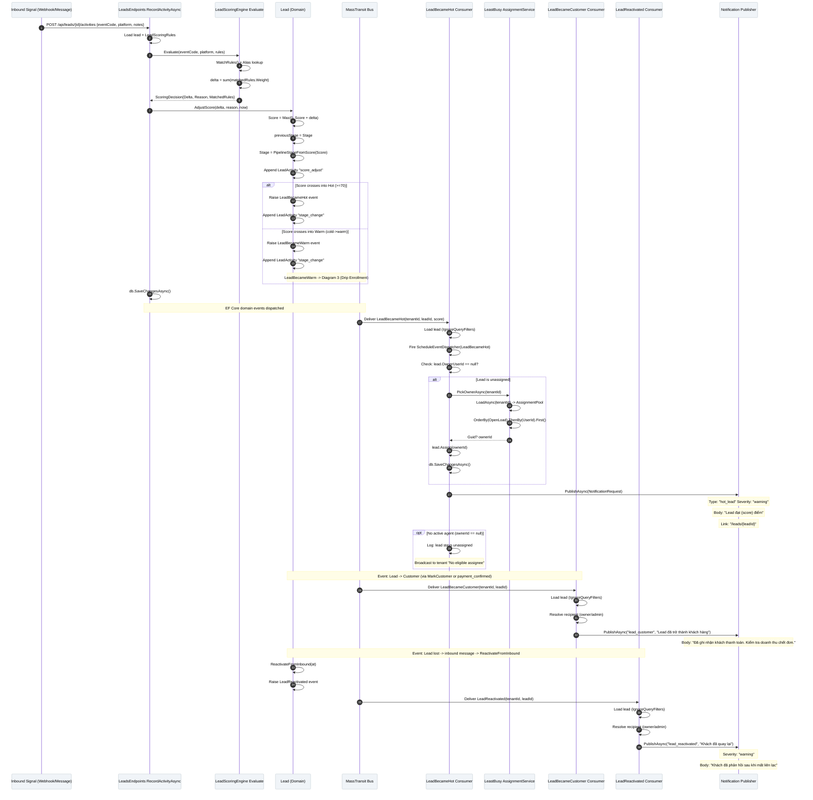

# SC-06 / Diagram 2: Real-Time Scoring, Assignment & Lifecycle Notifications

> **Automation Type:** Event-Driven Architecture (Reactive Level)
> **Module:** CRM -> Lead Scoring, Assignment & Lifecycle
> **Trigger:** Inbound Activity / Signal (system-captured activity from Webhook/Message)
> **Traces to:** LeadScoringEngine, Lead.AdjustScore, LeadBecameHotConsumer, LeadBecameCustomerConsumer, LeadReactivatedConsumer, LeastBusyLeadAssignmentService, NotificationPublisher

---

## 1. Tổng quan

Luồng này mô tả **toàn bộ event-driven chain** của SC-06 -- từ khi tin nhắn inbound đến,
hệ thống tự tính điểm, tự phát state transition events, và từng consumer xử lý:
- **LeadBecameHot** -> tự gán sale rảnh nhất + bật Telegram alert
- **LeadBecameCustomer** -> thông báo "đã trở thành khách hàng" + AI ước tính doanh thu
- **LeadReactivated** -> thông báo "Khách đã quay lại"

**Kiểm soát chính:** Score band (>=70 Hot, 30-69 Warm, <30 Cold) và assignment policy (least-busy).

### Kiến trúc tham gia

| Tầng | Thành phần | Vai trò |
|---|---|---|
| API Layer | `LeadsEndpoints.RecordActivityAsync()` | Nhận activity request, gọi scoring engine |
| Domain | `LeadScoringEngine.Evaluate()` | Tính delta từ scoring rules |
| Domain | `Lead.AdjustScore()` | Cập nhật score + phát LeadBecameHot/Warm/Customer/Reactivated events |
| Event Bus | `MassTransit` (InMemory/RabbitMQ) | Chuyển domain events đến consumers |
| Consumer 1 | `LeadBecameHotConsumer` | Xử lý event: assign + notify khi lead đạt Hot |
| Consumer 2 | `LeadBecameCustomerConsumer` | Xử lý event: notify "lead trở thành khách" + revenue estimate |
| Consumer 3 | `LeadReactivatedConsumer` | Xử lý event: notify "khách đã quay lại" |
| Assignment | `LeastBusyLeadAssignmentService` | Chọn sale có OpenLoad thấp nhất |
| Revenue | `LeadRevenueEstimateJobHandler` | AI ước tính doanh thu khi lead -> customer |
| Notification | `INotificationPublisher` | Push Telegram / In-app notifications |
| Database | `AppDbContext` (Leads, LeadScoringRules, LeadActivities) | Lưu lead, rules, activity log |

---

## 2. Participants trong Sequence Diagram

Vẽ 12 lifelines từ trái sang phải:

```
[Inbound Signal] -> [LeadsEndpoints] -> [LeadScoringEngine] -> [Lead (Domain)]
-> [MassTransit Bus] -> [LeadBecameHotConsumer] -> [LeastBusyAssignmentService]
-> [LeadBecameCustomerConsumer] -> [LeadRevenueEstimateJob]
-> [LeadReactivatedConsumer] -> [NotificationPublisher]
```

Trên draw.io:
- **Actor** ở trên cùng: `[Inbound Signal]` (Webhook, Message Bus)
- **Note** bên cạnh Lead: "score >= 70 => Hot | 30-69 => Warm | <30 => Cold"
- **Note** bên cạnh Lead.AdjustScore: "Tự động raise events khi stage thay đổi"
- **Database cylinders:** Leads, LeadScoringRules, LeadActivities

---

## 3. Chi tiết từng bước (Step-by-Step)

### Phase A: Activity Ingestion & Scoring

| Step | Actor | Action | Code Map |
|---|---|---|---|
| 1 | Inbound Signal | Activity đến (tin nhắn Zalo/FB/Web, webhook event) | Webhook receiver hoặc API caller |
| 2 | `LeadsEndpoints` | `RecordActivityAsync(id, body)`: load lead + scoring rules | `LeadsEndpoints.RecordActivityAsync()` |
| 3 | `LeadsEndpoints` | Validate: lead exists, user có permission | `db.Leads.FirstOrDefaultAsync()` |
| 4 | `LeadsEndpoints` | `LeadScoringEngine.Evaluate(eventCode, platform, rules)` | Gọi scoring engine |
| 5 | `LeadScoringEngine` | Match rules: `eventCode` + `platform` -> list matched rules | `MatchRules()` + alias lookup |
| 6 | `LeadScoringEngine` | Tính `delta = sum(matchedRules.Weight)` | Platform-specific rule preferred |
| 7 | `LeadScoringEngine` | Trả `ScoringDecision { Delta, Reason, MatchedRules }` | Return decision |
| 8 | `Lead.AdjustScore` | Nếu delta != 0: `lead.AdjustScore(delta, reason, now)` | Domain method |
| 9 | `Lead.AdjustScore` | `Score = Math.Max(0, Score + delta)` | Cap score >= 0 |
| 10 | `Lead.AdjustScore` | `previousStage = Stage` -> `Stage = PipelineStageFromScore(Score)` | Band classification |
| 11 | `Lead.AdjustScore` | Thêm `LeadActivity` type="score_adjust" | Audit trail |

### Phase B: Event Emission (nếu score cross band)

| Step | Actor | Action | Code Map |
|---|---|---|---|
| 12a | `Lead` | Nếu `Stage == "hot"` và `previousStage != "hot"`: `Raise(LeadBecameHot)` | `Lead.AdjustScore()` line ~70 |
| 12b | `Lead` | Nếu `Stage == "warm"` và `previousStage == "cold"`: `Raise(LeadBecameWarm)` | `Lead.AdjustScore()` line ~73 |
| 13 | `Lead` | Thêm `LeadActivity` type="stage_change" (nếu có stage transition) | `AddStageChangeActivity()` |
| 14 | `LeadsEndpoints` | `db.SaveChangesAsync()` -- flush lead + activities + domain events | EF Core publish events |

### Phase C: Consumer 1 -- LeadBecameHot (Auto-Assignment)

| Step | Actor | Action | Code Map |
|---|---|---|---|
| 15 | `MassTransit Bus` | `LeadBecameHot` event dispatched to consumers | InMemory transport |
| 16 | `LeadBecameHotConsumer` | `Consume(context)`: load lead từ DB (IgnoreQueryFilters) | `LeadBecameHotConsumer.Consume()` |
| 17 | `LeadBecameHotConsumer` | Fire schedule event: `ScheduleEventDispatcher.FireAsync(LeadBecameHot)` | Trigger downstream schedules |
| 18 | `LeadBecameHotConsumer` | Kiểm tra: `lead.OwnerUserId == null`? | Chỉ assign nếu chưa có chủ |
| 19 | `LeadBecameHotConsumer` | Nếu chưa có chủ: `_assignment.PickOwnerAsync(tenantId)` | Gọi least-busy service |
| 20 | `LeastBusyLeadAssignmentService` | `_source.LoadAsync(tenantId)` -> `AssignmentPool` | Lấy danh sách active agents |
| 21 | `LeastBusyLeadAssignmentService` | `Candidates.OrderBy(OpenLoad).ThenBy(UserId).First()` | Least-busy selection |
| 22 | `LeastBusyLeadAssignmentService` | Trả `Guid? userId` (null nếu không có agent) | Return pick |
| 23 | `LeadBecameHotConsumer` | `lead.Assign(ownerId.Value)` | Cập nhật OwnerUserId |
| 24 | `LeadBecameHotConsumer` | `db.SaveChangesAsync()` | Lưu assignment |
| 25 | `LeadBecameHotConsumer` | `_publisher.PublishAsync(NotificationRequest)` | Push notification |
| 26 | `NotificationPublisher` | Push `"hot_lead"` notification đến owner | Telegram / In-app |

### Phase D: Consumer 2 -- LeadBecameCustomer (Revenue Estimate)

| Step | Actor | Action | Code Map |
|---|---|---|---|
| 27 | `MassTransit Bus` | `LeadBecameCustomer` event dispatched | InMemory transport |
| 28 | `LeadBecameCustomerConsumer` | `Consume(context)`: load lead từ DB | `LeadBecameCustomerConsumer.Consume()` |
| 29 | `LeadBecameCustomerConsumer` | Resolve recipient: `recipients.ResolveAsync(tenantId, lead.OwnerUserId)` | `ILeadNotificationRecipientResolver` |
| 30 | `LeadBecameCustomerConsumer` | `_publisher.PublishAsync("lead_customer")` | Notify: "Lead đã trở thành khách hàng" |
| 31 | `NotificationPublisher` | Body: "Đã ghi nhận khách thanh toán. Kiểm tra doanh thu chết đơn." | Deep link: `/leads/{leadId}` |

### Phase E: Consumer 3 -- LeadReactivated (Re-engagement)

| Step | Actor | Action | Code Map |
|---|---|---|---|
| 32 | *Inbound message* | Lead trả lời tin sau khi bị mark "lost" | Webhook/Message |
| 33 | `Lead` | `ReactivateFromInbound(at)` -> `Stage = PipelineStageFromScore(Score)` | `Lead.ReactivateFromInbound()` |
| 34 | `Lead` | `Raise(LeadReactivated)` event | Domain event |
| 35 | `MassTransit Bus` | `LeadReactivated` event dispatched | InMemory transport |
| 36 | `LeadReactivatedConsumer` | `Consume(context)`: load lead từ DB | `LeadReactivatedConsumer.Consume()` |
| 37 | `LeadReactivatedConsumer` | Resolve recipient | `ILeadNotificationRecipientResolver` |
| 38 | `LeadReactivatedConsumer` | `_publisher.PublishAsync("lead_reactivated")` | Notify: "Khách đã quay lại" |
| 39 | `NotificationPublisher` | Body: "Khách đã phản hồi sau khi mất liên lạc -- liên hệ ngay." | Warning severity |

---

## 4. Mermaid Sequence Diagram



---

## 5. Hướng dẫn vẽ trên draw.io

### 5.1 Layout

- **Hàng ngang (trái -> phải):** Webhook -> API -> ScoringEngine -> Lead -> MassTransit -> HotConsumer -> AssignmentService -> CustomerConsumer -> ReactivatedConsumer -> Notification
- **Hàng dọc (trên -> dưới):** Thời gian chạy từ trên xuống
- **Khoảng cách giữa lifelines:** ~120px mỗi cột
- **DB cylinders** đặt bên dưới hoặc bên cạnh Lead và API

### 5.2 Ký hiệu

| Thành phần draw.io | Shape |
|---|---|
| Inbound Signal (Webhook) | Actor (hình người que) hoặc Cloud shape |
| LeadsEndpoints | Participant (rectangle) |
| LeadScoringEngine | Participant + note "Static class, pure function" |
| Lead (Domain) | Participant + note "AggregateRoot, Domain Events" |
| MassTransit Bus | Participant + note "Message Bus (InMemory)" |
| LeadBecameHotConsumer | Participant (rectangle) |
| LeastBusyAssignmentService | Participant + note "ILeadAssignmentService" |
| LeadBecameCustomerConsumer | Participant (rectangle) |
| LeadReactivatedConsumer | Participant (rectangle) |
| NotificationPublisher | Participant + note "Push: Telegram/InApp" |
| DB: Leads, Rules, Activities | Database cylinders |

### 5.3 Phân tách vùng (Region)

Sử dụng **Combined Fragment** trong draw.io:

1. **Alt fragment** lớn: "Score crosses into Hot" vs "Score crosses into Warm" vs "No transition"
2. **Alt fragment** nhỏ: "Lead is unassigned" vs "Lead already has owner"
3. **Opt fragment**: "No active agent available" -> broadcast
4. **Note** bên cạnh AdjustScore: "BR-15: Score >= 70 = Hot, 30-69 = Warm, <30 = Cold"
5. **Note** bên cạnh AssignmentService: "NFR-REL-04: p95 assign < 2s"
6. **Dashed line ngang** phân tách Phase C (Hot), Phase D (Customer), Phase E (Reactivated)

### 5.4 Màu sắc gợi ý

| Phase | Màu background |
|---|---|
| Phase A: Activity Ingestion | Light blue `#E3F2FD` |
| Phase B: Score & Event | Light green `#E8F5E9` |
| Phase C: LeadBecameHot (Assignment) | Light orange `#FFF3E0` |
| Phase D: LeadBecameCustomer (Revenue) | Light yellow `#FFFDE7` |
| Phase E: LeadReactivated (Re-engagement) | Light purple `#F3E5F5` |

---

## 6. Code Map Summary (File -> Responsibility)

```
LeadsEndpoints.cs                -> RecordActivityAsync() - entry point
LeadScoringEngine.cs             -> Evaluate() - static scoring logic
Lead.cs                          -> AdjustScore() - domain: score + stage + event emission
Lead.cs                          -> ReactivateFromInbound() - lost -> re-activate
LeadBecameHot.cs                 -> Domain event: lead đạt Hot
LeadBecameCustomer.cs            -> Domain event: lead trở thành khách hàng
LeadReactivated.cs               -> Domain event: lead bị lost được kích hoạt lại
LeadBecameHotConsumer.cs         -> MassTransit consumer: assign + notify
LeadBecameCustomerConsumer.cs    -> MassTransit consumer: notify "đã trở thành khách"
LeadReactivatedConsumer.cs       -> MassTransit consumer: notify "khách đã quay lại"
LeadAssignmentService.cs         -> LeastBusyLeadAssignmentService: PickOwnerAsync()
IAssignmentPoolSource             -> Load active agents + OpenLoad
ILeadNotificationRecipientResolver -> Resolve owner/admin for notification
LeadRevenueEstimateJobHandler     -> Hangfire job: AI estimate revenue when lead -> customer
NotificationPublisher             -> Push Telegram / In-app notifications
LeadScoringRule.cs               -> Domain entity: eventCode, platform, weight
LeadActivity.cs                  -> Domain entity: activity log entry
ScheduleEventKeys.cs             -> "lead.became_hot" key for downstream dispatch
```
