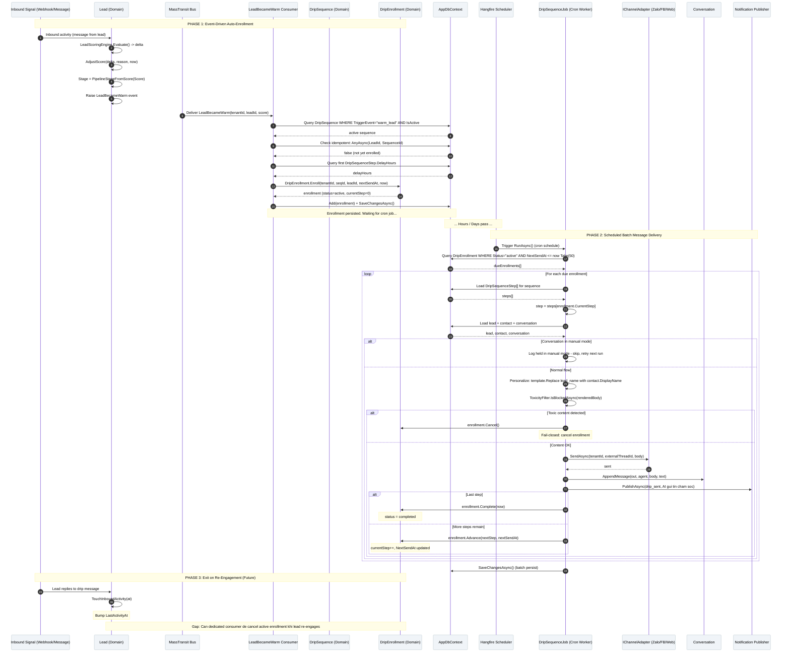

# SC-06 / Diagram 3: Drip Marketing & Nurturing

> **Automation Type:** Scheduled Batch Processing (Async Batch Level)
> **Module:** CRM -> Drip Sequence
> **Trigger:** Dual Automated Trigger -- (1) Warm Event Auto-Enroll, (2) Hangfire Cron Job Auto-Send
> **Traces to:** LeadBecameWarmConsumer, DripSequence, DripEnrollment, DripSequenceJob, IChannelAdapter

---

## 1. Tổng quan

Luồng này mô tả **drip marketing automation** -- hệ thống tự động nuôi dưỡng leads
qua nhiều tin nhắn định kỳ trên nhiều kênh (Zalo, Facebook, Web).

Luồng có **2 pha độc lập** nhưng kết nối với nhau:
- **Phase 1 (Auto-Enroll):** Khi lead điểm đạt Warm (30-69), MassTransit dispatch LeadBecameWarm
  -> Consumer tự động ghi danh lead vào drip sequence.
- **Phase 2 (Auto-Execute):** Hangfire cron job chạy định kỳ -> quét enrollments đến hạn ->
  gửi tin qua channel adapter -> advance step -> ghi log.

**Đặc biệt:** Exit condition -- khi lead trả lời (re-engagement) hoặc score rise out of Cold,
system tự động cancel drip enrollment, hủy các bước còn lại.

### Kiến trúc tham gia

| Tầng | Thành phần | Vai trò |
|---|---|---|
| Event Bus | MassTransit | Chuyển LeadBecameWarm đến consumer |
| Consumer | LeadBecameWarmConsumer | Xử lý event: tìm sequence, enroll lead |
| Domain | DripSequence, DripSequenceStep | Định nghĩa sequence (template, delay, channel) |
| Domain | DripEnrollment | Trạng thái enroll: active/completed/cancelled, currentStep |
| Scheduler | Hangfire / DripSequenceJob | Cron job quét enrollments đến hạn |
| Channel Adapter | IChannelAdapter (Zalo, FB, Web) | Gửi tin qua kênh gốc của lead |
| Safety | IToxicityFilter | Kiểm tra toxicity trước khi gửi |
| Notification | INotificationPublisher | Thông báo "AI đã gửi tin chăm sóc" |
| Database | AppDbContext | DripSequence, DripSequenceStep, DripEnrollment, Leads, Conversations |

---

## 2. Participants trong Sequence Diagram

Vẽ 10 lifelines, chia thành 2 hàng (hoặc 2 khu vực rộng):

**Hàng trên (Phase 1 -- Auto-Enroll):**
[Inbound Signal] -> [Lead.AdjustScore] -> [MassTransit Bus] -> [LeadBecameWarmConsumer]
-> [DripSequence (Domain)] -> [DripEnrollment (Domain)] -> [AppDbContext]

**Hàng dưới (Phase 2 -- Cron Job Send):**
[Hangfire Scheduler] -> [DripSequenceJob] -> [DripEnrollment (Domain)]
-> [IChannelAdapter] -> [Conversation] -> [NotificationPublisher]

Trên draw.io:
- **Dashed line ngang** phân tách Phase 1 (trên) và Phase 2 (dưới) với chú thích "Time gap: hours to days"
- **Note** bên cạnh DripEnrollment: "Status: active -> completed/cancelled"
- **Note** bên cạnh ChannelAdapter: "Zalo / Facebook / Web (lead's original channel)"
- **Database cylinders:** DripSequence, DripEnrollment, Leads, Conversations

---

## 3. Chi tiết từng bước (Step-by-Step)

### Phase 1: Auto-Enrollment (Event-Driven)

| Step | Actor | Action | Code Map |
|---|---|---|---|
| 1 | Inbound Signal | Tin nhắn inbound từ lead (Zalo/FB/Web) | Webhook receiver |
| 2 | Lead.AdjustScore | LeadScoringEngine.Evaluate() -> tính delta | Tự động tính điểm |
| 3 | Lead.AdjustScore | Score cross vào Warm (cold -> warm): Raise(LeadBecameWarm) | Lead.AdjustScore() line ~73 |
| 4 | MassTransit Bus | Dispatch LeadBecameWarm event | InMemory transport |
| 5 | LeadBecameWarmConsumer | Consume(context): load lead từ DB | LeadBecameWarmConsumer.Consume() |
| 6 | LeadBecameWarmConsumer | Tìm sequence: WHERE TriggerEvent = "warm_lead" AND IsActive | _db.Set() |
| 7 | LeadBecameWarmConsumer | Kiểm tra idempotent: AnyAsync(e => LeadId == leadId && SequenceId == seqId) | Bỏ qua nếu đã enroll |
| 8 | LeadBecameWarmConsumer | Lấy first step delay: steps.OrderBy(StepOrder).First().DelayHours | Tính nextSendAt |
| 9 | DripEnrollment.Enroll | DripEnrollment.Enroll(tenantId, seqId, leadId, nextSendAt, now) | Tạo enrollment |
| 10 | AppDbContext | db.Set().Add(enrollment) | Persist |
| 11 | AppDbContext | db.SaveChangesAsync() | Flush to DB |
| 12 | LeadBecameWarmConsumer | Log: "LeadBecameWarm enrolled tenant {T} lead {L} into drip {S}" | Audit trail |

### Phase 2: Cron Job Message Execution (Batch)

| Step | Actor | Action | Code Map |
|---|---|---|---|
| 13 | Hangfire Scheduler | Trigger DripSequenceJob.RunAsync() theo cron schedule | [DisableConcurrentExecution(300)] |
| 14 | DripSequenceJob | Query: DripEnrollment WHERE Status="active" AND NextSendAt <= now | Take(50) batch |
| 15 | DripSequenceJob | Nếu 0 due: return (bỏ qua, log) | Early return |
| 16 | DripSequenceJob | Loop qua từng enrollment: | For each enrollment |
| 17 | DripSequenceJob | Load steps: DripSequenceStep WHERE SequenceId = enrollment.SequenceId | Order by StepOrder |
| 18 | DripSequenceJob | Lấy step hiện tại: steps[enrollment.CurrentStep] | Index-based |
| 19 | DripSequenceJob | Load lead: db.Leads.FirstOrDefaultAsync(l => l.Id == enrollment.LeadId) | Kiểm tra lead tồn tại |
| 20 | DripSequenceJob | Load contact: db.Contacts.FirstOrDefaultAsync(c => c.Id == lead.ContactId) | Lấy tên để personalize |
| 21 | DripSequenceJob | Load conversation: db.Conversations.FirstOrDefaultAsync(...) | Kiểm tra conversation active |
| 22 | DripSequenceJob | **Kiểm tra manual mode:** !conversation.AiAutoReplyEnabled? | Nếu đang handover -> hold |
| 23 | DripSequenceJob | **Personalize:** step.TemplateBody.Replace("{lead_name}", contact.DisplayName) | Interpolate tên |
| 24 | DripSequenceJob | **Toxicity check:** toxicity.IsBlockedAsync(renderedBody) | Fail-closed: cancel nếu toxic |
| 25 | DripSequenceJob | **Channel match:** step.Channel == adapter.Name? | Khác channel -> cancel |
| 26 | DripSequenceJob | adapter.SendAsync(tenantId, externalThreadId, body) | Gửi tin qua kênh gốc |
| 27 | Conversation | conversation.AppendMessage("out", "agent", body, "text", now) | Ghi log tin gửi |
| 28 | NotificationPublisher | PublishAsync("drip_sent", "AI đã gửi tin nhắn chăm sóc theo kịch bản") | Thông báo |
| 29 | DripEnrollment | Nếu bước cuối: enrollment.Complete(now) -> status="completed" | Kết thúc sequence |
| 30 | DripEnrollment | Nếu còn bước: enrollment.Advance(nextStep, nextSendAt) | Chuyển bước kế |
| 31 | AppDbContext | db.SaveChangesAsync() | Lưu tất cả thay đổi |

### Phase 3: Exit Conditions (Re-engagement)

| Step | Actor | Action | Code Map |
|---|---|---|---|
| 32 | Lead reply | Lead trả lời tin drip (inbound message) | Webhook/Message inbound |
| 33 | System | Lead.TouchInboundActivity(at) -> bump LastActivityAt | Lead domain |
| 34 | System | Kiểm tra: lead có enrollment active? -> enrollment.Cancel() | Exit drip |
| 35 | System | Hủy các bước còn lại: enrollment status -> "cancelled" | Cancel remaining |
| 36 | System | Log: "Lead replied -- exited drip sequence" | Audit trail |

**Lưu ý:** Exit-on-reply chưa có dedicated consumer trong codebase. Logic hiện tại
chưa cancel enrollment khi lead reply. Đây là gap cần bổ sung.

---

## 5. Hướng dẫn vẽ trên draw.io

### 5.1 Layout

- **Chia thành 2 khu vực rộng** (swim lane ngang):
  - **Khu vực trên:** Phase 1 (Auto-Enrollment) -- Event-driven
  - **Khu vực dưới:** Phase 2 (Cron Job Send) -- Scheduled batch
  - **Phân cách:** Dashed line ngang + chú thích "Time gap: hours to days"
  - **Khu vực cuối:** Phase 3 (Exit) -- optional/future

- **Hàng ngang (trái -> phải):**
  - Phase 1: Webhook -> Lead -> MassTransit -> WarmConsumer -> DripSequence -> DripEnrollment -> DB
  - Phase 2: Hangfire -> DripSequenceJob -> DripEnrollment -> ChannelAdapter -> Conversation -> Notification

- **Khoảng cách giữa lifelines:** ~120px mỗi cột

### 5.2 Ký hiệu

| Thành phần draw.io | Shape |
|---|---|
| Inbound Signal | Actor hoặc Cloud shape |
| Lead (Domain) | Participant + note "AggregateRoot" |
| MassTransit Bus | Participant + note "Message Bus" |
| LeadBecameWarmConsumer | Participant (rectangle) |
| DripSequence | Participant + note "Domain: name, triggerEvent, steps" |
| DripEnrollment | Participant + note "Domain: status, currentStep, nextSendAt" |
| Hangfire Scheduler | Participant + note "Background job runner" |
| DripSequenceJob | Participant + note "Hangfire job, [DisableConcurrentExecution]" |
| IChannelAdapter | Participant + note "Zalo / FB / Web" |
| Conversation | Participant + note "AppendMessage, AiAutoReplyEnabled" |
| DB | Database cylinders (3-4: DripSequence, DripEnrollment, Leads, Conversations) |

### 5.3 Phân tách vùng (Region)

Sử dụng **Combined Fragment** trong draw.io:

1. **Note** lớn giữa Phase 1 và Phase 2: "Time gap: hours to days between enrollment and first send"
2. **Loop fragment** bao quanh Phase 2: "For each due enrollment (batch of 50)"
3. **Alt fragment** trong loop:
   - "Manual mode (AiAutoReplyEnabled=false)" -> hold/retry
   - "Normal flow" -> personalize + toxicity + send
4. **Alt fragment** nhỏ hơn: "Toxic content" -> cancel vs "Content OK" -> send
5. **Alt fragment**: "Last step" -> Complete vs "More steps" -> Advance
6. **Opt fragment** (Phase 3): "Lead replies -> exit drip"

### 5.4 Màu sắc gợi ý

| Phase | Màu background |
|---|---|
| Phase 1: Auto-Enrollment | Light purple #F3E5F5 |
| Time Gap Note | Light gray #ECEFF1 |
| Phase 2: Cron Job Execution | Light green #E8F5E9 |
| Phase 3: Exit Conditions | Light orange #FFF3E0 |
| Toxicity Check | Light red #FFEBEE |
| Manual Mode Hold | Light yellow #FFFDE7 |

### 5.5 Layout tip trên draw.io

1. **Tạo swim lanes (lanes ngang):**
   - Insert -> Shape -> Flowchart -> Vertical Separator (hoặc vẽ rect + text)
   - Lane 1: "Phase 1: Event-Driven Auto-Enrollment"
   - Lane 2: "Phase 2: Scheduled Batch Delivery"
   - Lane 3: "Phase 3: Exit Conditions (Future)"

2. **Đặt participant boxes** trong mỗi lane
   - Mỗi box: 140x60px, màu theo bảng màu ở trên
   - Text: tên class/component, font 11px

3. **Vẽ lifelines:**
   - Dashed line từ box xuống dưới
   - Activation bar (nhỏ, màu trắng) trên lifeline khi đang xử lý

4. **Vẽ messages:**
   - Đường màu đen: gọi đồng bộ
   - Dashed màu đen: trả về
   - Màu đỏ: event dispatch
   - Màu xanh: DB query

---

## 6. Code Map Summary (File -> Responsibility)

```
Lead.cs (AdjustScore)             -> Raise LeadBecameWarm event on cold->warm transition
LeadBecameWarmConsumer.cs         -> MassTransit consumer: find sequence, enroll lead
LeadBecameWarm.cs                 -> Domain event record
DripSequence.cs                   -> Domain: sequence definition, AddStep()
DripSequenceStep.cs               -> Domain: step (order, delay, channel, templateBody)
DripEnrollment.cs                 -> Domain: enrollment (Enroll, Advance, Complete, Cancel)
DripSequenceJob.cs                -> Hangfire cron job: fetch due, personalize, send, advance
IToxicityFilter                   -> Content safety check before outbound
IChannelAdapter                   -> Platform-specific send (Zalo, FB, Web)
AppDbContext.cs                   -> DripSequence, DripSequenceStep, DripEnrollment DbSets
HangfireModule.cs                 -> Job registration
ScheduleEventKeys.cs              -> "lead.became_warm" (not yet registered, manual trigger only)
```

---

## 7. Gap Analysis (Chưa có code)

| Feature | Status | Mô tả |
|---|---|---|
| Admin CRUD API for DripSequence | **CHƯA CÓ** | Domain có nhưng không có HTTP endpoints |
| Exit-on-reply consumer | **CHƯA CÓ** | LeadBecameWarmConsumer chỉ enroll, không cancel khi lead trả lời |
| Exit-on-score-rise consumer | **CHƯA CÓ** | Khi lead score > 69 (warm->hot), enrollment nên cancel |
| DripSequence CRUD UI (FE) | **CHƯA CÓ** | Admin không thể quản lý sequences từ frontend |
| Cancel enrollment on lead.MarkCustomer | **CHƯA CÓ** | LeadBecameCustomer event chưa có consumer unlink drip |
| Cold lead 7-day auto-enroll (BR-17) | **CHƯA CÓ** | Hiện chỉ enroll trên Warm, chưa có Cold->Drip path |
| Out-of-hours check | **CHƯA CÓ** | BR-25: restrict outbound timing |
```


---

## 4. Mermaid Sequence Diagram

