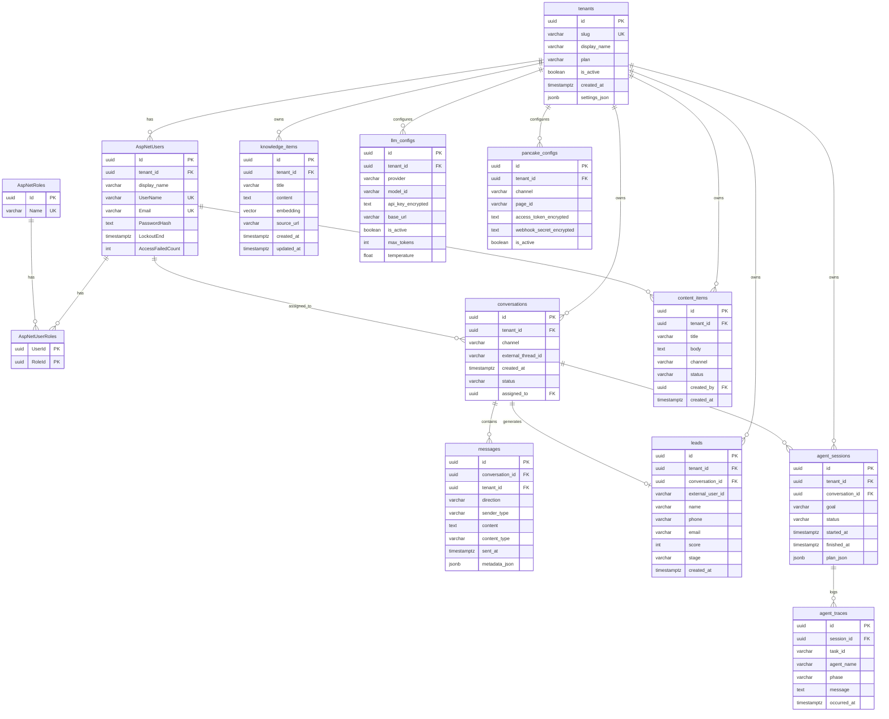

```mermaid
erDiagram
    tenants {
        uuid id PK
        varchar slug UK
        varchar display_name
        varchar plan
        boolean is_active
        timestamptz created_at
        jsonb settings_json
    }

    AspNetUsers {
        uuid Id PK
        uuid tenant_id FK
        varchar display_name
        varchar UserName UK
        varchar Email UK
        text PasswordHash
        timestamptz LockoutEnd
        int AccessFailedCount
    }

    AspNetRoles {
        uuid Id PK
        varchar Name UK
    }

    AspNetUserRoles {
        uuid UserId PK
        uuid RoleId PK
    }

    conversations {
        uuid id PK
        uuid tenant_id FK
        varchar channel
        varchar external_thread_id
        timestamptz created_at
        varchar status
        uuid assigned_to FK
    }

    messages {
        uuid id PK
        uuid conversation_id FK
        uuid tenant_id FK
        varchar direction
        varchar sender_type
        text content
        varchar content_type
        timestamptz sent_at
        jsonb metadata_json
    }

    leads {
        uuid id PK
        uuid tenant_id FK
        uuid conversation_id FK
        varchar external_user_id
        varchar name
        varchar phone
        varchar email
        int score
        varchar stage
        timestamptz created_at
    }

    knowledge_items {
        uuid id PK
        uuid tenant_id FK
        varchar title
        text content
        vector embedding
        varchar source_url
        timestamptz created_at
        timestamptz updated_at
    }

    llm_configs {
        uuid id PK
        uuid tenant_id FK
        varchar provider
        varchar model_id
        text api_key_encrypted
        varchar base_url
        boolean is_active
        int max_tokens
        float temperature
    }

    pancake_configs {
        uuid id PK
        uuid tenant_id FK
        varchar channel
        varchar page_id
        text access_token_encrypted
        text webhook_secret_encrypted
        boolean is_active
    }

    agent_sessions {
        uuid id PK
        uuid tenant_id FK
        uuid conversation_id FK
        varchar goal
        varchar status
        timestamptz started_at
        timestamptz finished_at
        jsonb plan_json
    }

    agent_traces {
        uuid id PK
        uuid session_id FK
        varchar task_id
        varchar agent_name
        varchar phase
        text message
        timestamptz occurred_at
    }

    content_items {
        uuid id PK
        uuid tenant_id FK
        varchar title
        text body
        varchar channel
        varchar status
        uuid created_by FK
        timestamptz created_at
    }

    tenants ||--o{ AspNetUsers : "has"
    tenants ||--o{ conversations : "owns"
    tenants ||--o{ leads : "owns"
    tenants ||--o{ knowledge_items : "owns"
    tenants ||--o{ llm_configs : "configures"
    tenants ||--o{ pancake_configs : "configures"
    tenants ||--o{ agent_sessions : "owns"
    tenants ||--o{ content_items : "owns"

    AspNetUsers ||--o{ AspNetUserRoles : "has"
    AspNetRoles ||--o{ AspNetUserRoles : "has"
    AspNetUsers ||--o{ conversations : "assigned_to"
    AspNetUsers ||--o{ content_items : "created_by"

    conversations ||--o{ messages : "contains"
    conversations ||--o| leads : "generates"
    conversations ||--o{ agent_sessions : "triggers"

    agent_sessions ||--o{ agent_traces : "logs"
```
