# ClawBot SaleMkt — ERD (Entity Relationship Diagram)

> 33 bảng **SQL Server 2022**. Tất cả `id` là `UNIQUEIDENTIFIER` (`NEWID()`). Tất cả tenant-scoped table có `tenant_id` FK + index `(tenant_id, created_at desc)`. Soft-delete (`deleted_at`) áp dụng cho aggregate gốc mutable. `messages` = immutable append-only log. Vector embedding lưu **Qdrant** (collection `kb_versions`); SQL Server giữ `kb_versions.embedding NVARCHAR(MAX)` (JSON float-array) làm bản sao audit.

Source-of-truth schema: `deploy/migrations/0001_init.sql`.

## Diagram

```mermaid
erDiagram
    %% ===== Multi-tenant & RBAC =====
    tenants {
        uuid id PK
        varchar slug UK
        varchar display_name
        varchar plan_name
        bit is_active
        nvarchar settings_json
        datetimeoffset created_at
    }
    users {
        uuid id PK
        uuid tenant_id FK
        varchar display_name
        varchar email UK
        varchar phone
        text password_hash
        int access_failed_count
        timestamptz lockout_end
        timestamptz created_at
    }
    roles {
        uuid id PK
        uuid tenant_id FK
        varchar name
        varchar description
    }
    permissions {
        uuid id PK
        varchar code UK
        varchar description
    }
    role_permissions {
        uuid role_id PK_FK
        uuid permission_id PK_FK
    }
    user_roles {
        uuid user_id PK_FK
        uuid role_id PK_FK
    }
    api_keys {
        uuid id PK
        uuid tenant_id FK
        varchar name
        text key_hash UK
        timestamptz expires_at
        timestamptz revoked_at
        timestamptz created_at
    }
    audit_logs {
        uuid id PK
        uuid tenant_id FK
        uuid user_id FK
        varchar action
        varchar resource_type
        uuid resource_id
        jsonb diff_json
        inet ip_address
        timestamptz occurred_at
    }

    %% ===== Contacts =====
    contacts {
        uuid id PK
        uuid tenant_id FK
        varchar display_name
        varchar phone
        varchar email
        varchar locale
        int lifetime_score
        varchar lifecycle_stage
        jsonb meta_json
        timestamptz created_at
        timestamptz deleted_at
    }
    contact_external_ids {
        uuid id PK
        uuid contact_id FK
        varchar platform
        varchar external_id
        timestamptz first_seen_at
    }

    %% ===== Conversations & Messages =====
    conversations {
        uuid id PK
        uuid tenant_id FK
        uuid contact_id FK
        varchar platform
        varchar external_thread_id
        varchar status
        uuid assigned_to FK
        timestamptz last_msg_at
        timestamptz created_at
        timestamptz deleted_at
    }
    messages {
        uuid id PK
        uuid conversation_id FK
        uuid tenant_id FK
        varchar direction
        varchar sender_type
        uuid sender_user_id
        text content
        varchar content_type
        jsonb metadata_json
        timestamptz sent_at
    }

    %% ===== Leads =====
    leads {
        uuid id PK
        uuid tenant_id FK
        uuid contact_id FK
        uuid owner_user_id FK
        int score
        varchar stage
        varchar source_platform
        timestamptz last_activity_at
        timestamptz created_at
        timestamptz deleted_at
    }
    lead_scoring_rules {
        uuid id PK
        uuid tenant_id FK
        varchar platform
        varchar event_code
        int weight
        boolean is_active
    }
    lead_activities {
        uuid id PK
        uuid tenant_id FK
        uuid lead_id FK
        varchar activity_type
        text notes
        jsonb meta_json
        timestamptz occurred_at
    }

    %% ===== Knowledge Base =====
    kb_modules {
        uuid id PK
        uuid tenant_id FK
        varchar code UK
        varchar name
        varchar owner_role
        varchar status
        timestamptz created_at
        timestamptz deleted_at
    }
    kb_versions {
        uuid id PK
        uuid kb_module_id FK
        int version
        nvarchar content_md
        nvarchar embedding
        decimal accuracy_score
        varchar status
        timestamptz deployed_at
        timestamptz created_at
    }
    kb_test_cases {
        uuid id PK
        uuid kb_module_id FK
        text question
        text expected_answer
        boolean is_active
    }

    %% ===== Chat Scenarios =====
    chat_scenarios {
        uuid id PK
        uuid tenant_id FK
        varchar code UK
        varchar group_name
        nvarchar trigger_text
        nvarchar response_template
        varchar tone_voice
        varchar platforms
        numeric success_rate
        timestamptz updated_at
    }

    %% ===== Agents =====
    agents {
        uuid id PK
        uuid tenant_id FK
        varchar code UK
        varchar display_name
        varchar agent_type
        varchar model
        varchar status
        jsonb skill_files_json
        jsonb kb_modules_json
        jsonb config_json
        timestamptz updated_at
        timestamptz deleted_at
    }
    agent_sessions {
        uuid id PK
        uuid tenant_id FK
        uuid agent_id FK
        uuid conversation_id FK
        varchar goal
        varchar status
        jsonb plan_json
        timestamptz started_at
        timestamptz finished_at
    }
    agent_traces {
        uuid id PK
        uuid session_id FK
        varchar task_id
        varchar agent_name
        varchar phase
        text message
        timestamptz occurred_at
    }

    %% ===== Sale Assist =====
    quick_reply_templates {
        uuid id PK
        uuid tenant_id FK
        varchar code
        varchar category
        text body
        varchar platforms
        timestamptz updated_at
    }

    %% ===== Documents =====
    document_templates {
        uuid id PK
        uuid tenant_id FK
        varchar code UK
        varchar doc_type
        text template_html
        jsonb fields_json
        timestamptz updated_at
        timestamptz deleted_at
    }
    generated_documents {
        uuid id PK
        uuid tenant_id FK
        uuid contact_id FK
        uuid template_id FK
        uuid generated_by FK
        varchar file_url
        varchar sent_via
        timestamptz sent_at
        timestamptz opened_at
        timestamptz created_at
    }

    %% ===== Content =====
    content_briefs {
        uuid id PK
        uuid tenant_id FK
        varchar platform
        text brief
        varchar status
        uuid created_by FK
        timestamptz created_at
    }
    content_items {
        uuid id PK
        uuid tenant_id FK
        uuid brief_id FK
        varchar platform
        varchar status
        text body
        jsonb assets_json
        uuid created_by FK
        uuid approved_by FK
        timestamptz approved_at
        timestamptz created_at
        timestamptz deleted_at
    }
    content_schedule {
        uuid id PK
        uuid tenant_id FK
        uuid content_item_id FK
        varchar platform
        timestamptz scheduled_at
        timestamptz posted_at
        varchar status
        text post_url
    }

    %% ===== Ads =====
    ads_campaigns {
        uuid id PK
        uuid tenant_id FK
        varchar platform
        varchar external_campaign_id
        varchar objective
        numeric daily_budget
        varchar status
        timestamptz synced_at
    }
    ads_rules {
        uuid id PK
        uuid tenant_id FK
        varchar platform
        varchar metric
        varchar comparator
        numeric threshold
        varchar action
        boolean is_active
    }
    ads_actions {
        uuid id PK
        uuid tenant_id FK
        uuid campaign_id FK
        uuid rule_id FK
        varchar action_taken
        jsonb payload_json
        timestamptz executed_at
    }

    %% ===== Analytics =====
    kpi_daily {
        uuid id PK
        uuid tenant_id FK
        date date
        varchar platform
        int leads
        int dms
        int replies
        int conversions
        numeric avg_response_time_sec
        numeric ad_spend
    }

    %% ===== Channel & LLM configs (đã có) =====
    pancake_configs {
        uuid id PK
        uuid tenant_id FK
        varchar channel
        varchar page_id
        text access_token_encrypted
        text webhook_secret_encrypted
        boolean is_active
    }
    llm_configs {
        uuid id PK
        uuid tenant_id FK
        varchar provider
        varchar model_id
        text api_key_encrypted
        varchar base_url
        boolean is_active
        int max_tokens
        numeric temperature
    }

    %% ===== Relationships =====
    tenants ||--o{ users : owns
    tenants ||--o{ roles : owns
    tenants ||--o{ api_keys : owns
    tenants ||--o{ contacts : owns
    tenants ||--o{ conversations : owns
    tenants ||--o{ leads : owns
    tenants ||--o{ kb_modules : owns
    tenants ||--o{ chat_scenarios : owns
    tenants ||--o{ agents : owns
    tenants ||--o{ quick_reply_templates : owns
    tenants ||--o{ document_templates : owns
    tenants ||--o{ generated_documents : owns
    tenants ||--o{ content_briefs : owns
    tenants ||--o{ content_items : owns
    tenants ||--o{ content_schedule : owns
    tenants ||--o{ ads_campaigns : owns
    tenants ||--o{ ads_rules : owns
    tenants ||--o{ kpi_daily : owns
    tenants ||--o{ audit_logs : owns
    tenants ||--o{ pancake_configs : owns
    tenants ||--o{ llm_configs : owns
    tenants ||--o{ lead_scoring_rules : owns
    tenants ||--o{ lead_activities : owns
    tenants ||--o{ messages : owns

    users }o--o{ user_roles : has
    roles }o--o{ user_roles : has
    roles }o--o{ role_permissions : has
    permissions }o--o{ role_permissions : has
    users ||--o{ audit_logs : performs
    users ||--o{ conversations : assigned_to
    users ||--o{ leads : owns
    users ||--o{ content_items : created_by
    users ||--o{ content_items : approved_by
    users ||--o{ content_briefs : created_by
    users ||--o{ generated_documents : generated_by

    contacts ||--o{ contact_external_ids : "linked across platforms"
    contacts ||--o{ conversations : initiates
    contacts ||--o| leads : becomes
    contacts ||--o{ generated_documents : receives

    conversations ||--o{ messages : contains
    conversations ||--o{ agent_sessions : triggers

    leads ||--o{ lead_activities : has

    kb_modules ||--o{ kb_versions : versions
    kb_modules ||--o{ kb_test_cases : tested_by

    agents ||--o{ agent_sessions : runs
    agent_sessions ||--o{ agent_traces : emits

    document_templates ||--o{ generated_documents : produces

    content_briefs ||--o{ content_items : generates
    content_items ||--o{ content_schedule : schedules

    ads_campaigns ||--o{ ads_actions : receives
    ads_rules ||--o{ ads_actions : triggers
```

## Conventions

- **Naming**: snake_case, plural for tables, singular FK suffix `_id`.
- **PK**: `UNIQUEIDENTIFIER` `NEWID()` (SQL Server).
- **Timestamps**: `DATETIMEOFFSET`. `created_at` mọi bảng mutable. `updated_at` khi entity mutable. `deleted_at` cho soft-delete.
- **Tenant scoping**: `tenant_id UNIQUEIDENTIFIER NOT NULL` + index `(tenant_id, created_at DESC)` cho hot read path.
- **Vector search**: SQL Server không hỗ trợ pgvector. Embedding lưu Qdrant (collection `kb_versions`, point `id = kb_versions.id`). Trên SQL Server `kb_versions.embedding NVARCHAR(MAX)` chỉ là JSON snapshot dùng cho audit/replay.
- **JSON**: `NVARCHAR(MAX)` (SQL Server không có `jsonb`; truy vấn JSON bằng `JSON_VALUE` / `OPENJSON`).
- **Soft-delete**: chỉ trên aggregate root mutable (contacts, leads, conversations, kb_modules, content_items, agents, document_templates).
- **Immutable**: `messages`, `audit_logs`, `agent_traces`, `lead_activities`, `ads_actions`, `kpi_daily` — append-only.
- **Unique constraints**: `(tenant_id, slug/code)`, `(contact_id, platform, external_id)`, `(kb_module_id, version)`, `(role_id, permission_id)`, `(user_id, role_id)`.
- **FK actions**: SQL Server cấm multi-path cascade — dùng `NO ACTION` ở các FK nhánh con (xem `0001_init.sql`); cleanup trong code khi cần.

## Index strategy

| Bảng | Index | Mục đích |
|---|---|---|
| `messages` | `(conversation_id, sent_at desc)` | Thread view |
| `messages` | `(tenant_id, sent_at desc)` | Inbox sort |
| `leads` | `(tenant_id, stage, score desc)` | Hot lead listing |
| `conversations` | `(tenant_id, status, last_msg_at desc)` | Active inbox |
| `audit_logs` | `(tenant_id, occurred_at desc)` | Compliance scan |
| `kpi_daily` | `(tenant_id, date desc, platform)` | Daily dashboard |
| `kb_versions` | `(kb_module_id, version desc)` | Latest version lookup |
| `kb_versions` | (Qdrant collection `kb_versions`) | Vector search via Qdrant — SQL Server only stores JSON snapshot |
| `contact_external_ids` | `(platform, external_id)` UK | Cross-platform unification |
| `chat_scenarios` | `(tenant_id, group_name)` | Scenario lookup |
