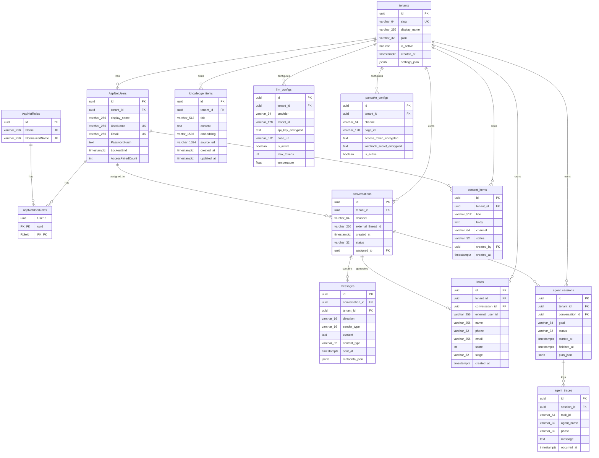

# ClawBot — ERD (Entity Relationship Diagram)

```mermaid
erDiagram
    tenants {
        uuid id PK
        varchar_64 slug UK
        varchar_256 display_name
        varchar_32 plan
        boolean is_active
        timestamptz created_at
        jsonb settings_json
    }

    AspNetUsers {
        uuid Id PK
        uuid tenant_id FK
        varchar_256 display_name
        varchar_256 UserName UK
        varchar_256 Email UK
        text PasswordHash
        timestamptz LockoutEnd
        int AccessFailedCount
    }

    AspNetRoles {
        uuid Id PK
        varchar_256 Name UK
        varchar_256 NormalizedName UK
    }

    AspNetUserRoles {
        uuid UserId PK_FK
        uuid RoleId PK_FK
    }

    conversations {
        uuid id PK
        uuid tenant_id FK
        varchar_64 channel
        varchar_256 external_thread_id
        timestamptz created_at
        varchar_32 status
        uuid assigned_to FK
    }

    messages {
        uuid id PK
        uuid conversation_id FK
        uuid tenant_id FK
        varchar_16 direction
        varchar_16 sender_type
        text content
        varchar_32 content_type
        timestamptz sent_at
        jsonb metadata_json
    }

    leads {
        uuid id PK
        uuid tenant_id FK
        uuid conversation_id FK
        varchar_256 external_user_id
        varchar_256 name
        varchar_32 phone
        varchar_256 email
        int score
        varchar_32 stage
        timestamptz created_at
    }

    knowledge_items {
        uuid id PK
        uuid tenant_id FK
        varchar_512 title
        text content
        vector_1536 embedding
        varchar_1024 source_url
        timestamptz created_at
        timestamptz updated_at
    }

    llm_configs {
        uuid id PK
        uuid tenant_id FK
        varchar_64 provider
        varchar_128 model_id
        text api_key_encrypted
        varchar_512 base_url
        boolean is_active
        int max_tokens
        float temperature
    }

    pancake_configs {
        uuid id PK
        uuid tenant_id FK
        varchar_64 channel
        varchar_128 page_id
        text access_token_encrypted
        text webhook_secret_encrypted
        boolean is_active
    }

    agent_sessions {
        uuid id PK
        uuid tenant_id FK
        uuid conversation_id FK
        varchar_64 goal
        varchar_32 status
        timestamptz started_at
        timestamptz finished_at
        jsonb plan_json
    }

    agent_traces {
        uuid id PK
        uuid session_id FK
        varchar_64 task_id
        varchar_32 agent_name
        varchar_32 phase
        text message
        timestamptz occurred_at
    }

    content_items {
        uuid id PK
        uuid tenant_id FK
        varchar_512 title
        text body
        varchar_64 channel
        varchar_32 status
        uuid created_by FK
        timestamptz created_at
    }

    tenants ||--o{ AspNetUsers : "has"
    tenants ||--o{ conversations : "owns"
    tenants ||--o{ leads : "owns"
    tenants ||--o{ knowledge_items : "owns"
    tenants ||--o{ llm_configs : "configures"
    tenants ||--o{ pancake_configs : "configures"
    tenants ||--o{ agent_sessions : "owns"
    tenants ||--o{ content_items : "owns"

    AspNetUsers ||--o{ AspNetUserRoles : "has"
    AspNetRoles ||--o{ AspNetUserRoles : "has"
    AspNetUsers ||--o{ conversations : "assigned_to"
    AspNetUsers ||--o{ content_items : "created_by"

    conversations ||--o{ messages : "contains"
    conversations ||--o| leads : "generates"
    conversations ||--o{ agent_sessions : "triggers"

    agent_sessions ||--o{ agent_traces : "logs"
```
