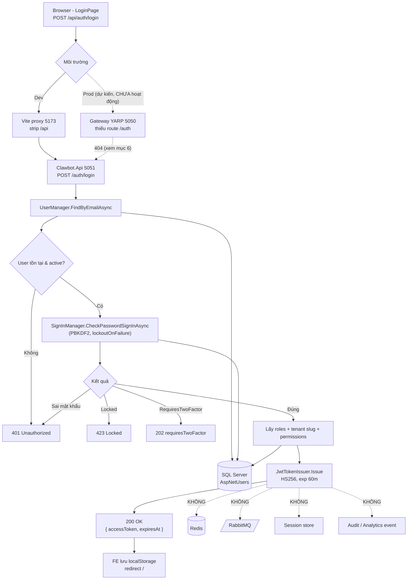

# Login Flow — Hệ thống ClawBot (trạng thái hiện tại)

> Tài liệu mô tả **chính xác luồng đăng nhập đang chạy trong code** tại thời điểm viết, kèm các điểm cần lưu ý.
> Nguồn: phân tích trực tiếp source (`src/api`, `src/gateway`, `src/frontend`, `src/shared`).

---

## 0. TL;DR — Trả lời nhanh

| Câu hỏi | Trả lời |
|---|---|
| UI nào gọi login? | **Web** (React 19 + Vite, `LoginPage.tsx`). Ngoài ra có thể test qua **Swagger UI** / HTTP client. Không có mobile/admin portal riêng. |
| Đi qua những service nào? | **Dev:** Browser → Vite dev proxy (5173) → **thẳng API `:5051`**. **Gateway (`:5050`) KHÔNG tham gia ở dev.** Không có Auth/User/IAM service riêng — là **modular monolith**, login xử lý in-process trong `Clawbot.Api`. |
| Redis có tham gia? | **KHÔNG.** Redis được kết nối (DI) nhưng không đụng tới trong login. |
| RabbitMQ/Kafka có tham gia? | **KHÔNG.** MassTransit/RabbitMQ có cấu hình nhưng login không publish message nào. Không dùng Kafka. |
| Ai validate user/password? | **ASP.NET Core Identity** (`SignInManager.CheckPasswordSignInAsync`) trong `AuthEndpoints.LoginAsync`. Hash PBKDF2. |
| Ai generate token? | `JwtTokenIssuer` (in-process, HS256, hết hạn **60 phút**). |
| Session lưu ở đâu? | **Không có session server-side** — JWT **stateless**. Client lưu token ở `localStorage`. |
| Refresh token? | **KHÔNG có.** Chỉ có 1 access token 60 phút; hết hạn phải login lại. |
| External dependency (OAuth/Keycloak/Google…)? | **KHÔNG có.** Identity nội bộ thuần. (Có hỗ trợ 2FA TOTP nội bộ, không phải bên thứ ba.) |
| Event sau login (audit/history/analytics)? | **KHÔNG phát event nào.** Audit interceptor return sớm khi request ẩn danh (chưa có tenant context). `last_login_at` cũng không được cập nhật. |

---

## 1. Tổng quan kiến trúc Login

ClawBot **không** theo mô hình microservice tách Auth/User/IAM. Đây là **modular monolith**:

- **`Clawbot.Api`** (`:5051`) — chứa luôn endpoint auth (`/auth/*`), dùng **ASP.NET Core Identity** + **EF Core** (SQL Server) để xác thực, và **`JwtTokenIssuer`** để phát JWT. Tất cả nằm trong cùng một process.
- **`Clawbot.Gateway`** (`:5050`) — YARP reverse proxy, rate limit, HMAC cho webhook. **Hiện chỉ proxy `/api/**`, `/webhook/**`, `/hubs/**`** — **không có route `/auth`**.
- **`Clawbot.AgentService`** — gRPC AI agents. **Không liên quan login.**
- **Frontend** `clawbot-web` (`:5173`) — React, gọi API qua axios; dev dùng Vite proxy trỏ thẳng API.

Hạ tầng đi kèm (`deploy/docker-compose.yml`): SQL Server, Redis, RabbitMQ, Qdrant, MinIO — nhưng **chỉ SQL Server tham gia login**.

```
Web (5173)
   │  POST /api/auth/login   (axios baseURL "/api")
   ▼
Vite dev proxy  ── rewrite: strip "/api" ──►  Clawbot.Api (5051)  /auth/login
                                                   │
                                                   ├─ ASP.NET Identity ─► SQL Server (AspNetUsers)
                                                   └─ JwtTokenIssuer ─► JWT (HS256, 60m)
                                                   ▼
                                            { accessToken, expiresAt }
   ◄───────────────────────────────────────────────┘
   (Redis ✗   RabbitMQ ✗   Session store ✗   Refresh token ✗)
```

---

## 2. Sequence Diagram

```mermaid
sequenceDiagram
    autonumber
    actor U as Người dùng (Browser)
    participant FE as Frontend React (5173)<br/>LoginPage + axios
    participant PX as Vite dev proxy<br/>(chỉ ở dev)
    participant API as Clawbot.Api (5051)<br/>AuthEndpoints
    participant ID as ASP.NET Identity<br/>(UserManager / SignInManager)
    participant DB as SQL Server<br/>(AspNetUsers, tenants, role_permissions)
    participant JWT as JwtTokenIssuer

    U->>FE: Nhập email + password, submit
    FE->>PX: POST /api/auth/login {email, password} (withCredentials)
    PX->>API: POST /auth/login (đã strip "/api")
    API->>ID: FindByEmailAsync(email)
    ID->>DB: SELECT * FROM AspNetUsers WHERE normalized_email=...
    DB-->>ID: AppUser (hoặc null)
    alt user null hoặc bị khoá (IsActive=false)
        API-->>FE: 401 Unauthorized
    else có user
        API->>ID: CheckPasswordSignInAsync(user, password, lockoutOnFailure:true)
        ID->>DB: Verify PBKDF2 hash; cập nhật AccessFailedCount/LockoutEnd
        alt IsLockedOut
            API-->>FE: 423 Locked
        else RequiresTwoFactor
            API-->>FE: 202 { requiresTwoFactor: true }
        else sai mật khẩu
            API-->>FE: 401 Unauthorized
        else đúng
            API->>ID: GetRolesAsync(user)
            ID->>DB: SELECT roles
            API->>DB: SELECT tenant slug + permissions (role_permissions ⨝ permissions)
            API->>JWT: Issue(userId, tenantId, slug, roles, perms)
            JWT-->>API: (token HS256, expiresAt = now + 60m)
            API-->>FE: 200 { accessToken, expiresAt }
            FE->>FE: localStorage["clawbot.access_token"] = accessToken
            FE->>U: redirect "/"
        end
    end

    Note over API,DB: KHÔNG ghi Redis, KHÔNG publish RabbitMQ,<br/>KHÔNG ghi audit log, KHÔNG tạo session, KHÔNG refresh token
```

---

## 3. Chi tiết từng bước

### Step 1 — User submit login form
- **UI:** [`LoginPage.tsx`](../src/frontend/clawbot-web/src/features/auth/LoginPage.tsx) — form email/password.
- **HTTP client:** [`client.ts`](../src/frontend/clawbot-web/src/shared/api/client.ts) — axios `baseURL = VITE_API_BASE_URL ?? "/api"`, `withCredentials: true`.
- **Gọi:** `apiClient.post("/auth/login", { email, password })` → URL thực tế `/api/auth/login`.
- **Dev routing:** [`vite.config.ts`](../src/frontend/clawbot-web/vite.config.ts) proxy `/api` → `http://localhost:5051` và **rewrite bỏ tiền tố `/api`** → API nhận `/auth/login`.
- **Validation phía client:** chỉ `required` + `type=email` (không validate gì thêm).

### Step 2 — Authentication
- **Endpoint:** `POST /auth/login` — [`AuthEndpoints.LoginAsync`](../src/api/Clawbot.Api/Endpoints/AuthEndpoints.cs#L40) (`.AllowAnonymous()`).
- **Request payload:** [`LoginRequest`](../src/api/Clawbot.Api.Contracts/Auth/LoginRequest.cs) = `{ Email, Password }`.
- **Logic:**
  1. `users.FindByEmailAsync(email)` → null hoặc user không active ⇒ **401**.
  2. `signIn.CheckPasswordSignInAsync(user, password, lockoutOnFailure: true)`:
     - `IsLockedOut` ⇒ **423 Locked**.
     - `RequiresTwoFactor` ⇒ **202** `{ requiresTwoFactor: true }` (chuyển sang `/auth/login/2fa`).
     - không thành công ⇒ **401**.
- **Database access:** ASP.NET Identity dùng [`AppDbContext`](../src/shared/Clawbot.Infrastructure/Persistence/AppDbContext.cs) (EF Core) trên bảng **`AspNetUsers`** (cột snake_case). Hash mật khẩu = **PBKDF2** (Identity v3). Khoá tài khoản: **5 lần sai → khoá 15 phút** (cấu hình ở [`DependencyInjection.cs`](../src/shared/Clawbot.Infrastructure/DependencyInjection.cs)).
- **Lưu ý:** không có Auth Service / User Service riêng — tất cả in-process.

### Step 3 — Token generation
- **Service:** [`JwtTokenIssuer.Issue(...)`](../src/api/Clawbot.Api/Auth/JwtTokenIssuer.cs).
- **Trước khi phát token,** `IssueAsync` truy vấn thêm:
  - `GetRolesAsync(user)` (bảng `AspNetUserRoles`/`AspNetRoles`).
  - tenant slug (bảng `tenants`).
  - permissions: `role_permissions ⨝ rbac roles ⨝ permissions`, lọc theo tenant + role.
- **Access token:** JWT **HS256**, ký bằng `Jwt:SigningKey` (đối xứng). Claims: `sub` (userId), `tenant_id`, `tenant_slug`, `role` (mỗi role 1 claim), `perm` (mỗi permission 1 claim), `iss=clawbot`, `aud=clawbot-clients`, `exp`.
- **Expiration:** `Jwt:AccessTokenMinutes` = **60 phút** ([`JwtOptions`](../src/api/Clawbot.Api/Auth/JwtOptions.cs)).
- **Refresh token:** ❌ **không tồn tại** — không có endpoint refresh, không phát refresh token. Hết hạn ⇒ phải đăng nhập lại.
- **Response:** [`LoginResponse`](../src/api/Clawbot.Api.Contracts/Auth/LoginResponse.cs) = `{ accessToken, expiresAt }` (field tên **`accessToken`**, không phải `token`).

### Step 4 — Session / Cache
- **Redis:** ❌ không dùng trong login. (Redis chỉ được đăng ký `IConnectionMultiplexer` trong DI cho mục đích khác.)
- **Session store:** ❌ không có. Xác thực **stateless** bằng JWT; server không lưu trạng thái đăng nhập.
- **Client-side:** token lưu ở `localStorage["clawbot.access_token"]` ([`AuthContext.tsx`](../src/frontend/clawbot-web/src/shared/auth/AuthContext.tsx)); mỗi request sau đính `Authorization: Bearer <token>` qua axios interceptor.
- **Xác thực request tiếp theo:** middleware JWT Bearer trong [`Program.cs`](../src/api/Clawbot.Api/Program.cs) validate issuer/audience/lifetime/signing key.

### Step 5 — Event publishing
- **RabbitMQ/Kafka:** ❌ login **không** publish message nào. MassTransit có cấu hình bus nhưng không dùng ở luồng này. Không có Kafka.
- **Exchange/Queue/Topic:** không áp dụng cho login.

---

## 4. Thành phần liên quan

| Component | Vai trò trong login | Có tham gia? |
|---|---|---|
| **UI (React `clawbot-web`)** | Form login, lưu token vào localStorage, đính Bearer cho request sau | ✅ |
| **Vite dev proxy** | Strip `/api`, forward `/auth/login` tới API (chỉ ở dev) | ✅ (dev) |
| **API Gateway (YARP `Clawbot.Gateway`)** | Reverse proxy `/api`,`/webhook`,`/hubs`. **Không có route `/auth`** → hiện không phục vụ login | ⚠️ Không (xem mục 6) |
| **Clawbot.Api** | Endpoint `/auth/login`, validate, phát JWT | ✅ (lõi) |
| **ASP.NET Identity** | `FindByEmailAsync`, `CheckPasswordSignInAsync`, roles, lockout | ✅ |
| **JwtTokenIssuer** | Sinh access token HS256 | ✅ |
| **SQL Server** | `AspNetUsers`, `AspNetUserRoles`, `tenants`, `role_permissions`, `permissions` | ✅ |
| **Redis** | (kết nối DI, không dùng ở login) | ❌ |
| **RabbitMQ (MassTransit)** | (bus cấu hình sẵn, không publish ở login) | ❌ |
| **Clawbot.AgentService (gRPC)** | AI agents | ❌ |
| **External IdP (OAuth/Keycloak/Auth0/LDAP/Google/MS)** | — | ❌ Không có |

---

## 5. Login Flow Diagram



---

## 6. Kết luận

**Trả lời trực tiếp các câu hỏi cốt lõi:**

1. **Login có đi qua Redis không?** → **KHÔNG.** Redis không tham gia bất kỳ bước nào của login.
2. **Login có publish message qua RabbitMQ/Kafka không?** → **KHÔNG.** Không có event/message nào được phát.
3. **Service nào chịu trách nhiệm authentication?** → **`Clawbot.Api`** (in-process), qua **ASP.NET Core Identity** (`SignInManager`/`UserManager`). Không có Auth/IAM service tách riêng.
4. **Service nào quản lý token/session?** → Token sinh bởi **`JwtTokenIssuer`** trong cùng `Clawbot.Api`. **Không có session server-side** (JWT stateless); client tự giữ token ở `localStorage`. **Không có refresh token.**
5. **Event nào phát sinh sau login?** → **Không có** (không audit log, không login history, không analytics, không notification). `last_login_at` cũng không được cập nhật.

**Điểm cần lưu ý — Bảo mật:**
- 🔴 **Không có refresh token** ⇒ hết 60 phút phải login lại; hoặc token sống lâu nếu tăng thời hạn. Cân nhắc thêm refresh token + revocation.
- 🔴 **Token để ở `localStorage`** ⇒ rủi ro XSS đánh cắp token. Cân nhắc httpOnly cookie. (Frontend đã bật `withCredentials` nhưng hiện không dùng cookie.)
- 🟠 **JWT stateless không có cơ chế thu hồi** ⇒ đổi mật khẩu / khoá user không vô hiệu hoá token đang phát hành cho tới khi hết hạn. Redis (đã sẵn) có thể dùng làm denylist/jti.
- 🟠 **Không ghi audit cho sự kiện login** (kể cả login fail) ⇒ thiếu vết để điều tra. `AuditSaveChangesInterceptor` return sớm vì request ẩn danh chưa có tenant context.
- 🟠 **Dev dùng `Jwt:SigningKey` placeholder** trong `appsettings.json` ⇒ phải thay khoá ≥32 byte ngẫu nhiên trước staging/prod (đã ghi chú ở README mục bảo mật).
- 🟢 Có sẵn: lockout 5 lần/15 phút, chống enumeration ở reset password, hỗ trợ 2FA TOTP.

**Điểm cần lưu ý — Kiến trúc / Hiệu năng:**
- 🔴 **Gateway YARP thiếu route `/auth`** và **không strip `/api`**: route `api-routes` match `/api/{**}` rồi forward nguyên path. Nếu client gọi `/api/auth/login` qua gateway, API nhận `/api/auth/login` → **404**. Hiện **chỉ Vite dev proxy** (strip `/api`, trỏ thẳng `:5051`) mới cho login chạy. Trước khi đưa frontend ra sau gateway ở prod, cần thêm route `/auth/{**}` (+ transform strip prefix phù hợp) hoặc thống nhất quy ước prefix giữa FE ↔ Gateway ↔ API.
- 🟠 **Mỗi lần login chạy nhiều query DB** (find user → check password → roles → tenant → permissions join). Có thể cache permissions theo (tenant, role) nếu cần.
- 🟢 Login stateless ⇒ scale ngang API dễ (không phụ thuộc sticky session).

---

### Phụ lục — Cách thử login hiện tại

```bash
# Trực tiếp API (dev/docker)
POST http://localhost:5051/auth/login
Content-Type: application/json
{ "email": "admin@clawbot.local", "password": "Admin@12345" }
# → 200 { "accessToken": "<JWT>", "expiresAt": "..." }

# Dùng token
GET http://localhost:5051/auth/me
Authorization: Bearer <accessToken>
```

> Tài khoản `admin@clawbot.local` / `Admin@12345` được seed bởi `DevDataSeeder` (chỉ ở môi trường Development).
