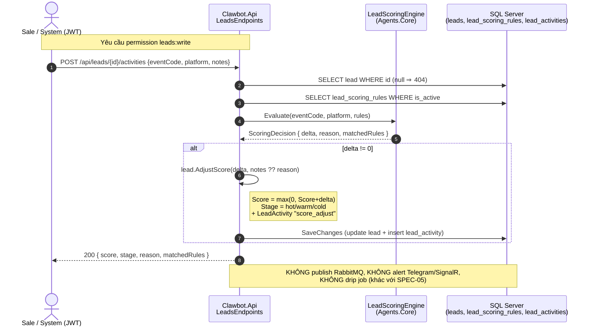
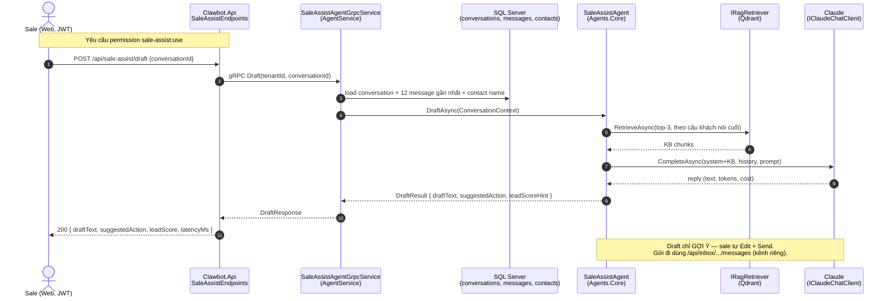

# Sale Flow — Hệ thống ClawBot (trạng thái hiện tại)

> Tài liệu mô tả **luồng sale (Lead/CRM + Sale Assist) đang chạy trong code** tại thời điểm viết, kèm khoảng cách so với SPEC.
> Nguồn: phân tích trực tiếp source (`src/api`, `src/agents`, `src/shared`) + `SPEC-04` (Sale Assist), `SPEC-05` (Lead & CRM), `docs/erd.md`.
> Liên quan: [login-flow.md](./login-flow.md) (auth + permission), [erd.md](./erd.md) (bảng dữ liệu).

---

## 0. TL;DR — Trả lời nhanh

| Câu hỏi | Trả lời |
|---|---|
| "Luồng sale" gồm những gì đã code? | **2 mảng:** (1) **Lead & CRM** — tạo lead, chấm điểm (scoring), phân loại stage, gán sale (assign), dedup. (2) **Sale Assist** — AI draft câu trả lời + tóm tắt hội thoại + thư viện quick-reply. |
| Lead được tạo từ đâu? | **Thủ công** qua `POST /api/leads`. **CHƯA** có auto-tạo lead từ webhook/inbox (không có liên kết tin nhắn → lead trong code hiện tại). |
| Ai chấm điểm lead? | `LeadScoringEngine.Evaluate` (pure function trong `Agents.Core`) — khớp `lead_scoring_rules` theo `(event_code, platform)`, **cộng dồn weight**. Gọi qua 2 đường: REST `POST /api/leads/{id}/activities` **và** gRPC `LeadAgent.Score`. |
| Stage phân loại thế nào? | `score >= 70 = hot`, `30..70 = warm`, `< 30 = cold` (trong `Lead.AdjustScore`). `customer`/`lost` có trong field nhưng **code chưa set** bao giờ. |
| Gán sale (assign) ra sao? | **Round-robin** (`RoundRobinLeadAssignmentService`, con trỏ static) qua `IAssignmentPoolSource`. Auto khi tạo lead, hoặc thủ công qua `POST /api/leads/{id}/assign`. **Chưa** có skill-based. |
| Sale Assist draft chạy ở đâu? | API `POST /api/sale-assist/draft` → **gRPC** `SaleAssistAgent.Draft` (trong `Clawbot.AgentService`) → **RAG** (top-3 KB) → **Claude** (`IClaudeChatClient`). |
| Có alert ">5 phút chưa rep" / hot-lead push? | **CHƯA.** SPEC-04/05 yêu cầu SignalR + Telegram alert nhưng **chưa có trong code**. Inbox có SignalR cho event hội thoại, nhưng không có alert SLA cho sale. |
| Có drip/nurture/remarketing? | **CHƯA.** SPEC-05 mô tả drip per-platform (MassTransit delayed) — **chưa code**. |
| Có auto-reassign sau 24h im lặng? | **CHƯA.** Chưa có background job. |
| Dedup có chặn tạo trùng không? | **KHÔNG chặn.** `EfLeadDedupService` chỉ **báo cáo** candidate trùng (same_contact / phone / email) trong response; lead vẫn được tạo. |
| Đi qua gateway nào? | Tất cả dưới `/api/**` → qua YARP gateway (`:5050`) bình thường (khác `/auth`). Dev có thể gọi thẳng API `:5051`. |
| RabbitMQ/Redis có tham gia? | **Hiện KHÔNG** ở luồng sale lõi. Scoring/assign/draft chạy đồng bộ in-process + gRPC + SQL. (MassTransit/Redis có DI nhưng luồng sale chưa publish/cache.) |

---

## 1. Tổng quan kiến trúc luồng sale

Luồng sale trải trên **3 tier**:

- **`Clawbot.Api`** (`:5051`) — REST endpoints:
  - [`LeadsEndpoints`](../src/api/Clawbot.Api/Endpoints/LeadsEndpoints.cs) → `/api/leads/**`, `/api/lead-scoring-rules/**` (quyền `leads:read` / `leads:write`).
  - [`SaleAssistEndpoints`](../src/api/Clawbot.Api/Endpoints/SaleAssistEndpoints.cs) → `/api/sale-assist/**` (quyền `sale-assist:use`).
  - [`InboxEndpoints`](../src/api/Clawbot.Api/Endpoints/InboxEndpoints.cs) → `/api/inbox/**` (nguồn hội thoại cho Sale Assist; quyền `conversations:*`).
- **`Clawbot.AgentService`** (gRPC) — AI agents:
  - [`SaleAssistAgentGrpcService`](../src/agents/Clawbot.AgentService/Services/SaleAssistAgentGrpcService.cs) → load context hội thoại → [`SaleAssistAgent`](../src/agents/Clawbot.Agents.Core/SaleAssist/SaleAssistAgent.cs) (RAG + Claude).
  - [`LeadAgentGrpcService`](../src/agents/Clawbot.AgentService/Services/LeadAgentGrpcService.cs) → chấm điểm lead qua `LeadScoringEngine`.
- **`Clawbot.Agents.Core`** — business logic thuần (không LLM, không EF):
  - [`LeadScoringEngine`](../src/agents/Clawbot.Agents.Core/Lead/LeadScoringEngine.cs) — pure function cộng weight.
  - [`RoundRobinLeadAssignmentService`](../src/agents/Clawbot.Agents.Core/Lead/LeadAssignmentService.cs) — chọn owner.
- **Data:** SQL Server — `leads`, `lead_scoring_rules`, `lead_activities`, `quick_reply_templates`, `conversations`, `messages`, `contacts` (xem [erd.md](./erd.md)).

```
                     ┌──────────────────────── Clawbot.Api (5051) ────────────────────────┐
   Sale (Web)  ─────▶│  /api/leads/**         LeadsEndpoints   ──┐                          │
   (JWT + perm)      │  /api/lead-scoring-rules                 │  EF Core ──► SQL Server   │
                     │  /api/sale-assist/**   SaleAssistEndpoints│  (leads, rules,          │
                     │  /api/inbox/**         InboxEndpoints      │   quick_reply, msgs)     │
                     └───────────┬───────────────────┬───────────┘                          │
                                 │ gRPC               │ in-process                            
                     ┌───────────▼───────────┐  ┌─────▼──────────────────────┐
                     │ SaleAssistAgent (gRPC) │  │ LeadScoringEngine (pure)   │
                     │  RAG(top-3) + Claude   │  │ RoundRobin assign + Dedup  │
                     └───────────┬───────────┘  └────────────────────────────┘
                                 │  Qdrant (RAG) + LLM (Claude)
                                 ▼
   (RabbitMQ ✗  Redis ✗  Telegram alert ✗  Drip job ✗  — chưa có ở luồng sale)
```

---

## 1.A — Vai trò từng thành phần hạ tầng (chi tiết: để làm gì · luồng sale dùng thế nào · trạng thái code thật)

> Ký hiệu trạng thái: 🟢 **dùng thật** trong luồng sale · 🟡 **cấu hình sẵn nhưng luồng sale chưa nối** · 🔴 **chưa có code** (chỉ có trong docker-compose / bản vẽ).

### 1. Pancake — cổng đa kênh (T-0)
- **Để làm gì:** Pancake là **nền tảng gom kênh** (Zalo OA, Facebook, Instagram, TikTok, YouTube). Thay vì ClawBot tự tích hợp từng kênh (mỗi kênh một SDK + webhook + OAuth + business verification riêng — Zalo OA bắt buộc xác minh doanh nghiệp), Pancake gom tất cả về **một webhook vào + một REST API ra**. DN bật kênh nào trên Pancake thì ClawBot phục vụ kênh đó.
- **Luồng sale dùng thế nào:**
  - **Chiều vào (in):** khách nhắn ở bất kỳ kênh → Pancake bắn **webhook** → [`WebhookEndpoints`](../src/api/Clawbot.Api/Endpoints/WebhookEndpoints.cs) → [`ChannelMessageIngestor`](../src/shared/Clawbot.Infrastructure/Channels/ChannelMessageIngestor.cs) tạo Contact + Conversation + Message. Đây là **nguồn nguyên liệu** của toàn bộ luồng sale (chưa nối sang lead — xem §2A/§7).
  - **Chiều ra (out):** sale/agent gửi trả lời → [`PancakeChannelAdapter`](../src/shared/Clawbot.Infrastructure/Channels/Pancake/PancakeChannelAdapter.cs) gọi **Pancake API** đẩy tin về đúng kênh.
- **Trạng thái:** 🟢 Adapter có thật, bọc **Polly** (retry + circuit breaker + timeout 10s). Secret/token kênh lưu `pancake_configs` (mã hoá). *Vì sao Pancake (cho báo cáo):* mua-thay-vì-tự-xây để dồn lực vào lõi multi-agent; `Adapter pattern` cô lập phụ thuộc → đổi/bỏ Pancake không phải sửa lõi.

### 2. YARP Gateway — `Clawbot.Gateway` (T-0.5)
- **Để làm gì:** reverse proxy đứng trước backend, lo **4 việc biên**: (a) **routing** `/webhook`,`/auth`,`/api`,`/hubs`; (b) **HMAC-SHA256** xác thực chữ ký webhook Pancake *trước khi* payload chạm backend; (c) **rate limit** (per-IP cho webhook, per-tenant cho api); (d) **inject `X-Trace-Id`** + validate **JWT** cho `/api`,`/hubs`.
- **Luồng sale dùng thế nào:** mọi request sale (`/api/leads`, `/api/sale-assist`, `/api/inbox`) đi qua route `api-routes` (`/api/{**}`, policy `authenticated`) → forward backend `:5051`. Đây là **mảnh mà 2 bản HTML thiếu** — code đã bù.
- **Trạng thái:** 🟢 Route `/api`,`/auth`,`/webhook`,`/hubs` đều có ([appsettings](../src/gateway/Clawbot.Gateway/appsettings.json)). Gateway **zero reference** tới project khác (ADR-007). *Lưu ý dev:* dev thường gọi thẳng API `:5051` (Vite proxy) nên gateway có thể không tham gia ở local.

### 3. Clawbot.Api — backend modular monolith (T-1)
- **Để làm gì:** chứa **toàn bộ** REST endpoint + SignalR Hub + Identity/Auth, chạy in-process (không tách microservice). Là nơi đặt logic điều phối request của luồng sale.
- **Luồng sale dùng thế nào:** [`LeadsEndpoints`](../src/api/Clawbot.Api/Endpoints/LeadsEndpoints.cs), [`SaleAssistEndpoints`](../src/api/Clawbot.Api/Endpoints/SaleAssistEndpoints.cs), [`InboxEndpoints`](../src/api/Clawbot.Api/Endpoints/InboxEndpoints.cs). Endpoint **mỏng**: xác thực quyền → EF Core đọc/ghi → (với draft) gọi gRPC sang AgentService.
- **Trạng thái:** 🟢 Chạy đồng bộ. EF Core + Identity + SignalR đầy đủ.

### 4. RabbitMQ + MassTransit — message bus / event (T-2)
- **Để làm gì:** **tách việc nặng/chậm khỏi request path** và làm **xương sống event-driven**. Ý tưởng (CLAUDE.md ADR Domain Events): entity đổi trạng thái → raise domain event → sau khi lưu DB → **publish** lên bus → consumer xử lý bất đồng bộ (alert, drip, dispatch agent). Giúp request trả nhanh, không treo theo agent, chịu tải tốt hơn.
- **Luồng sale *đáng lẽ* dùng:** event `lead_scored` → alert hot-lead; `lead_stage_changed` (cold) → `drip_sequence`; `inbound_message` → dispatch Agent-SaleAssist. **Đây là cơ chế mà cả 2 bản HTML coi là trung tâm.**
- **Trạng thái:** 🟡 **Bus đã bật** (`AddMassTransit` + `UsingRabbitMq` + `ConfigureEndpoints`, [DI:79](../src/shared/Clawbot.Infrastructure/DependencyInjection.cs#L79)) nhưng **luồng sale chưa publish/consume gì** — `Lead` chưa gọi `Raise()`, chưa có consumer, chưa có outbox. Bus chạy **không tải** cho sale. (Đây là Gap 2.)

### 5. Semantic Kernel + gRPC AgentService — AI Core (T-3)
- **Để làm gì:** `Clawbot.AgentService` host **8 agent** dưới dạng **gRPC service** (ADR-008: contract mạnh kiểu, hỗ trợ streaming, tách process được sau). **Semantic Kernel** chỉ làm **plugin/planner host** (gọi skill, lập kế hoạch) — **không** làm chat completion (quyết định ở [RFC-001 "Option B"](../.sdd/rfcs/001-semantic-kernel-vs-direct-anthropic.md)).
- **Luồng sale dùng thế nào:** `POST /api/sale-assist/draft` → API gọi gRPC [`SaleAssistAgentGrpcService`](../src/agents/Clawbot.AgentService/Services/SaleAssistAgentGrpcService.cs) → core [`SaleAssistAgent`](../src/agents/Clawbot.Agents.Core/SaleAssist/SaleAssistAgent.cs). `LeadAgent.Score` cũng là gRPC.
- **Trạng thái:** 🟢 gRPC chạy thật. ⚠️ **Không có NestJS, không có DeepSeek ModelRouter** (khác Doc 2 — đã bị RFC-001 thay).

### 6. Claude / Anthropic — LLM sinh nội dung
- **Để làm gì:** mô hình sinh **draft trả lời** + **tóm tắt** hội thoại cho sale.
- **Luồng sale dùng thế nào:** [`AnthropicChatClient`](../src/agents/Clawbot.Agents.Core/Chat/AnthropicChatClient.cs) (`IClaudeChatClient`) gọi thẳng API Anthropic (`/v1/messages`, HS… HTTP + `x-api-key`), model lấy từ `AnthropicOptions.Model`; trả về text + token + **chi phí USD** (để track cost).
- **Trạng thái:** 🟢 Gọi Claude trực tiếp. ⚠️ **Không đọc `llm_configs`** (bảng có nhưng path sale hardcode qua `AnthropicOptions`) — khác mô tả "runtime-resolved" của CLAUDE.md.

### 7. Qdrant — vector store / RAG
- **Để làm gì:** lưu **embedding** của Knowledge Base (`kb_versions`) để **tìm ngữ nghĩa** (semantic search) — kéo đoạn KB liên quan nhét vào prompt cho câu trả lời "có căn cứ" (grounded).
- **Luồng sale dùng thế nào:** khi draft, [`QdrantRagRetriever`](../src/agents/Clawbot.Agents.Core/Rag/QdrantRagRetriever.cs) lấy **top-3** chunk theo câu khách nói cuối → nối vào system prompt của Claude.
- **Trạng thái:** 🟡 Qdrant + retriever chạy, **nhưng** embedding là [`HashEmbeddingProvider`](../src/agents/Clawbot.Agents.Core/Rag/HashEmbeddingProvider.cs) (vector băm 384-dim **giả lập**, không mang ngữ nghĩa) → retrieve gần như ngẫu nhiên ⇒ KB hints hiện **vô giá trị**. (Đây là Gap 4.)

### 8. SQL Server 2022 — dữ liệu nghiệp vụ
- **Để làm gì:** nguồn sự thật cho mọi bảng nghiệp vụ. Schema gốc = `deploy/migrations/0001_init.sql` (ADR-009: DDL là nguồn sự thật, EF map vào).
- **Luồng sale dùng thế nào:** `leads`, `lead_scoring_rules`, `lead_activities`, `quick_reply_templates`, `conversations`, `messages`, `contacts`. Multi-tenant qua global query filter (ADR-011) + soft-delete (ADR-002).
- **Trạng thái:** 🟢 Single-node (chưa Always On AG như Doc 2). Cũng là backend lưu trữ của **Hangfire**.

### 9. Redis — cache
- **Để làm gì:** cache để **giảm latency** + làm SignalR backplane khi scale (ADR-004).
- **Luồng sale dùng thế nào:** [`PermissionResolver`](../src/shared/Clawbot.Infrastructure/Auth/PermissionResolver.cs) **cache role→permissions** (TTL 600s) — mọi request sale qua `RequirePermission(...)` hưởng cache này; Redis **miss/sập thì fallback DB**, không chặn request (NFR-02).
- **Trạng thái:** 🟢 Dùng thật cho cache phân quyền. 🔴 **Chưa** dùng làm SignalR backplane (Hub đang in-memory — ADR-004 nói phải bật backplane trước prod) và 🔴 chưa cache scoring/draft.

### 10. SignalR — realtime dashboard (T-5)
- **Để làm gì:** đẩy sự kiện thời gian thực xuống dashboard (tin mới, đổi trạng thái hội thoại).
- **Luồng sale dùng thế nào:** [`IInboxNotifier`/`SignalRInboxNotifier`](../src/api/Clawbot.Api/Hubs/SignalRInboxNotifier.cs) bắn event khi có tin vào / assign / resolve / gửi tin. **Đây cũng là kênh** mà alert SLA (Gap 3) sẽ dùng.
- **Trạng thái:** 🟢 Cho inbox. ⚠️ **Chưa** stream draft Sale Assist (SPEC-04 muốn stream qua `DashboardHub`; hiện draft trả đồng bộ qua HTTP).

### 11. Hangfire — job theo lịch
- **Để làm gì:** chạy job **có lịch + audit trail + retry UI** (CLAUDE.md phân vai: Hangfire = scheduled; BackgroundService/MassTransit = consume event liên tục).
- **Luồng sale *đáng lẽ* dùng:** quét **>5 phút chưa rep**, **reassign 24h** im lặng, re-embed KB, re-score định kỳ.
- **Trạng thái:** 🟡 **Đã wired đủ** — server + 3 recurring job (retention 2h, KPI rollup 7h30, token cleanup 3h) ([HangfireModule](../src/shared/Clawbot.Infrastructure/Jobs/HangfireModule.cs)), dashboard `/hangfire`. **Nhưng chưa có job nào cho sale** — thêm SLA/reassign chỉ là thêm `AddOrUpdate`. (Phục vụ Gap 3.)

### 12. Polly — chống lỗi external call
- **Để làm gì:** retry + timeout + circuit breaker bọc quanh **lời gọi ra ngoài** (điểm dễ sập nhất của hệ agent).
- **Trạng thái:** 🟡 Đã bọc **kênh Pancake** ([DI:99](../src/shared/Clawbot.Infrastructure/DependencyInjection.cs#L99)). 🔴 **Chưa** bọc gRPC agent / lời gọi Claude → draft fail thì chưa có retry/CB ở tầng này.

### 13. MinIO / S3 — object storage
- **Để làm gì:** giữ **file gốc** (PDF, brochure, audio call) để re-embed/đối chiếu — phục vụ Document Generation (FR-07) & Knowledge Capture.
- **Trạng thái:** 🔴 **Không có code** (chỉ trong `docker-compose`). Luồng sale hiện không đụng.

### 14. Telegram bot — kênh alert
- **Để làm gì:** đẩy cảnh báo hot-lead / >5 phút cho sale ngoài app.
- **Trạng thái:** 🔴 **Không có code**. SPEC-04/05 yêu cầu; cần thêm `ITelegramAlertSender` + chỗ lưu bot token per tenant. (Phục vụ Gap 3.)

> **Tóm 1 dòng:** Luồng sale **lõi** hôm nay chạy bằng **Pancake → Api (đồng bộ) → gRPC/Claude → SQL**, có **Redis** cache quyền và **Qdrant** RAG (embedding còn giả). **RabbitMQ, Hangfire, Polly** đã *cắm điện* nhưng **chưa nối dây vào sale**; **MinIO, Telegram** thì **chưa có code**.

---

## 2. Hai sub-luồng

### 2A. Lead lifecycle (Lead & CRM)

```
  [Tạo lead]                [Tương tác → chấm điểm]            [Phân loại + theo dõi]
POST /api/leads     ─►   POST /api/leads/{id}/activities  ─►   stage = hot/warm/cold
  ├─ dedup (báo trùng)      ├─ LeadScoringEngine.Evaluate         (theo Score)
  └─ auto-assign owner      │   (Σ weight của rule khớp)
     (round-robin)          ├─ Lead.AdjustScore(delta)
                            │   └─ tạo LeadActivity "score_adjust"
                            └─ trả {score, stage, matchedRules}

  [Gán lại]  POST /api/leads/{id}/assign  (userId cụ thể hoặc round-robin)
```

**Entity** [`Lead`](../src/shared/Clawbot.Domain/Leads/Lead.cs):
- `Score` (int, **sàn 0** — `Math.Max(0, …)`), `Stage` (mặc định `cold`), `OwnerUserId`, `SourcePlatform`, `LastActivityAt`.
- `AdjustScore(delta, reason, at)`: cộng điểm → **re-map stage** (`>=70 hot`, `>=30 warm`, else `cold`) → push `LeadActivity` type `score_adjust` → cập nhật `LastActivityAt`.
- `Assign(userId)`: set owner.
- ⚠️ `Stage` field cho phép `customer|lost` nhưng **không method nào set 2 giá trị này** — chưa có chuyển đổi sang khách hàng / mất.

**Scoring rule** [`LeadScoringRule`](../src/shared/Clawbot.Domain/Leads/LeadScoringRule.cs): `(EventCode, Platform?, Weight, IsActive)`. `Weight` int — **âm cũng được** (event tiêu cực trừ điểm). Platform rỗng = áp cho mọi platform.

**Engine** [`LeadScoringEngine.Evaluate`](../src/agents/Clawbot.Agents.Core/Lead/LeadScoringEngine.cs): lọc rule active khớp `eventCode` (case-insensitive) + platform (rỗng = any) → **cộng dồn** weight = `delta` → trả `reason` + `matchedRules`. Không khớp rule ⇒ `delta = 0`.

**Dedup** [`EfLeadDedupService`](../src/shared/Clawbot.Infrastructure/Leads/EfLeadDedupService.cs): tìm candidate trùng — `same_contact` (conf 1.0), `phone_match` / `email_match` (conf 0.9). **Chỉ báo cáo trong `CreateLeadResponse.Dupes`, không tự merge / không chặn tạo.**

**Assign** [`RoundRobinLeadAssignmentService`](../src/agents/Clawbot.Agents.Core/Lead/LeadAssignmentService.cs): nạp pool từ `IAssignmentPoolSource`, xoay vòng bằng con trỏ static `Interlocked.Increment`. Pool rỗng ⇒ trả `null` (lead không owner).

### 2B. Sale Assist (AI hỗ trợ sale)

```
Sale mở hội thoại ──► POST /api/sale-assist/draft {conversationId}
                          │  (gRPC)
                          ▼
              SaleAssistAgentGrpcService.Draft
                          │
                          ├─ LoadContextAsync: lấy 12 message gần nhất + tên contact + platform
                          ▼
                  SaleAssistAgent.DraftAsync (Agents.Core)
                          ├─ RAG: RetrieveAsync top-3 KB chunk theo câu khách nói cuối
                          ├─ Claude.CompleteAsync(system+KB, history, prompt)
                          ├─ InferAction(...)      → book_trial / send_quote / ask_goal / follow_up
                          └─ HintLeadScore(...)    → 10/30/50/70 theo số lượt khách nhắn
                          ▼
              { draftText, suggestedAction, leadScore, latencyMs }
```

[`SaleAssistAgent`](../src/agents/Clawbot.Agents.Core/SaleAssist/SaleAssistAgent.cs):
- **Draft:** system prompt yêu cầu reply ấm áp, ≤80 từ, tiếng Việt; nối thêm **KB hints** (RAG top-3) vào system; history = các lượt (`in`→user, out→assistant). Trả về text Claude + `suggestedAction` (suy luận heuristic theo từ khoá/độ dài hội thoại) + `leadScoreHint` (heuristic theo số lượt khách: 1→30, 3→50, 5→70).
- **Summarize:** Claude tóm tắt 3 bullet (mục tiêu khách / vướng mắc / next action).
- ⚠️ `leadScoreHint` là **gợi ý độc lập**, **không** đồng bộ với `Lead.Score` thật trong DB.

**Quick replies** [`QuickReplyTemplate`](../src/shared/Clawbot.Domain/SaleAssist/QuickReplyTemplate.cs): CRUD thư viện template (`code`, `category`, `body`, `platforms`) qua `/api/sale-assist/quick-replies`. `code` unique trong tenant (POST trùng ⇒ 409).

---

## 3. Sequence Diagram — Lead scoring (đường REST)



## 4. Sequence Diagram — Sale Assist draft



> Lưu ý: endpoint `draft` hiện truyền `SaleUserId = ""` (chưa gắn người dùng vào draft request). Việc **gửi** câu trả lời không nằm trong Sale Assist — sale bấm gửi qua `POST /api/inbox/conversations/{id}/messages` ([InboxEndpoints](../src/api/Clawbot.Api/Endpoints/InboxEndpoints.cs)), đẩy ra kênh qua `IChannelAdapter` + phát SignalR.

---

## 5. Các endpoint của luồng sale

| Method | Route | Permission | Hành vi |
|---|---|---|---|
| GET | `/api/leads?stage=&page=&pageSize=` | `leads:read` | List, sort `score desc` rồi `lastActivityAt desc` |
| GET | `/api/leads/{id}` | `leads:read` | Chi tiết lead |
| POST | `/api/leads` | `leads:write` | Tạo lead + **dedup (báo trùng)** + **auto-assign** round-robin |
| POST | `/api/leads/{id}/activities` | `leads:write` | Ghi activity → **scoring** → cập nhật score/stage |
| POST | `/api/leads/{id}/assign` | `leads:write` | Gán owner (userId cụ thể hoặc round-robin) |
| GET/POST/DELETE | `/api/lead-scoring-rules` | `leads:write` | Quản lý rule chấm điểm (DELETE = deactivate) |
| POST | `/api/sale-assist/draft` | `sale-assist:use` | AI draft reply (gRPC → RAG → Claude) |
| POST | `/api/sale-assist/summary` | `sale-assist:use` | AI tóm tắt hội thoại |
| GET/POST/PUT/DELETE | `/api/sale-assist/quick-replies` | `sale-assist:use` | Thư viện quick-reply |

> Phân quyền: [`AuthEndpoints`/`RequirePermission`](../src/api/Clawbot.Api/Endpoints/LeadsEndpoints.cs#L17) — claim `perm` trong JWT (xem [login-flow.md](./login-flow.md) §3).

---

## 6. Thành phần liên quan

| Component | Vai trò trong luồng sale | Có tham gia? |
|---|---|---|
| **Clawbot.Api (Leads/SaleAssist/Inbox endpoints)** | REST surface, EF Core, phân quyền | ✅ |
| **LeadScoringEngine** (Agents.Core) | Cộng weight rule → delta điểm | ✅ |
| **RoundRobin assignment** (Agents.Core) | Chọn owner cho lead | ✅ |
| **EfLeadDedupService** (Infrastructure) | Báo lead trùng khi tạo (không chặn) | ✅ |
| **SaleAssistAgent (gRPC)** | Draft/summary qua RAG + Claude | ✅ |
| **Qdrant (RAG)** | Lấy KB chunk cho draft | ✅ (qua agent) |
| **Claude (`IClaudeChatClient`)** | Sinh draft / summary | ✅ (qua agent) |
| **SQL Server** | `leads`, `lead_scoring_rules`, `lead_activities`, `quick_reply_templates`, `conversations`, `messages`, `contacts` | ✅ |
| **SignalR (`IInboxNotifier`)** | Realtime event hội thoại (assign/resolve/message) | ⚠️ Có ở Inbox, **không** alert SLA sale |
| **RabbitMQ (MassTransit)** | Drip/nurture, event lead | ❌ Chưa dùng ở luồng sale |
| **Redis** | Cache permissions/score | ❌ Chưa dùng ở luồng sale |
| **Telegram bot** | Alert hot-lead / >5 phút | ❌ Chưa có |

---

## 7. Khoảng cách so với SPEC (chưa code)

| SPEC | Yêu cầu | Trạng thái |
|---|---|---|
| SPEC-05 | `score >= 70` ⇒ assign + **Telegram alert ≤ 2 phút** | 🔴 Assign có; **alert chưa**. Không có ngưỡng auto-alert theo score. |
| SPEC-05 | Lead **im lặng 24h** ⇒ reassign sale khác | 🔴 Chưa có background job. |
| SPEC-05 | `stage = cold` ⇒ **drip per-platform** (Zalo 7d, FB 5d) | 🔴 Chưa có (cần MassTransit delayed). |
| SPEC-05 | Lead thành `customer` ⇒ welcome sequence | 🔴 Chưa có transition sang `customer`. |
| SPEC-05 | Auto-tạo/scoring từ sự kiện kênh (5-channel routing) | 🔴 Lead tạo **thủ công**; chưa nối webhook → lead. |
| SPEC-04 | Hội thoại chờ **> 5 phút** ⇒ alert SignalR + Telegram | 🔴 Chưa có timer/alert SLA. |
| SPEC-04 | Draft tự động **mỗi inbound message** (<3s) | 🟠 Hiện draft theo **yêu cầu** (gọi endpoint), chưa auto-trigger khi có tin mới. |
| SPEC-04 | Cảnh báo từ off-brand ("discount") trước khi gửi | 🔴 Chưa có guard. |
| SPEC-04 | Stream draft qua SignalR `DashboardHub` | 🟠 Hiện trả đồng bộ qua HTTP, chưa stream. |

---

## 8. Kết luận

**Trả lời trực tiếp "luồng sale như nào":**

1. **Đã chạy:** quản lý **Lead** (tạo → chấm điểm theo rule → phân loại hot/warm/cold → gán sale round-robin, có dedup cảnh báo) và **Sale Assist** (AI draft reply + tóm tắt + quick-reply), tất cả sau JWT + permission, qua `/api/**`.
2. **Lõi scoring** là pure function cộng weight (`LeadScoringEngine`) — dùng chung cho cả REST (`/activities`) và gRPC (`LeadAgent.Score`). Dễ test, không phụ thuộc hạ tầng.
3. **AI draft** đi qua gRPC `SaleAssistAgent` → RAG (Qdrant top-3) → Claude; chỉ **gợi ý**, sale tự sửa và **gửi qua Inbox** (kênh tách biệt).
4. **Đồng bộ, in-process + gRPC:** luồng sale hiện **không** đụng RabbitMQ/Redis/Telegram.

**Điểm cần lưu ý:**
- 🔴 **Chưa nối nguồn lead tự động** từ webhook/inbox — lead phải tạo thủ công ⇒ "5-channel routing" của SPEC-05 chưa khép kín.
- 🔴 **Thiếu toàn bộ tầng automation theo SLA/thời gian:** alert hot-lead, alert >5 phút, reassign 24h, drip/nurture. Đây là phần phụ thuộc background job (MassTransit/Hangfire — đang deferred Sprint 2 theo CLAUDE.md §8).
- 🟠 **Hai chỉ số "điểm" song song:** `Lead.Score` (thật, từ rule) vs `leadScoreHint` của draft (heuristic theo số lượt) — cần thống nhất để tránh nhầm trên UI.
- 🟠 **Dedup không tự xử lý** — chỉ trả candidate; cần quyết định luồng merge/confirm ở UI.
- 🟠 **Stage `customer`/`lost`** khai báo nhưng chưa có đường chuyển trạng thái ⇒ chưa đo được conversion thật.
- 🟢 Phân quyền chặt (`leads:read/write`, `sale-assist:use`), scoring tách pure-function, agent tách gRPC ⇒ nền tốt để bổ sung automation sau.

---

### Phụ lục — Thử nhanh luồng sale (dev)

```bash
# Đăng nhập lấy token (xem login-flow.md)
POST http://localhost:5051/auth/login
{ "email": "admin@clawbot.local", "password": "Admin@12345" }   # → accessToken

# Tạo rule chấm điểm
POST http://localhost:5051/api/lead-scoring-rules
Authorization: Bearer <token>
{ "eventCode": "replied", "platform": "zalo", "weight": 40 }

# Tạo lead (kèm dedup + auto-assign)
POST http://localhost:5051/api/leads
{ "contactId": "<guid>", "sourcePlatform": "zalo" }             # → { id, dupes: [...] }

# Ghi activity ⇒ chấm điểm ⇒ đổi stage
POST http://localhost:5051/api/leads/<leadId>/activities
{ "eventCode": "replied", "platform": "zalo" }                  # → { score: 40, stage: "warm", ... }

# AI draft cho 1 hội thoại
POST http://localhost:5051/api/sale-assist/draft
{ "conversationId": "<guid>" }                                  # → { draftText, suggestedAction, leadScore }
```

> Tài khoản seed `admin@clawbot.local` / `Admin@12345` (chỉ Development). Cần SQL Server + AgentService chạy để draft/scoring hoạt động đầy đủ.
</content>
</invoke>
